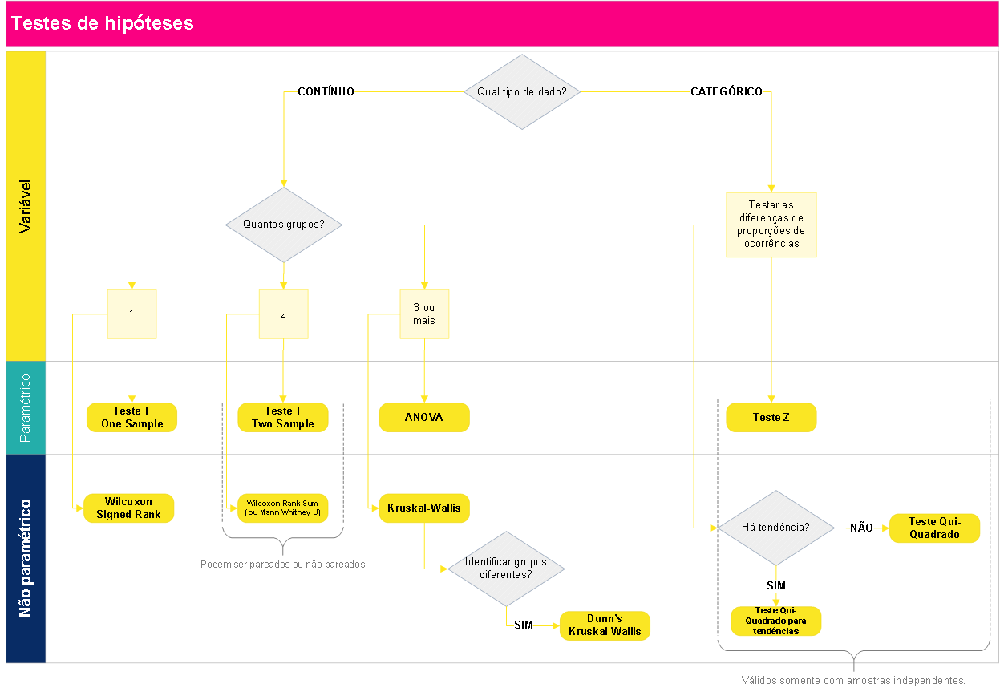
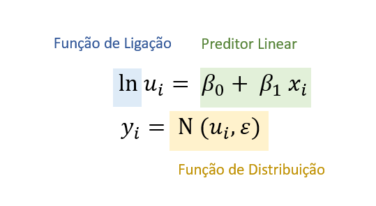
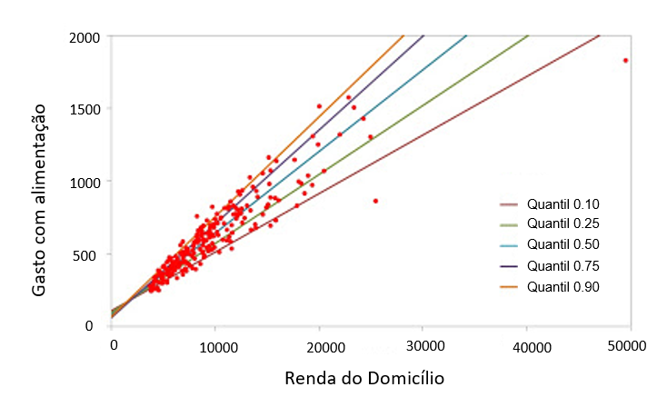
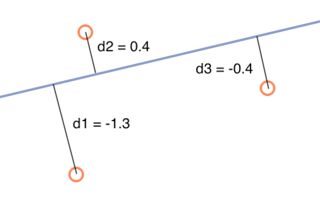
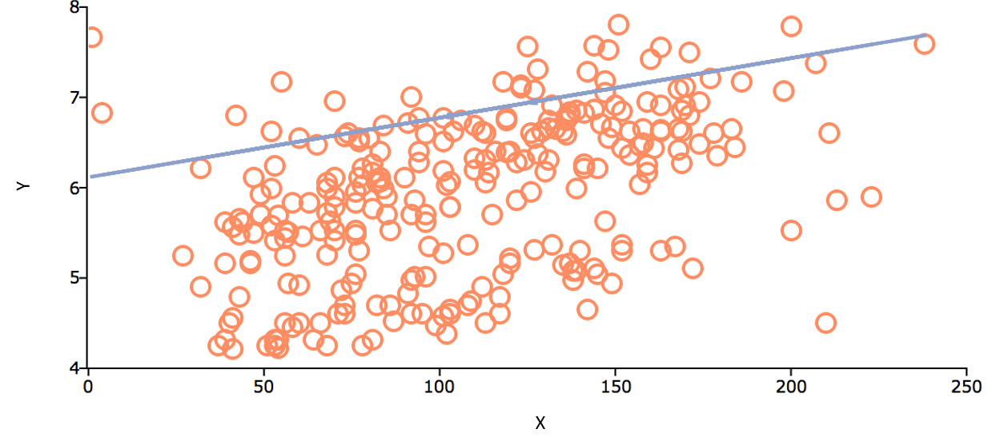

```{r setup, include=FALSE, warning=FALSE, message=FALSE}
knitr::opts_chunk$set(echo = FALSE, message = FALSE, warning = FALSE)

# Remove scientific notation
options(scipen=999, warn = -1)
```

___

**Atenção, este documento é o apêndice dos relatórios de hipóteses desenvolvido pela equipe de Dados da Tembici**

___

Neste documento são apresentadas as informações sobre os testes estatísticos aplicados nos relatório de hipóteses desenvolvidos pela equipe de Dados da Tembici. 

# Teste de Hipóteses {#teste_hipoteses}

Esta seção apresenta algumas informações sobre os testes estatísticos aplicados para avaliar as hipóteses apresentadas nos relátorios de hipóteses realizados pela equipe de Dados da Tembici. 

A estatística possui uma área chamada de **teste de hipóteses**, que viabiliza verificar ou refutar uma hipótese existente acerca do comportamento dos dados. Os testes de hipóteses são muito utilizados no **meio acadêmico**, mas também possuem grande valor se usados de forma adequada no **contexto corporativo**.

Nas empresas existem diversas crenças acerca de como as coisas acontecem e se relacionam. Formalizar estas crenças em **hipóteses de negócio** permite que sejam formuladas **hipóteses estatísticas**, as quais podem ser testadas e validadas (ou não) com o uso de testes de hipóteses.

Porém, para que os resultados dos testes sejam corretos, é preciso conhecer os principais tipos de testes existentes e alguns dos seus conceitos. Assim é possível direcionar para a aplicação correta a ser utilizado em cada hipótese.

Basicamente os **passos para uma boa execução** de testes de hipóteses são:

1. Definir uma **hipótese de negócio**;
2. Transformá-la em uma **hipótese estatística**;
3. **Escolher o teste correto** baseado nas características dos dados e no resultado esperado;
4. **Transformar os dados** para que estejam de acordo com o *input* exigido pelo teste escolhido;
5. **Aplicar** o teste de hipótese.

<div style="background:#f5f5f5; padding:20px; margin: 10px;">

#### Por que Utilizar um Teste de Hipótese? {.unnumbered}

Quando as tabelas dinâmicas do Excel já não são suficientes para que os resultados das análises sejam conclusivas é um bom indicativo de que já passou da hora de utilizar testes de hipóteses.

Um teste de hipótese auxilia a eliminar a incerteza que permanece mesmo após procedimentos de sumarização dos dados, como ocorre nas tabelas dinâmicas dos *softwares* de planilha eletrônica.

Por exemplo, uma organização quer saber se os homens possuem salário superior às mulheres em um determinado cargo. A tabela dinâmica vai trazer o resultado, que pode ser expresso através da média dos salários daquele cargo em cada gênero (masculino ou feminino). Porém, o resultado da média pode mostrar apenas uma diferença pequena entre os salários de homens e mulheres, o que acaba deixando no ar a dúvida inicial e nenhuma conclusão pode ser tomada.

Um teste de hipótese estatística é capaz de dizer (quando bem aplicado) que o salário das mulheres é de fato menor ou maior naquele caso, e que o resultado mostrado na média não é uma simples obra do acaso. 

</div>

## Conceitos Importantes sobre os Testes de Hipóteses

Uma hipótese estatística, formalmente, é uma afirmação sobre alguma característica da população. Um teste de hipótese, por sua vez, **é um procedimento estatístico para dizer se uma afirmação sobre a população é verdadeira**. 

Se a probabilidade de ocorrência de um evento atrelado à hipótese for baixa, então a hipótese é assumida como não verdadeira.


### Hipótese Nula e Hipótese Alternativa {.unnumbered}


Todo teste de hipóteses precisa de uma **hipótese nula** ($H_0$) e uma **hipótese alternativa** ($H_1$). 

A $H_0$ é uma afirmação que **sempre representará uma igualdade**. Por exemplo: "a média salarial de homens **é igual** a média salarial de mulheres"; "colaboradores com maior grade **possuem o mesmo** tempo de empresa que colaboradores com menor grade". Veja que a $H_0$ pode ser dividia em duas declarações, que chamaremos de $X$ e $Y$. Nos exemplos citados, as declarações que representam $X$ seriam "média salarial de homens" e "colaboradores com maior grade"; enquanto $Y$ seriam "média salarial de mulheres" e "colaboradores com menor grade".

Já quando olhamos para $H_1$, temos três possibilidades de configurações: existe diferença, é maior ou  é menor. Olhando para as declarações de $X$ e $Y$, poderíamos ter como hipótese alternativa à $H_0$, citada acima, que "a média salarial de homens **é maior** que a média salarial de mulheres". Ou ainda, quando não temos um palpite definido (se maior ou menor), podemos definir $H_1$ como "colaboradores com maior grade possuem tempo de empresa **diferentes** que colaboradores com menor grade".

Resumindo, para definirmos as hipóteses nula e alternativa teremos:

  $H_0 : X = Y$
  
  $H_1 : X \neq Y ~\text{ou}~ X < Y ~\text{ou}~ X > Y$


### Qual a Decisão em um Teste de Hipótese?  {.unnumbered}

Em um teste de hipóteses a decisão será sempre **rejeitar a hipótese nula** ou **não rejeitar a hipótese nula**.

Para isso, os testes geram um *p-valor* para representar a **probabilidade de significância** estatística (métrica que vai de 0 a 1). **Quanto mais próximo de 0 o *p-valor*, mais significativa é a diferença testada**.


> Um **baixo p-valor** indica **forte evidência** contra a hipótese nula, o que leva à **rejeição** de $H_0$.


De forma geral, recomenda-se **rejeitar $H_0$** com **_p-valor_ menor que $0,05$** (ou $5\%$). Em alguns casos específicos, o nível de significância **pode ser de $10\%$**.

### Testes Paramétricos e não Paramétricos? {.unnumbered}


**Testes paramétricos** assumem que os dados são distribuídos aleatoriamente a partir da população e que seguem uma **distribuição normal**.

**Testes não paramétricos** também assumem que os dados são aleatoriamente distribuídos a partir da população, mas **não exigem que sigam uma distribuição normal**. 

Os testes não paramétricos, além de não exigirem "normalidade" na distribuição dos dados, também apresentam resultados melhores quando aplicados em **amostras pequenas**. Por esses motivos, em casos reais normalmente são os preferidos e mais adequados em testes de hipóteses.

A questão que permanece é **como saber se o teste a ser escolhido é paramétrico ou não paramétrico**?

A resposta é simples: se o dado a ser testado segue uma distribuição normal, então recomenda-se utilizar testes paramétricos; caso o dado não possua distribuição normal então utiliza-se testes não paramétricos.

Quando o dado é normalmente distribuído então alguns testes podem trazer inferências sobre intervalos, pois já se conhece a distribuição. Já os testes não paramétricos não se baseiam na distribuição dos dados.

Testar a normalidade de uma série de dado é bastante simples pela linguagem R. Uma das possibilidades é utilizar o teste [Shapiro-Wilk](https://en.wikipedia.org/wiki/Shapiro%E2%80%93Wilk_test) por meio da função `shapiro.test()`. O teste possui hipótese nula ($H_0$) de que o dado é normalmente distribuído, a qual recomenda-se ser rejeitada a um p-valor menor que 0,05. Em outras palavras, se o p-valor for maior que 0,05 então assumimos que o dado é normalmente distribuído e seguimos com testes paramétricos; caso contrário procuramos um teste adequado entre os não paramétricos.  

### Testes Pareados e não Pareados {.unnumbered}

Em testes para **dados pareados** as amostras são **dependentes**. Aplicam-se, por exemplo, no caso das duas métricas que serão comparadas serem obtidas a partir do **mesmo indivíduo**, antes e após um tratamento. 


<div style="background:#f5f5f5; padding:20px; margin: 10px;">
<h5 class="alert-heading">**Exemplo** de teste pareado</h5>

  Após um colaborador receber movimentação salarial por mérito, sua produtividade melhora.  

  <hr>
  
  Para validar esta hipótese um teste pareado sobre as observações de produtividade deveria ser executado com duas amostras do mesmo colaborador: uma antes e outra depois da movimentação salarial por mérito.

</div>

Em testes para **dados não pareados** os dados são coletados de **indivíduos distintos** e que pertencem a grupos também distintos. As amostras a serem testadas são **independentes**.

<div style="background:#f5f5f5; padding:20px; margin: 10px;">
<h5 class="alert-heading">**Exemplo** de teste não pareado</h5>

  As avaliações de lideranças na área de TI são inferiores às avaliações na área de Recursos Humanos .

  <hr>
  
  Para validar esta hipótese é necessário um teste não pareado sobre as notas dos líderes em cada área.
  
</div>


Vale ainda ressaltar que, em testes para dados pareados, obrigatoriamente o tamanho das amostras deve ser igual (afinal, as amostras devem ser "pares"). Já em testes não pareados os tamanhos das amostras podem ser diferentes.


## Tipos de Testes

Existem diversos testes de hipóteses, sendo que cada um é mais adequado para uma situação específica. A seguir são apresentados alguns testes (não todos, pois existem diversos) que servem para a maior parte das situações que envolvem testes de hipóteses.

### Testes de Proporções

Os testes de proporções são adequados quando se têm **variáveis binárias ou categóricas** (ou numéricas dividas em faixas, como renda, idade ou número de funcionários), e se deseja saber se determinada característica é mais ou menos presente em um certo tratamento. Alguns exemplos de hipóteses alternativas a serem verificadas com testes de proporções:

- O *turnover* voluntário é maior em colaboradores do gênero masculino do que feminino;
- Há um maior índice de *turnover* voluntário em colaboradores cuja frequência de viagem a trabalho é maior.

Veja, *turnover* é uma variável binária, que indica quando um colaborador é desligado ou não, e o que normalmente se deseja testar com esta variável são casos em que há maior ou menor índice de *turnover*. Este é um tipo de situação em que é adequado aplicar testes de proporções. 


#### Teste Z {.unnumbered}

É um teste **paramétrico** utilizado para comparar diferenças de proporções entre duas amostras independentes. É idêntico ao teste Qui-Quadrado para diferença de proporções (apresentado a seguir), exceto que este permite estimar o desvio-padrão pela distribuição normal. Um cuidado que deve-se tomar com este teste é relacionado a sua aplicação em amostras que não são independentes. A equação implementada na linguagem R para teste de proporções não contempla o teste Z, apenas o Qui-Quadrado. 

[Usos e mau usos do Teste Z](https://influentialpoints.com/Training/z-test_for_independent_proportions_use_and_misuse.htm)

#### Teste Qui-Quadrado ($X^2$) {.unnumbered}

É uma alternativa **não paramétrica** ao teste Z. O teste *Chi-Squared* para proporções é um dos testes estatísticos mais utilizados. É mais adequado para amostras pequenas que o teste Z. Um dos seus principais usos incorretos está atrelado também a não independência entre as amostras.

[Usos e mau usos do Person's Chi-Squared Test](https://influentialpoints.com/Training/Pearsons_chi_square_test_of_independence_use_and_misuse.htm)

Na linguagem R há uma função nativa para este teste, `prop.test()`, que necessita como input (i) a quantidade de ocorrências para cada evento e (ii) o total de casos. Assim, o próprio teste calcula as proporções. Além disso, é possível aplicar o teste também para verificar se há diferença entre **mais de duas amostras**, e também verificar se há **tendência nas proporções** entre os grupos, por meio da função `prop.trend.test()`.


#### Teste de Fisher {.unnumbered}

O teste exato de Fisher é um teste não paramétrico que tem o objetivo de testar a independência de duas ou mais variáveis categóricas. Ele é uma alternativa ao teste Qui-Quadrado e normalmente é utilizado para a tabela de contingência 2×2, ou quando as frequências esperadas de uma das células da tabela de contingência são menores do que 5.   

A lógica do teste de Fisher é a mesma apresentada no teste Qui-Quadrado: identificar se as variáveis categóricas são independentes (o `H0`, hipótese nula do teste) ou se exsite alguma relação entre elas (o `H1`, hipótese alternativa do teste). 

Na linguagem R, o teste de Fisher pode ser facilmente implementado utilizando a função `fisher.test`, que necessita como input uma tabela de continguência ou a especificação de duas variáveis categorias de uma base de dados, que serão então utilizadas pelo teste para identificar a existência ou não de associações entre elas. 

### Testes para Diferenças com uma Amostra (*one sample*)

São testes aplicados para **variáveis contínuas** em caso de se ter apenas uma amostra de dados e desejar testar se há diferença desta amostra contra parâmetros hipotéticos. Por exemplo:

$H_0$: os colaboradores recém promovidos recebem em torno de 100% da faixa.

$H_1$: os colaboradores recém promovidos recebem mais de 100% da faixa.

Neste caso, não se compara duas ou mais amostras, mas realiza-se o teste com base em um valor que seria esperado por alguma razão, por exemplo, por uma política de recursos humanos da organização.

#### Teste T One Sample {.unnumbered}

O teste T para uma amostra é um teste **paramétrico** que permite verificar se a média de uma série de dados é diferente de uma média hipotética que se deseja testar. Para implementar o teste em R, utiliza-se `t.test(x, mu = 0)`, em que `x` representa o vetor com a amostra a ser testada, e `mu` é o parâmetro para definir a média esperada.


#### Wilcoxon Signed Rank {.unnumbered}

É um teste **não paramétrico** para uma amostra contra uma mediana hipotética. Foi proposto no mesmo artigo que o teste Wilcoxon Rank Sum, aplicável para duas amostras. Na linguagem R, utiliza-se a função `wilcox.test()`.


### Testes para Diferenças entre Dois Grupos (*two sample*)

Quando se têm **variáveis contínuas** e se deseja verificar uma possível diferença entre duas amostras utiliza-se um teste para verificar se há diferenças entre as distribuições.


#### Teste T Two Sample {.unnumbered}

É um teste **paramétrico**, capaz de verificar se duas populações possuem **médias** iguais para uma determinada variável. A versão do teste implementada na linguagem R ([Welch's t-test](https://en.wikipedia.org/wiki/Welch%27s_t-test)) é mais confiável do que o tradicional Teste t de Student quando as amostras não possuem a mesma variância e/ou o tamanho das amostras é desigual.


<div style="float: left; width: 100%; background:#f5f5f5; padding:20px; margin: 10px;">
<div style="float: left; width: 50%;">
O gráfico ao lado é um exemplo em que pode se aplicar o seguinte teste:

$H_0$ : A = B.

$H_1$ : A < B.

O gráfico foi construído com uma amostra aleatória que segue a distribuição normal. As médias ($\mu$) e desvios-padrão ($\sigma$) simuladas estão expressas no gráfico. De fato $H_0$ é rejeitada pelo teste T a um p-valor $<$ 0,05 neste exemplo. 


</div>
<div style="float: right; width: 50%;">
```{r, echo=FALSE, fig.height=5}
aux$exemplos$t_test_x = rnorm(100000,mean=12,sd=2)
aux$exemplos$t_test_y = rnorm(100000,mean=18,sd=2)

hist(aux$exemplos$t_test_x, freq=TRUE, breaks=100, col=aux$bici_colors[1] ,
     xlim = c(0,30),
     main=expression(paste("A(",mu,'=12, ',~ sigma,'=2) '," B(",mu,'=18, ',~ sigma,'=2)')), xlab = "A     e     B")
hist(aux$exemplos$t_test_y, freq=TRUE, breaks=100, col=paste0("#00",gsub( "#", "", aux$bici_colors[3])),
     xlim = c(0,30),
     add=TRUE)
```
</div></div> <br/>


Para implementar o teste em R, utiliza-se `t.test(x,y)`, em que `x` e `y` representam vetores com as duas amostras a serem testadas. Para teste pareado, basta utilizar o parâmetro `paired = TRUE` dentro da função.


#### Wilcoxon Rank Sum {.unnumbered}

Este é um teste que serve como alternativa **não paramétrica** ao teste T para duas amostras, sendo também chamado de **Teste U de Mann-Whitney**. Muito utilizado para testar diferenças entre duas amostras, pois não é preciso cumprir a premissa de normalidade. Essa característica faz com que este seja um teste mais abrangente que o teste T, servindo para variadas situações do dia a dia.

É um teste baseado apenas na ordem em que as observações das duas amostras aparecem. Um caso de uso interessante ocorre **quando a amostra é pequena** demais a ponto de não ser possível dizer se a distribuição é normal ou não. 

O teste Rank Sum de Wilcoxon baseia-se na classificação das observações das duas amostras sendo testadas. À cada observação é atribuída uma classificação, sendo que a menor tem classificação 1, a segunda menor classificação 2, e assim por diante. A estatística de teste é calculada com base na soma das classificações de cada uma das amostras. Dessa forma o teste consegue dizer se a soma dos *rankings* associados a uma amostra é menor, igual ou maior que da outra, apontando se há diferenças nas amostras e também o sentido desta diferença. O resultado é similar ao do teste T, mas por utilizar um sistema de *ranking* não se presume nada acerca de como o dado é distribuído.

Para aplicar o teste na linguagem R utiliza-se a função `wilcox.test(x, y)`, em que `x` e `y` representam vetores com as duas amostras a serem testadas. Para teste pareado basta utilizar o parâmetro `paired = TRUE`.


<div style="float: left; width: 100%; background:#f5f5f5; padding:20px; margin: 10px;">
<div style="float: left; width: 50%;">
O gráfico ao lado é um exemplo em que pode se aplicar o seguinte teste:

$H_0$ : A = B.

$H_1$ : A < B.

O gráfico foi construído com duas amostras de 50 observações cada, com dados que não possuem nitidamente o formato de sino da distribuição normal, apesar de o teste de normalidade não ter fornecido indícios de que o dado não segue uma distribuição normal. Pelo teste Wilcoxon $H_0$ é rejeitada a um p-valor $<$ 0,05. 


</div>
<div style="float: right; width: 50%;">

```{r, echo=FALSE}
aux$exemplos$wilcox_x = (iris %>% filter(Species == "setosa"))$Sepal.Length
aux$exemplos$wilcox_y = (iris %>% filter(Species == "virginica"))$Sepal.Length

# shapiro.test(aux$exemplos$wilcox_x)
# shapiro.test(aux$exemplos$wilcox_y)

hist(aux$exemplos$wilcox_x, freq=TRUE, breaks=100, col=aux$bici_colors[1], xlim = c(4,8),
     main=expression(paste("")),
     xlab = "A     e     B")
hist(aux$exemplos$wilcox_y, freq=TRUE, breaks=100, col=paste0("#00",gsub( "#", "", aux$bici_colors[3])),
     add=TRUE, xlim = c(4,8))

# wilcox.test(aux$exemplos$wilcox_x, aux$exemplos$wilcox_y)

```

</div></div> <br/>

- [Veja mais sobre o Wilcoxon Rank Sum](https://www.stat.auckland.ac.nz/~wild/ChanceEnc/Ch10.wilcoxon.pdf).
- [Artigo comparativo entre teste T e Wilcoxon Rank Sum](https://www.ncbi.nlm.nih.gov/pmc/articles/PMC3445820/)

### Testes para Diferenças entre mais de Dois Grupos

#### ANOVA  {.unnumbered}

Análise de Variância (ANOVA, do inglês *Analisys of Variance*), compreende uma família de testes que permitem verificar diferenças entre séries de dados. A ideia central da ANOVA é testar se há **diferença entre as médias** (a ANOVA pertence aos **testes paramétricos**) das amostras analisadas, permitindo trabalhar com **3 ou mais amostras**. A Análise de Variância é muito utilizada em ambientes experimentais, para verificar a existência de diferenças entre variados tratamentos aplicados em grupos distintos.

É, portanto, uma alternativa paramétrica ao teste T, para os casos com mais de duas amostras. Porém, por ser paramétrico possui seu uso restrito.

#### Kruskal-Wallis  {.unnumbered}

Este é um teste **não paramétrico** que serve como alternativa à ANOVA, caso os critérios de normalidade e homoscedasticidade (igual variância entre as amostras) não sejam cumpridos. Kruskal-Wallis é uma extensão do teste Wilcoxon Rank Sum, sendo aplicável para casos com mais de duas amostras a serem comparadas. O resultado do teste indica se há diferença entre pelo menos duas das amostras testadas.

O teste pode ser executado com amostras extremamente pequenas (a partir de 6 observações, sendo pelo menos duas para cada grupo). Também é um teste aplicável para amostras não balanceadas (tamanhos diferentes).

#### Kruskal-Wallis Dunn Test {.unnumbered}

Quando a hipótese nula do teste Kruskal-Wallis é rejeitada, então sabe-se que pelo menos duas amostras são distintas (das 3 ou mais que foram testadas). Porém, na maioria dos casos ainda se deseja saber mais. A conclusão que de fato vai agregar valor é quais as combinações de grupos que diferem, e quais são os sinais destas diferenças. É para esta situação que utiliza-se o Dunn Test.

## Qual teste utilizar em cada caso?

Dado que existem diversos testes de hipótese e que cada um é mais adequado para um determinado tipo de situação, a seguir é apresentado um fluxograma que auxilia na escolha do teste. 




Por fim, a tabela a seguir sintetiza o que foi abordado neste documento acerca de testes de hipóteses. Existem diversos outros testes, porém, os que são apresentados na sequência viabilizam a verificação estatística da maior parte das hipóteses de negócio levantas em projetos de análise de dados.


| Teste | Testa diferenças entre: | Paramétrico ou não? | Qtde de amostras que compara | Função no R / pacote | Observações |
|-----------------|---------------------|----------------|---------------|-----------------|----------------------------|
| Z | Proporções | Paramétrico | 2 | Necessário criar |  | 
| [Chi-Squared](https://www.r-bloggers.com/comparison-of-two-proportions-parametric-z-test-and-non-parametric-chi-squared-methods/) | Proporções | Não paramétrico | 2 | prop.test() / Default |  | 
| T one sample | Médias | Paramétrico | 2 | t.test() / Default | Pareado | 
| T two sample | Médias | Paramétrico | 2 | t.test() / Default | Não pareado | 
| [Wilcoxon one sample](http://www.sthda.com/english/wiki/one-sample-wilcoxon-signed-rank-test-in-r) | Distribuições | Não paramétrico |  | wilcox.test() / Default | Pareado, análogo ao teste T one sample. | 
| [Wilcoxon rank sum test (ou Mann Whitney U Test)](http://www.sthda.com/english/wiki/unpaired-two-samples-wilcoxon-test-in-r) | Distribuições | Não paramétrico | 2 | wilcox.test() / Default | Não pareado, análogo ao teste T two sample. | 
| [Kruskal-Wallis](https://www.inf.ufsc.br/~vera.carmo/Testes_de_Hipoteses/Teste_Nao_parametrico_Kruskal-Wallis.pdf) | Distribuições | Não paramétrico | 3 ou mais | kruskal.test / Default | Não pareado. Extensão do Wilcoxon rank sum. Se pelo menos dois grupos apresentarem diferença, então o p-valor é significativo. | 
| [Dunn's Kruskal-Wallis](http://derekogle.com/FSA/reference/dunnTest.html) | Distribuições | Não paramétrico | Testa todas as combinações em pares | dunnTest() / FSA | Quando o Kruskal-Wallis é significativo, o Dunn's test verifica em quais combinações há diferença. | 


<br>


# Análise de Sobrevivência {#analise_sobrevida}

A análise de sobrevivência é utilizada para analisar dados em que o interesse está na mensuração do tempo até um determinado evento. A variável resposta, portanto, está usualmente referindo-se ao **tempo até o evento**, **tempo de falha** ou **tempo de sobrevivência**. A estimação da função de sobrevida é uma tarefa simples em situações onde o evento de interesse foi observado para todas as observações. Porém, na prática, isso raramente acontece. Suponha, por exemplo, que você está realizando um estudo observacional com 50 colaboradores de uma empresa e os "acompanhada" por 3,7 anos, a partir de sua admissão. Ao final desse período você observa o evento desligamento. É de se esperar que nem todos os indivíduos tenham deixado a organização nesse período, o que significa que desse grupo de 50 pessoas, nem todas sofreram o evento de interesse (desligamento).

Esses casos (que não sofreram o evento de interesse ao término do período de acompanhamento) recebem o nome de **censura**. Ao analisar dados de sobrevida, a existência de dados censurados invalida a realização de métricas simples como médias e medianas ou até mesmo testes de hipóteses baseados na análise de variância, média e regressões. 

## Funções da Análise de Sobrevivência

Ao analisar dados de sobrevivência, duas funções merecem atenção: a **função de sobrevida** e a **função de risco**. 

Assuma que $T$ é uma variável aleatória contínua e positiva que representa o tempo de sobrevivência. A seguir definimos as funções básicas de sobrevida.


**Função de sobrevivência $S(t)$**: representa a probabilidade de um indivíduo sobreviver por mais do que um determinado tempo $t$.

$$
S(t) = Pr\{T > t\}~ = ~ 1- F(t) ~  = ~\int_t^\infty f(x)dx
$$

<div style="background:#f5f5f5; padding:20px; margin: 10px;">

A função de Sobrevivência possui as seguintes propriedades:

*  É decrescente

* Em $t = 0$, $S(t) = 1$, ou seja, a probabilidade de sobrevivência no tempo zero é de 100%. 

* Em $t = \infty$, $S(t) = S(\infty) = 0$. Ou seja, a função de probabilidade tende a zero. 

</div>

**Função de distribuição acumulada $F(t)$**: representa a probabilidade de um evento ocorrer até o tempo $t$.

$$
F(T) = Pr(t < T) = ~\int_0^Tf(t)d(t)
$$

Sendo $f(t)$ a função de desnidade de probabilidade da variável $T$.

Como pode-se ver, $S(t)$ é o complemento da função de distribuição acumulada $F(t)$.


**Função de risco $h(t)$**: representa o risco instantâneo de ocorrência de um evento, dado que até então o evento não tenha ocorrido.

$$
h(t) = \displaystyle{\lim_{t \to \infty}} \frac{Pr(t < T \leq	 t + \Delta t|T > t)} {\Delta t} 
$$


A função de risco também é chamada de: função ou taxa de incidência; força de infecção; taxa de falha; força de mortalidade; força de mortalidade condicional.

<div style="background:#f5f5f5; padding:20px; margin: 10px;">

**A função de risco não é uma probabilidade**, uma vez que pode assumir qualquer valor positivo.

</div>

**Função de risco acumulado $H(t)$**: representa o risco de ocorrência do evento até o tempo $T$. É a soma dos riscos a cada momento do tempo até o tempo $T$.

$$
H(t) = \int_0^t h(u)d(u)
$$

A função de risco acumulado também não é uma probabilidade, e sim uma taxa.

<div style="background:#f5f5f5; padding:20px; margin: 10px;">

Uma vez que função de risco é a derivada da função cumulativa de risco, podemos encontrar uma relação matemática entre as funções básicas de sobrevivência. Assim, ao estimar uma dessas quantidades é possível obter as demais. Essa relação é válida para situações onde há apenas um evento de interesse.

$$
h(t) = \frac{\partial log (S(t))}{\partial t}
$$

$$
H(t) = - log (S(t))
$$

$$
S(t) = exp(-H(t))
$$

</div>

## Regressão de Cox 

O modelo de regressão de Cox é um dos mais amplamente utilizados para modelar dados de tempo até um evento. Neste modelo, a mensuração do efeito é feita através do risco relativo (*hazard rate*), que é o risco de falha (o risco de um colaborador se tornar inativo, por exemplo), dado que o participante sobreviveu até aquele instante do tempo. 

A **Regressão de Cox** pode ser expressa a partir de:

$$
h(t) = h_0 (t)exp(\beta_1X_1 + \beta_2X_2 + ... + \beta_nX_n)
$$

Em que:

* $h(t)$ é a taxa de risco esperada no tempo $t$;
* $h_0(t)$ é o risco basal comum a todas as observações, e representa o risco quando todos os outros preditores forem iguais a zero;
* $X_1, X_2,...,X_n$ são as variáveis preditoras. 

Dessa forma, o risco predito em um determinado momento do tempo $h(t)$, é igual ao produto do risco basal $h_0(t)$ e uma função exponencial da combinação linear dos preditores. Assim sendo, os fatores preditores têm um efeito multiplicativo ou proporcional no risco predito. 


### Pressupostos do Modelo de Cox

O modelo de riscos proporcionais de Cox é um modelo **semi-paramétrico**. Isso porque:

* Ele não assume uma distribuição para o tempo de sobrevivência (nem para o risco basal, nem para a estimação dos efeitos das covariáveis), o que lhe concede um aspecto não paramétrico;

* Possui um componente paramétrico, ou componente linear, $exp(\beta_1X_1 + \beta_2X_2 + ... + \beta_nX_n)$ frequentemente utilizado de forma multiplicativa, garantindo que $h(t)$ seja sempre não negativo.

Sendo assim, apesar de ser mais flexível que um modelo paramétrico, o modelo continua possuindo pressupostos importantes para o funcionamento do modelo. São estes:

* Os tempos de ocorrência dos eventos devem ser **independentes**;

* Deve existir uma **relação multiplicativa** ou **linear** entre as covariáveis e o risco;

* A razão de riscos tem de ser constante ao longo do tempo (**riscos proporcionais**);

* O **tempo deve ser contínuo**.

<div style="background:#f5f5f5; padding:20px; margin: 10px;">

Um dos pressupostos mais importantes do modelo é o de riscos proporcionais. 

Considere que tenhamos apenas um fator preditor $X_1$. O modelo então se daria pela seguinte equação:

$$
h(t) = h_0(t) exp (\beta_1 X_1)
$$

Supondo que queiramos comparar dois participantes em termos de riscos esperados, sendo $X_1 = a$ para o primeiro participante e $X_1 = b$ para o segundo participante. A razão dos riscos relativos entre os dois participantes, portanto será:

$$
\frac{h_0(t)exp(\beta_1a)}{h_0(t)exp(\beta_1b)} = exp(\beta_1(a-b)) 
$$

Ou seja, a razão dos riscos relativos não depende do tempo. Dizemos assim que o risco é **proporcional** ao longo do tempo. 

</div>

### Interpretação dos Coeficientes

Os coeficientes originados pelo modelo, quando elevados à exponencial **($exp(\beta_i)$)**, fornecem os riscos relativos **(RR ou HR, _hazard ratios_)** do modelo. Um valor de coeficiente maior que zero, ou de forma equivalente, o valor de $exp(\beta_i)$ for superior a um, indica que o risco do evento aumenta, e assim sendo o tempo de sobrevida diminui. De forma análoga, quando $exp(\beta_i)$ for abaixo de um, o risco diminui e o tempo de sobrevida aumenta. 

Em resumo, 

* RR = 1: Sem efeito.
* RR < 1: Redução do risco. A variável da análise é dita como **fator protetivo**.
* RR > 1: Aumento do risco. A variável da análise é dita como **fator de risco**.


# Regressão Linear {#regressao_linear}

Em estatística a regressão linear é uma técnica utilizada para investigar a **relação linear** existente entre variáveis através da construção de uma equação (modelo). Este modelo pode ser usado para determinar o valor esperado de uma variável como função de outras variáveis.

## Regressão Linear Simples

Quando dizemos que apenas uma variável impacta outra variável, temos uma regressão linear simples. Chamaremos estas duas variáveis genericamente de $y$ e $x$, mas que poderiam ser `salário` e `anos de estudo` ou `consumo` e `renda`. 

Além de determinar se existe uma relação linear entre duas variáveis, frequentemente se deseja conhecer a função que mostra como $y$ varia quando $x$ sofre alguma alteração. O modelo estatístico de uma regressão linear simples é:

$$
y_i = \beta_0 + \beta_1x_i + \varepsilon_i
$$

onde:

* $i = 1, 2, ..., n$ corresponde a cada linha de dado da amostra, sendo que $n$ é o tamanho da amostra;
* $\beta_0$ é o intercepto;
* $\beta_1$ é o coeficiente angular da reta;
* $\varepsilon_i$ é o termo de erro;
* $y$ é a variável dependente, ou seja, a variável afetada por $x$;
* $x$ é a variável independente.

Nosso objetivo é encontrar estimadores para os parâmetros $\beta_0$ e $\beta_1$. Se fosse possível coletar os dados de toda a população de interesse, teríamos os verdadeiros valores destes parâmetros. Porém, na maioria das vezes temos apenas uma amostra de dados e, neste caso, obtemos $\hat{\beta_0}$ e $\hat{\beta_1}$, que são os estimadores de $\beta_0$ e $\beta_1$, respectivamente. 


<div style="background:#f5f5f5; padding:20px; margin: 10px;">

Qual a razão de existir o termo de erro? Nem sempre é possível medir todas as variáveis que impactam $y_i$. Por exemplo, para o caso onde $y_i$ é o salário e $x_i$ representa os anos de estudo, $\varepsilon_i$ poderia conter fatores como `aptidão inata` e `qualidade da educação`.  

</div>

## Regressão Linear Múltipla

Quando temos um modelo de regressão linear com múltiplas variáveis independentes, chamamos de **regressão linear múltipla**. Por exemplo, supondo $j=1,2, ..., q$ variáveis independentes para uma amostra de $i = 1, 2, ..., n$ observações, teríamos a seguinte equação:

$$
y_i = \beta_0 + \beta_1x_{i1} + \beta_2x_{i2} + ... + \beta_qx_{iq} + \varepsilon_i
$$

### Pressupostos da Regressão Linear {#pressupostos .unnumbered}

A regressão linear tem alguns **pressupostos importantes** para a validade estatística e consistência dos parâmetros estimados. Elas são:

1. A equação a ser estimada é linear nos parâmetros;
2. A amostra é obtida aleatoriamente e é representativa da população descrita pelo modelo;
3. O termo de erro tem o valor esperado igual a zero, dados quaisquer valores das variáveis explicativas (em outras palavras, $E\left[\varepsilon_i| x_{ij}\right]= 0$);
4. Na amostra, nenhuma das variáveis independentes é constante e não existem relacionamentos lineares exatos entre as variáveis independentes (multicolinearidade perfeita);
5. O termo de erro tem a mesma variância (homocedasticidade) dados quaisquer valores das variáveis explicativas (ou seja, $Var\left(\varepsilon_i| x_{ij}\right)=\sigma^2$);
6. Ausência de autocorrelação serial (ou seja, $Cov\left(\varepsilon_s,\varepsilon_l|x_{ij}\right)=0$ para todo $s \neq l$)
7. O erro populacional é normalmente distribuído (ou seja, $\varepsilon_i \sim N (0, \sigma^2)$) e produz $y_i \sim N (\beta_0 + \beta_1x_{i1} + \beta_2x_{i2} + ... + \beta_qx_{iq}, \sigma^2)$). 

<div style="background:#f5f5f5; padding:20px; margin: 10px;">

O não cumprimento de alguns destes requisitos pode prejudicar a **inferência estatística**, que tem como objetivo estudar generalizações sobre uma população através de evidências fornecidas por uma amostra retirada desta população. Alguns pontos importantes:

* A violação das hipóteses 4, 5 e 6 coloca em risco o uso dos desvios-padrão (**variâncias viesadas**) dos estimadores nos testes de hipóteses, mesmo em amostras grandes;
* A violação da hipótese 7, em amostras pequenas, também prejudica o uso dos desvios-padrão dos estimadores. Porém, quando o tamanho da amostra é suficientemente grande (pelo menos maior que 200), a hipótese de normalidade não é necessária, dado que o **[Teorema Central do Limite](https://en.wikipedia.org/wiki/Central_limit_theorem)** garante que a distribuição do termo de erro se aproximará de uma distribuição Normal.

Para o primeiro caso, temos duas alternativas:

* Fazer uso de **erros-padrões robustos à presença de heterocedasticidade e autocorrelação serial** como, por exemplo, usar estimativas para a matriz de variâncias e covariâncias proposto por @newey1986simple;
* Mensurar quais variáveis estão causando multicolinearidade por meio da computação do *score* conhecido como _variance inflation factor_ ([VIF](http://www.sthda.com/english/articles/39-regression-model-diagnostics/160-multicollinearity-essentials-and-vif-in-r/)). O menor valor possível de VIF é 1 (indica ausência de multicolinearidade), enquanto valores superiores a 5 ou 10 indicam multicolinearidade. Na presença de multicolinearidade devemos excluir variáveis que são redundantes para o problema (variáveis que fornecem informação sobre a variável dependente que já é obtida por outra variável que também está na equação do modelo)

Já para o segundo caso, uma alternativa é **trabalhar com amostras grandes**. 

</div>


Para estimar os parâmetros de interesse podemos fazer uso do **método dos mínimos quadrados ordinários** (conhecido como [MQO](https://en.wikipedia.org/wiki/Ordinary_least_squares)), que basicamente tem como objetivo encontrar parâmetros que geram uma reta na posição em que a distância entre cada ponto observado e o ponto estimado seja a mínima possível. 


## Regressão Linear Simples com Dummies {#regressao_simples}

Em uma regressão, a variável dependente $y_i$ pode ser influenciada por variáveis quantitativas (isto é, variáveis numéricas como idade ou tempo de trabalho) ou qualitativas (isto é, variáveis que expressem características como o sexo ou nível de educação, por exemplo). Para introduzir e mensurar os efeitos das variáveis qualitativas sobre uma varíavel $y_i$, uma das técnicas utilizadas é a introdução de variáveis **dummies**.

Uma **dummy** nada mais é do que uma variável fictícia que assume alguns valores que não têm significado numérico. Por exemplo, uma variável dummy para o indicar o sexo poderia conter **0** para todas as **mulheres** da amostra e **1** para todos os **homens**. 

O mesmo pode ser válido se quisermos inserir outras características, como educação ou departamentos. As variáveis não precisam ser apenas binárias (como sexo feminino e sexo masculino) para que possamos criar dummies. 

No geral, se temos $n$ estados, devemos trabalhar com $n~–~1$ variáveis *dummies*. Neste exemplo, os dois estados que possuímos são: sexo feminino e sexo masculino. Dessa forma damos origem a uma variável *dummy* apenas. 

Uma das vantages de utilizarmos *dummies* é a facilidade para interpretarmos resultados. Por exemplo, ao criar um modelo de regressão para o salário (`salario`), com uma *dummy* para sexo (`sexo`), temos a seguinte equação:

$$
salario_i = \beta_0 + \beta_1sexo_i + \varepsilon_i
$$

com $i = 1, 2, ..., n$ e:

1. $\beta_0$ é o intercepto;
2. $\beta_1$ é o coeficiente da variável *dummy*;
3. $sexo$ é a variável *dummy* criada cujo valor é igual a $0$ para sexo feminino e $1$ para sexo masculino;
4. $\varepsilon_i$ é o termo de erro.


Na equação acima, o intercepto para mulheres é $\beta_0$ e o intercepto para homens é $\beta_0 ~+~ \beta_1$. Isso significa que podemos facilmente observar as diferenças entre o sexo feminino e masculino e a variável resposta $y_i$. Dessa forma, se:

* $\beta_1$ for maior do que zero, então homens ganham em média mais do que mulheres;
* $\beta_1$ for menor do que zero, então mulheres ganham em média menos do que homens;
* $\beta_1$ for igual a zero, então mulheres e homens não diferem em média salarial.


<div style="background:#f5f5f5; padding:20px; margin: 10px;">

Para $sexo_i = 1$ (homem), a equação se torna:

$$
salario_i = \beta_0 + \beta_1 + \varepsilon_i
$$

Para $sexo_i = 0$ (mulher), a equação se torna:

$$
salario_i = \beta_0 + \varepsilon_i
$$

Estatisticamente, teremos para a primeira equação $E\left[salario_i|sexo_i = 1\right] =  \beta_0 + \beta_1$ enquanto que para a segunda $E\left[salario_i|sexo_i = 0\right] =  \beta_0$. Isso implica que a diferença salarial esperada entre homens e mulheres será:

$$
E\left[salario_i|sexo_i = 1\right] - E\left[salario_i|sexo_i = 0\right] =  \beta_0 + \beta_1 - \beta_0 = \beta_1
$$

</div>

Para que as afirmativas acimas estejam corretas, no entanto, é preciso observar qual o nível de significância de $\beta_0$ e $\beta_1$. Mas o que isto significa? Em termos gerais, precisamos observar, para cada um dos coeficientes estimados pela regressão, qual a probabilidade destes valores serem iguais a zero, ou seja, não possuírem efeitos sobre $salario_i$. 

Podemos observar isso a partir do valor $p$ (`p-value`), que indica, de maneira simplificada, a probabilidade deste coeficiente possuir um valor igual a zero. Em estatística, normalmente adota-se um nível de confiança de 95%, ou seja, variáveis são ditas significativas se possuem um valor $p$ (`p-value`) de até 0.05 (ou seja, 5%). 

Por exemplo, suponha que para uma amostra de $1000$ colaboradores, estimamos o modelo anterior (`salario` como função da dummy `sexo`) e que todos os pressupostos do método são mantidos. A tabela abaixo, resume os resultados:

| Variável | Estimativa | p-valor |
|:--------:|:----------:|:-------:|
| $\beta_0$ | $11.37$ | $0.00$ | 
| $\beta_1$ | $0.10$ | $0.00$ | 


Nela, conseguimos observar o valor dos coeficientes $\beta_0$ (11.37) e $\beta_1$ (0.10) e seus respectivos `p-values` que são baixos. Dessa forma, concluímos que, dada a significância estatística de $\beta_1$, a média salarial dos homens é, com um nível de confiança superior a 99%, maior que a média salarial das mulheres.

<div style="background:#f5f5f5; padding:20px; margin: 10px;">

Para facilitar a interpretação dos coeficientes de uma dummy, muitas vezes utiliza-se o logaritmo natural da variável dependente, isto é, $ln(Y)$. 

Supondo que este seja o caso para o exemplo anterior, teríamos $\ln(salario)$ e em função disso podemos interpretar o coeficiente $\beta_1$ como o percentual de mudança no $salario$ associado com a presença da característica expressa pela *dummy*. Isso quer dizer que, no caso da tabela acima, homens possuem uma média salarial 10% maior do que as mulheres. 

</div>


## Regressão Linear Múltipla com _Dummies_ {#regressao_multipla}


O exemplo acima foi composto por uma regressão linear simples com uma *dummy*, porém podemos adicionar mais variáveis na equação. Por exemplo:

$$
\ln(salario_i) = \beta_0 + \beta_1sexo_i + \beta_2educ_i +  \varepsilon_i
$$

com $i = 1, 2, ..., n$ e:

1. $\beta_0$ é o intercepto;
2. $\beta_1$ é o coeficiente da variável *dummy* para sexo;
3. $sexo$ é a variável *dummy* criada cujo valor é igual a $0$ para mulheres e $1$ para homens;
4. $\beta_2$ é o coeficiente da variável educação (aqui, `educ`);
5. $educ$ é a variável numérica que representa os anos de educação do colaborador;
6. $\varepsilon_i$ é o termo de erro. 

Na equação acima estamos controlando os anos de educação do colaborador para avaliar a diferença salarial entre homens e mulheres. Porém, assumimos que independente do sexo do colaborador, o impacto de um ano a mais de educação é o mesmo sobre o salário. 

<div style="background:#f5f5f5; padding:20px; margin: 10px;">

Para $sexo_i = 1$ (homem), a equação se torna:

$$
\ln(salario_i) = \beta_0 + \beta_1 + \beta_2educ_i + \varepsilon_i
$$

Para $sexo_i = 0$ (mulher), a equação se torna:

$$
\ln(salario_i) = \beta_0 + \beta_2educ_i + \varepsilon_i
$$

</div>

Outra possibilidade é trabalhar com mais de uma *dummy* na equação, com iteração entre elas. Como exemplo, suponha a equação abaixo:

$$
\ln(salario_i) = \beta_0 + \beta_1sexo_i + \beta_2casado_i + \beta_3sexo_i \times casado_i +  \varepsilon_i
$$

com $i = 1, 2, ..., n$ e:

1. $\beta_0$ é o intercepto;
2. $\beta_1$ é o coeficiente da variável *dummy* para a variável `sexo`;
3. $sexo$ é a variável *dummy* criada cujo valor é igual a $0$ para sexo feminino e $1$ para sexo masculino;
4. $\beta_2$ é o coeficiente da variável *dummy* para a variável `casado`;
5. $casado$ é a variável *dummy* criada cujo valor é igual a $0$ para solteiro e $1$ para casado;
6. $\beta_3$ é o coeficiente da interação entre as duas *dummies*;
7. $\varepsilon_i$ é o termo de erro. 


Agora, estamos assumindo que a diferença salarial entre homens e mulheres é diferente caso o estado civil seja solteiro ou casado. Assim, temos as seguintes possibilidades para o intercepto:

* Homens  solteiros: $\beta_0 + \beta_1$
* Homens casados: $\beta_0 + \beta_1 + \beta_2 + \beta_3$
* Mulheres solteiras: $\beta_0$
* Mulheres casadas: $\beta_0 + \beta_2$

Ainda temos como alternativa a interação de variáveis binárias com variáveis que não são binárias para permitir diferença nas inclinações. Podemos testa, por exemplo, se o retorno da educação é o mesmo para homens e mulheres, considerando um diferencial de salários constante entre os dois sexos:


$$
\ln(salario_i) = \beta_0 + \beta_1sexo_i + \beta_2educ_i + \beta_3 sexo_i \times educ_i  + \varepsilon_i
$$

com $i = 1, 2, ..., n$ e:

1. $\beta_0$ é o intercepto;
2. $\beta_1$ é o coeficiente da variável *dummy* para sexo;
3. $sexo$ é a variável *dummy* criada cujo valor é igual a $0$ para mulheres e $1$ para homens;
4. $\beta_2$ é o coeficiente da variável educação (aqui, `educ`);
5. $educ$ é a variável numérica que representa os anos de educação do colaborador;
6. $\beta_3$ é o coeficiente da variável *dummy* para a interação entre o sexo e anos de educação;
7. $\varepsilon_i$ é o termo de erro. 

<div style="background:#f5f5f5; padding:20px; margin: 10px;">

Para $sexo_i = 1$ (homem), a equação se torna:

$$
salario_i = \beta_0 + \beta_1 + (\beta_2 + \beta_3)educ_i + \varepsilon_i
$$

Para $sexo_i = 0$ (mulher), a equação se torna:

$$
salario_i = \beta_0 + \beta_2educ_i + \varepsilon_i
$$

Neste caso, o impacto de um ano a mais de educação sobre o salário é diferente entre homens e mulheres. 
</div>


## Modelos Lineares Generalizados 

Apesar de serem muito úteis, as regressões lineares expostas acima exigem fortes suposições para sua utilização, como a normalidade dos resíduos. A partir disso, surgem então os Modelos Lineares Generalizados (*Generalized Linear Models*, em inglês, GLM). Os GLMs são uma extensão dos modelos de regressão simples e múltipla, mas que possibilitam utilizar outras distribuições para os erros, como gamma, poisson ou normal inversa. Essa técnica permite a utilização de qualquer distribuição da família exponencial.  

De forma geral, um modelo Linear Generalizado possui três componentes:

1. Um preditor linear.

2. Uma Função de Ligação.

3. Uma Distribuição de Probabilidade associada.

Por exemplo, considere a seguinte regressão:



O **preditor linear** é apenas uma combinação do parâmetro ($\beta$) e da variável explicativa ($x$), tal qual observamos na regressão linear.

A **função de ligação** literalmente "vincula" o preditor linear e o parâmetro para distribuição de probabilidade. Neste caso, estamos utilizando um link de log entre a relação. Ela é uma função real, monótona e diferenciável que associa o componente aleatório (ou, mais especificamente, a média de sua distribuição $u_i$) ao componente sistemático do modelo (neste caso $x_i$). 

O último componente é a **distribuição de probabilidade** que gera a variável observada $y$. Neste caso estamos utilizando a distribuição normal para facilitar o entendimento, mas poderíamos utilizar outras distribuições como: gamma, normal inversa, binomial, poisson, dentre outras. 

Os Modelos Lineares Generalizados permitem, portanto, ‘alargar’ as suposições admitidas e examinar não somente as relações lineares entre as variáveis explicativas e a resposta.

A regressão linear é um caso particular dos GLMs, de forma que sua função de ligação é chamada de "Identidade", pois não há nenhuma transformação associada. A equação é, portanto: 

$$
u_i = \beta_0 + \beta_1x_i \\  y_i = N(u_i, \varepsilon)
$$


Mais detalhes da aplicação e teoria por trás dos Modelos Lineares Genelarizados podem ser vistos no <a href="http://www.leg.ufpr.br/lib/exe/fetch.php/wiki:internas:biblioteca:lindsey-glm.pdf"target="blank">link</a>

## Regularização {#regularizacao}

A regressão linear é uma abordagem simples e fundamental para a aprendizagem supervisionada. Quando as suposições exigidas pela regressão de mínimos quadrados ordinários, discutidas [acima](#pressupostos), são atendidas, os coeficientes produzidos pelo MQO são imparciais e, de todas as técnicas lineares imparciais, apresentam a menor variância. 

Apesar de sua simplicidade, os conjuntos de dados analisados são cada dia mais complexos, abrangendo uma grande quantidade de variáveis. À medida que o número de variáveis aumenta, nossas suposições de MQO geralmente não são satisfeitas e os modelos acabam por produzir resultados com *overfitting* à amostra de treinamento. *Overfitting*, ou sobreajuste, ocorre quando um modelo tem excelente desempenho aos dados com os quais foi treinado, porém é incapaz de fazer uma boa generalização para novos dados. 

Os métodos de regularização fornecem um meio de controlar nossos coeficientes de regressão, o que pode reduzir a variância e diminuir o erro amostral. De forma geral, a regularização refere-se ao método de impedir o ajuste excessivo, controlando explicitamente a complexidade do modelo e levando a uma suavização da regressão. Isso é feito através de uma penalização na regressão. Em outras palavras, essa técnica desencoraja o aprendizado de modelos mais complexos ou flexíveis, reduzindo o risco de sobreajuste. 


### Por que regularizar? {.unnumbered}

Para entender a ideia por trás da regularização, vamos considerar uma regressão linear simples, que tem a intenção de estimar um valor $y$ dado uma série de variáveis independentes ($x$), conforme à equação abaixo:

$$
y_i = \beta_0 + \beta_1x_i + ... + \beta_px_p
$$

Neste exemplo, $\beta_1$ e $\beta_p$ são os coeficientes, $x_1,...,x_p$ são as variáveis independentes, $\beta_0$ é o intercepto da regressão e $p$ é o número de variáveis do modelo.  

O objetivo da regressão de mínimos quadrados ordinários é encontrar o plano que minimiza a soma dos quadrados dos resíduos (SQR) entre a resposta observada e a prevista. A SQR funciona muito bem quando nossos dados alinham-se às principais premissas da regressão linear, vistos nesta [seção](#pressupostos). 

No entanto, para muitos conjuntos de dados da vida real, temos dados muito amplos, o que significa que temos um grande número de variáveis $p$ que acreditamos serem informativas na previsão dos resultados. À medida que a quantidade de variáveis aumenta, podemos violar rapidamente algumas das suposições das regressões lineares e exigimos abordagens alternativas para fornecer soluções analíticas preditivas. Especificamente, à medida que $p$ aumenta, existem três problemas bastante frequentes, que serão detalhados abaixo. 

**1. Multicolinearidade**

À medida que $p$ aumenta, é mais provável que teremos variáveis com alguma multicolinearidade. Quando existe multicolinearidade, geralmente vemos alta variabilidade nos termos dos coeficientes ($\beta_1,...\beta_p$). Um problema da multicolinearidade na regressão é que os coeficientes de variáveis correlacionadas ficam superinflados e podem flutuar de forma significativa. Uma das consequências dessas flutuações é o *overfitting* dos dados. 

**2. Solução Insuficiente**

Quando o número de variáveis exceder o número de observações ($p>n$), a matriz da solução SQR não é invertível. Isso causa problemas porque significa: (1) que as estimativas dos mínimos quadrados não serão únicas. De fato, haverá um conjunto infinito de soluções disponíveis e a maioria dessas soluções causarão **overfitting**; (2) que, em muitos casos, o resultado será inviável computacionalmente.

Consequentemente, para resolver esse problema, um analista pode remover variáveis até $p<n$  e, em seguida, ajustar um modelo de regressão SQR. Embora um analista possa usar ferramentas de pré-processamento para orientar essa abordagem manual, pode ser complicado e propensa a erros.

**3. Interpretação**

Quando possuímos um grande conjunto de variáveis, geralmente temos interesse de identificar um subconjunto que possua maiores efeitos sobre nossa variável resposta. Para isso, muitas vezes utilizamos técnicas para seleção de variáveis. No entanto, as abordagens de seleção de modelo podem ser computacionalmente ineficientes. Uma alternativa à isso é a utilização de uma abordagem que faça uma seleção de variáveis a partir de um critério de penalização. Dessa forma, variáveis sem relevância para o modelo acabam por ter um $\beta$ pequeno ou igual à zero, como será visto a seguir. 

### Regressão com regularização {.unnumbered}

Uma técnica utilizada para contornar os problemas descritos acima é a regressão com regularização. A regressão regularizada impõe restrições à magnitude dos coeficientes e os encolhe progressivamente para zero. Essa restrição ajuda a reduzir a magnitude e as flutuações dos coeficientes e reduz a variação do nosso modelo. De forma geral, a regularização refere-se ao método de impedir o ajuste excessivo, controlando explicitamente a complexidade do modelo e levando a uma suavização da regressão. Isso é feito através de uma penalização na regressão.  Para entender a ideia por trás da regularização, vamos considerar a mesma regressão linear exposta acima, de forma que:

$$
y_i = \beta_0 + \beta_1x_i + ... + \beta_px_p
$$

Agora, para ajustar um modelo que prevê com precisão o valor de $y$, é necessária de uma função de perda (*loss function*). A função de perda normalmente utilizada para uma regressão linear é chamada de "Soma dos Quadrados Residuais - SQR" (RSS, em inglês, *Residuals Sum of Squares*), que pode ser dada pela equação:

$$
SQR = \sum_{i = 1}^{n} (y_i - \beta_0 - \sum_{j=1}^p \beta_jx_{ij})^2
$$

A partir dessa função, o modelo aprenderá e ajustará os pesos dos coeficientes conforme os dados de treinamento. Se o conjunto de dados utilizado para este treino possuir muitos *noisy data points* (isto é, pontos que não representam as propriedades reais do conjunto de dados, mas apenas chances aleatórias), essa regressão terá problemas de *overfitting*. 

Para contornar este problema, a regularização entra para suavizar estas estimativas. Existem duas técnicas de regularização, a *Ridge Regression* e a *Lasso Regression*. Em seguida, explicaremos os detalhes de cada uma. 

### _Ridge Regression_ (L2) {.unnumbered}

Na *Ridge Regression* (ou apenas L2), a função de perda é modificada com a adição de um termo de penalização (*shrinkage quantity*). Em nosso exemplo utilizando a função de perda SQR, esse termo é  equivalente ao quadrado da magnitude dos coeficientes, e a função pode ser expressa por:


$$
SQR_{Ridge} = SQR + L2
$$

ou ainda, de forma detalhada:

$$
SQR_{Ridge} = \sum_{i = 1}^{n} (y_i - \beta_0 - \sum_{j=1}^p \beta_jx_{ij})^2 + \lambda \sum_{j=1}^p \beta_j^2
$$

Aqui, $λ$ é o parâmetro de ajuste que decide o quanto queremos penalizar a flexibilidade do nosso modelo. O aumento da flexibilidade de um modelo é representado pelo aumento de seus coeficientes e, se queremos minimizar a função acima, esses coeficientes precisam ser pequenos.

É assim que a técnica de regressão de *Ridge* impede que os coeficientes tenham um valor muito alto. Observe também que reduzimos a associação estimada de cada variável com a resposta, exceto o intercepto $\beta_0$. Esse intercepto é uma medida do valor médio da resposta quando todas as variáveis dependentes são iguais a zero.

Quando $λ = 0$, o termo da penalidade não tem efeito e as estimativas produzidas pela *ridge regression* serão iguais às da regressão linear utilizando a função de perda SQR. Entretanto, conforme $λ$ aumenta, o impacto da penalidade aumenta e as estimativas do coeficiente da *ridge regression* aproximam-se de zero.


### _LASSO Regression_ (L1) {.unnumbered}

LASSO (*Least Absolute Shrinkage and Selection Operator*, ou apenas L1) é outra técnica utilizada para a regularização de uma função. Ela difere da *ridgde regression* apenas por utilizar o módulo de $\beta_j$ ($|\beta_j|$) ao invés de $\beta_j^2$ para penalizar os coeficientes. Para o exemplo citado anteriormente da regressão linear utilizando a função de perda SQR, a equação fica: 

$$
SQR_{LASSO} =  SQR + L1 
$$

ou ainda, de forma detalhada:

$$
SQR_{LASSO} = \sum_{i = 1}^{n} (y_i - \beta_0 - \sum_{j=1}^p \beta_jx_{ij})^2 + \alpha \sum_{j=1}^p |\beta_j| 
$$


Apesar de ser aparentemente uma pequena diferença, na prática há uma vantagem considerável em relação à *Ridge regression*. Isso porque na *LASSO*, além dos coeficientes com valores altos sofrerem punição, o módulo da equação faz com que alguns dos coeficientes passem a ter valor igual a zero se não tiverem relevância para o modelo. Sendo asism, a *LASSO* acaba também por realizar uma seleção de variáveis (*feature selection*), pois as variáveis com coeficientes iguais a zero passam a serem desconsideradas no modelo. Quanto maior o $\lambda$ utilizado, maior a penalização, fazendo com que uma maior quantidade de variáveis tenham seu valor ajustado para zero. 


### _Elastic Net_ {.unnumbered}

No momento de decidir entre usar *LASSO* ou *Ridge* é preciso ter alguma justificativa pelo uso de um método ou outro. Em suma, se é necessário manter todas as variáveis, apesar de algumas possuírem contribuições muito pequenas ao modelo, então opta-se pela *Ridge*. Por outro lado, se não há problema em realizar *feature selection* então opta-se pela *LASSO*. 

No entanto, há uma forma de unificar as duas metodologias. É para isso que serve a *Elastic Net*. Se olharmos para o exemplo da regressão, a função de perda fica:

$$
SQR_{Elastic Net} =  SQR + L2 + L1 
$$

ou ainda, de forma detalhada:

$$
SQR_{Elastic Net} =  \sum_{i = 1}^{n} (y_i - \beta_0 - \sum_{j=1}^p \beta_jx_{ij})^2 + \lambda \sum_{j=1}^p \beta_j^2 + \alpha \sum_{j=1}^p |\beta_j|  
$$


Os parâmetros $\lambda$ e $\alpha$ respresentam, respectivamente, os hiperparâmetros de L2 e L1. Como não há uma regra para definir L2 e L1 o procedimento normalmente adotado é de definir intervalos de valores para cada parâmetro e aplicá-los em um processo de [*grid search*](#gridsearch). Conforme [Zou e Hastis (2004)](https://web.stanford.edu/~hastie/Papers/elasticnet.pdf), poderíamos ainda extrair um problema de otimização se definirmos $\lambda = (1-\alpha)$ e buscarmos minimizar a função de perda.


## Regressão Quantílica {#regressao_quantilica}

O modelo de regressão linear simples, visto anteriormente, procura estimar uma reta para descrever as relações entre as variáveis independentes ($X$) e a variável dependente ($Y$). Entretando, essa regressão apenas observa o comportamento no $Y$ médio, deixando de capturar mudanças na distribuição da variável dependente. Para contornar esse problema, o modelo de regressão quantílica surge como uma opção, uma vez que permite estimar distintas retas para cada quantil de interesse. 

Além de ser apropriada para distribuições heterogêneas (ou seja, quando variações de $X$ têm impactos diferenciados em valores altos e baixos de $Y$), a regressão quantílica possui a vantagem de não fazer suposições sobre a distribuição dos resíduos, fazendo com que ela não necessite de pressuspostos teóricos para sua aplicação, diferentemente do modelo de regressão linear simples. 

Um exemplo da utilização da regressão quantílica poderia ser feito para estudar a relação entre renda familiar e gasto com alimentação. Se estimarmos apenas uma regressão linear simples para essa relação, estariamos olhando apenas para o gasto médio com alimentação, e perderíamos alguns aspectos importantes da análise. Contudo, se dividirmos as regressões em diferentes quantis, podemos visualizar distintas relações, como visto no gráfico abaixo. 


<center></center>


Na regressão quantílica, cada quantil a ser estimado denomina-se $\tau$, e o mesmo determina a proporção da população associada à distribuição. Por exemplo, um valor de $\tau = 0.1$, mostra os 10% da população com menor $Y$, enquanto um valor de $\tau = 0.9$, irá mostrar os 90% da população com menor $Y$. O quantil condicional correspondente de $Y$ dado $X$ é frequentemente escrito como $Q_{\tau}(X|Y)$. 

O modelo da Regressão Quantílica, que descreve a relação funcional entre a variável dependente e a variável independente, pode ser descrito como:

$$
y_i = y_i = \beta_0 (\tau) + \beta_1(\tau)X + \varepsilon (\tau)
$$

Em que: 

* $\beta_0(\tau)$ representa a constante da regressão para o quantil $\tau$;

* $\beta_1(\tau)$ representa o coeficiente da regressão para o quantil $\tau$; 

* $\varepsilon (\tau)$ representam os erros aleatórios do model; 

* $X$ é a variável independente.

Essa equação é muito similar à vista na [Regressão Linear](#regressao_linear), com a diferença de que aqui estamos olhando para os quartis previamente especificados.

Para resolver a equação acima, a regressão quantílica minimiza uma soma ponderada dos termos de erro positivos e negativos, de forma que: 

$$
\tau \sum_{y_i > \hat{\beta_\tau} ` X_i} |y_i - \hat{\beta_\tau} ` X_i | + (1 - \tau) \sum_{y_i < \hat{\beta_\tau} ` X_i} |y_i - \hat{\beta_\tau} ` X_i |
$$


Por exemplo, supondo que, ao estimarmos uma reta, possuímos os seguintes resíduos:

<center></center>

Na imagem, cada ponto laranja representa uma observação diferente, enquanto a linha azul representa a reta estimada. As distâncias entre a reta e as observações são denominadas $d1$, $d2$, e $d3$.


Se assumirmos um $\tau = 0.9$ podemos calcular a função de perda da equação da seguinte forma:

$$
\begin{equation}
\tau(d2) + (1 - \tau)(|d1 + d3|) \\
0.9 \times 0.4 + 0.1 \times (|-1.3 + -0.4|) = 0.53
\end{equation}
$$

A otimização dessa função de perda resulta em uma relação linear estimada entre $Y$ e $X$, em que uma parte dos dados está abaixo da linha e a parte restante dos dados está acima da linha, conforme mostrado no gráfico abaixo.

<center></center>

Para facilitar a comparação a regressão quantílica e a regressão linear, a tabela abaixo mostra as principais diferenças as técnicas. 


 | **Regressão Linear**  | **Regressão Quantílica**   |
|---|---|
| Estima a média condicional $E(Y|X)$  | Estima os quantis condicionais $Q_{\tau} (Y|X)$   |
| É aplicável quando amostra é pequena  | Precisa de dados suficientemente grandes  |
| Asssume normalidade dos resíduos |  Não assume nenhuma distribuição |
| É sensível a *outliers*  |  É robusto à presença de *outliers* |
| Não exige poder computacional  | Exige certo poder computacional   |


# Referências {.unnumbered}
