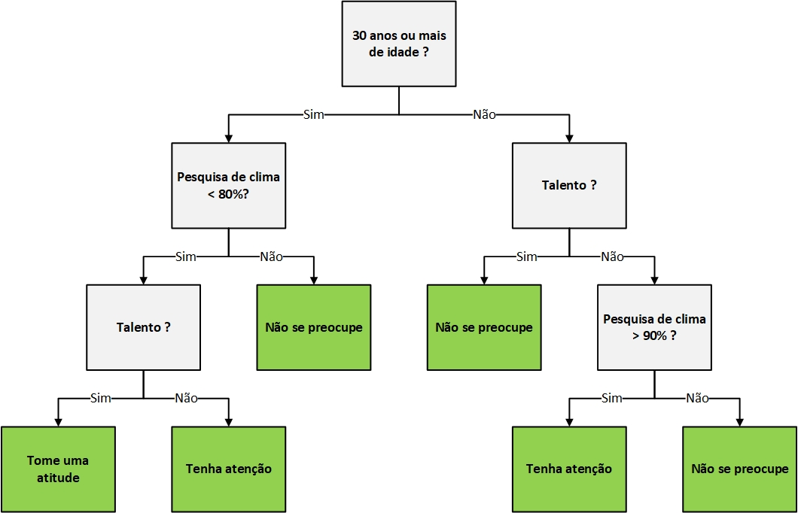
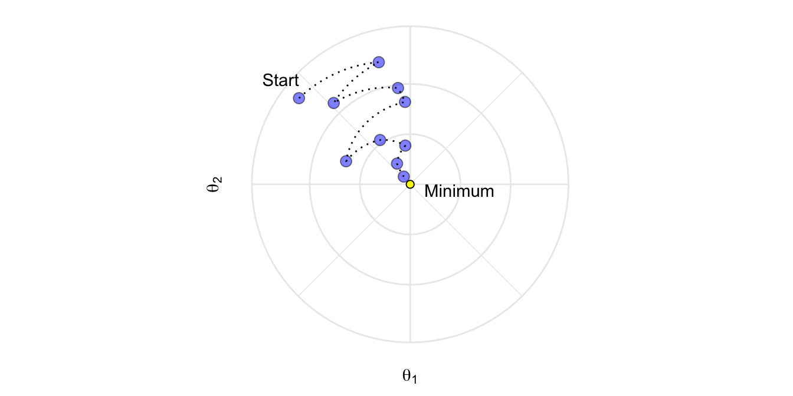

```{r setup, include=FALSE, warning=FALSE, message=FALSE}
knitr::opts_chunk$set(echo = FALSE, message = FALSE, warning = FALSE)

# Remove scientific notation
options(scipen=999, warn = -1)
```

___

**Atenção, este documento é o apêndice dos relatórios de *Machine Learning* criados pela equipe de Dados da Tembici.**

___

Neste documento são apresentadas as explicações dos modelos de *machine learning* utilizados nos processos de predição relacionado à diferentes problemas de negócio. 

A estrutura deste Apêndice está dividida da seguinte forma:

- Primeiramente, apresenta-se a lógica por trás das árvores de decisão, que não são utilizadas diretamente, mas que são as bases para algoritmos como *random forest* e GBM e XGBoost;
- Na segunda parte, explica-se o conceito de *Random Forest*;
- Na sequência, ocorre a explicação sobre *Gradient Boost Machine* (GBM);
- Em seguida, apresenta-se o conceito de *XGBoost*;
- A próxima parte mostra a lógica do modelo de *Deep Learning*;
- Por fim, é exposto o conceito de *grid search* e como ocorre a otimização dos algoritmos;

# Árvore de Decisão

Uma árvore de decisão é uma ferramenta de **suporte à tomada de decisão** que usa um gráfico no formato de árvore e demonstra visualmente as condições e as probabilidades para se chegar a resultados. O algoritmo utilizado para chegar na representação visual da árvore pertence ao grupo de **aprendizado de máquina supervisionado**, e funciona tanto para **regressão** (por exemplo, para saber salário esperado de um colaborador) quanto para **classificação** que é nosso objetivo para avaliar se um colaborador se desligará voluntariamente ou não da empresa.

Para facilitar o entendimento, abaixo uma árvore de decisão:

<br/><br/>

<center></center>

<br/><br/>

A partir deste exemplo, podemos observar alguns pontos importantes sobre a criação de uma árvore de decisão:

-	O primeiro nó é chamado de **nó raiz**;
-	Chamamos de **nó interno** ou apenas de **nó** os que têm setas apontando para eles e setas apontando para fora deles (em cinza);
-	Chamamos de **nó folha** ou apenas **folha** os que têm setas apontando para eles, mas não possuem setas apontando para fora deles (em verde);
- Um nó pode representar um corte da mesma variável em mais de uma vez;
-	O valor de corte de uma variável numérica não precisa ser o mesmo em todas as vezes que ela aparecer (observe a variável pesquisa de clima);
-	A ordem das questões não necessariamente precisa ser a mesma em ambos os lados (observe a questão sobre o talento).

O processo de construção da árvore é chamado de **indução** (tipo de raciocínio que consiste em afirmar uma verdade generalizada a partir da observação de alguns elementos) e pode exigir bastante poder computacional. **O propósito da árvore de decisão é fazer diversas divisões dos dados em subconjuntos, de tal forma que os subconjuntos fiquem cada vez mais puros**. Um subconjunto dos dados será mais puro na medida em que contém menos classes (ou apenas uma) da variável *target*.

Como exemplo, suponha que temos o seguinte conjunto de dados e que nosso objetivo é criar uma árvore de decisão que avalie se um colaborador deixará ou não a empresa (a variável *target* será **Turnover voluntário**).

<center>

|**Talento?** |**Gest. consequência?**|**Hora extra?** |***Turnover* voluntário?**|
|:--:|:--:|:--:|:--:|
|Não |Não |Não |Não |
|Sim |Sim |Sim |Sim |
|Sim |Sim |Não |Não |
|Sim |Não |NA | Sim |
|... |... |... |... |

</center>

**Primeiro passo:** Queremos saber se as variáveis **talento**, **gest. consequência** ou **hora extra** estão no topo da árvore. Para isso, olhamos quão bem cada variável sozinha consegue prever a variável ***turnover* voluntário**. A árvore de decisão preliminar para cada variável é mostrada na sequência. 

Como exemplo de como criamos tais árvores, vamos analisar a variável **talento**. Olhando para a tabela, percebemos que o primeiro colaborador (primeira linha da tabela) não era talento e não se desligou voluntariamente.  Ele então é contabilizado como um dos 125 colaboradores que têm a mesma característica na base de dados. Por outro lado, observe o segundo colaborador (segunda linha da tabela) que é um talento e se desligou voluntariamente. Ele é contabilizado como um dos 105 colaboradores que têm a mesma característica. Continuando esse processo para cada colaborador e variável na tabela de dados, podemos gerar as árvores abaixo:

<br/><br/>

<center></center>

<br/><br/>

Observe que nenhum nó folha tem 100% tanto para sim ou para não na variável de interesse, neste caso *turnover* voluntário. Em função disso, **dizemos que eles são impuros**. Caso contrário, a variável que gera o nó folha com 100% deveria estar no topo da árvore. Como este não é o nosso caso, precisamos mensurar qual separação é melhor, ou seja, **menos impura**. 

Existem diversas formas de avaliar a **impureza** de um nó folha [^3]. A utilizada no relatório desenvolvido é o índice de Gini. Esse índice é cálculado para cada nó pela seguinte equação:

[^3]: Índice de Gini, Qui-Quadrado, Ganho de Informação, Redução na Variância.


$$
\text{Índice de Gini} = 1 - \sum_{i=1}^{c}{p_i^2}
$$

Em que $p_i$ é a frequência relativa de cada classe em cada nó e $c$ é o número de classes (no nosso caso, $c=2$ para sair ou não voluntariamente). Quando este índice é igual a $0$, o nó é puro. Por outro lado, quando ele se aproxima de $1$ o nó é impuro.

**Exemplo:** Imagine que queremos separar (em relação a sair ou não voluntariamente) os colaboradores com base na variável talento. O primeiro passo é obter, para cada divisão possível, o valor para o índice de Gini. Assim, o cálculo abaixo mostra o caso onde o colaborador é um talento ($\text{talento}  = \text{Sim}$):

$$
\begin{split}
\text{Índice de Gini}_{\text{talento}  = \text{Sim}} &= \left[1-\left(\frac{\text{turnover vol.} = \text{Sim}}{\text{talento}  = \text{Sim}} \right)^2 - \left(\frac{\text{turnover vol.} = \text{Não}} {\text{talento} = \text{Sim}} \right)^2\right] \\
& \\
&= \left[1-\left(\frac{105}{105+39}\right)^2-\left(\frac{39}{105+39}\right)^2\right] \\
& \\
& = 0.395
\end{split}
$$


Agora, quando o colaborador não é um talento ($\text{talento}  = \text{Não}$):

$$
\begin{split}
\text{Índice de Gini}_{\text{talento}  = \text{Não}} &= \left[1-\left(\frac{\text{turnover vol.} = \text{Sim}}{\text{talento}  = \text{Não}} \right)^2 - \left(\frac{\text{turnover vol.} = \text{Não}} {\text{talento} = \text{Não}} \right)^2\right] \\
& \\
& = \left[1-\left(\frac{34}{34+125}\right)^2-\left(\frac{125}{34+125}\right)^2\right] \\
& \\
& = 0.336
\end{split}
$$

Após isso, obtemos o índice de Gini ponderado para a variável talento:


$$
\begin{split}
\text{Índice de Gini}_{\text{talento}} &= \frac{\text{Col. talento}}{\text{Colaboradores}} \times  0.395 + \frac{\text{Col. não talento}}{\text{Colaboradores}}\times 0.336 \\
& \\
& = \frac{144}{144+59} \times 0.395 + \frac{159}{144+159}\times 0.336 \\
& \\
& = 0.364
\end{split}
$$


Fazendo o mesmo para as demais variáveis, encontramos os resultados abaixo:

<center>
| | Talento? | Gest. consequência? | Hora extra? |
|:--:|:--:|:--:|:--:|
| Índice de Gini | 0.364 | 0.360 | 0.381 |
</center>

Assim, podemos perceber que a variável que melhor separa colaboradores que saem ou não voluntariamente é **gest. consequência**, pois tem o **menor valor para o Índice de Gini**. Logo, ela será o nó raiz da árvore e a versão preliminar da árvore de decisão é:

<br/><br/>

<center></center>

<br/><br/>

Este é apenas o primeiro resultado da nossa árvore. Agora, nosso objetivo é verificar como as variáveis talento e hora extra separam os 164 colaboradores com gest. consequência (37 com *turnover* voluntário e 127 sem *turnover* voluntário) bem como os 133 colaboradores que não tem gest. consequência (100 com *turnover* voluntário e 33 sem *turnover* voluntário) em relação a se desligar ou não voluntariamente. 

Para tanto, fazemos o mesmo que anteriormente e escolhemos a variável que melhor faz isso usando o Índice de Gini, pois não temos nó folha com 100% para “Sim” (se desligou voluntariamente) ou “Não” (não se desligou voluntariamente).  Abaixo, a divisão realizada por cada uma das duas variáveis e os respectivos valores para o Índice de Gini:

<br/><br/>

<center></center>

<br/><br/>

<center>
|  | Talento? | Hora extra?
|:--:|:--:|:--:|
| Índice de Gini | 0.3 | 0.29 |
</center>

Encontramos que a variável com menor impureza após a decisão de usar a variável gest. consequência como nó raiz é a variável hora extra, uma vez que possui menor valor para o Índice de Gini. Assim, a nova versão da árvore é:

<br/><br/>

<center></center>

<br/><br/>

Perceba que ainda estamos com um nó folha impuro. Em função disso, precisamos continuar na tentativa de encontrar um nó folha o mais puro possível. Navegando na árvore com colaboradores com gest. consequência e hora extra, encontramos 49 colaboradores (24 com *turnover* voluntário e 25 sem *turnover* voluntário). Agora só temos a variável talento e precisamos avaliar quão bem ela separa estes 49 colaboradores.  A árvore abaixo mostra tal resultado:

<br/><br/>

<center></center>

<br/><br/>

Observe que a variável talento consegue distinguir bem quem tem *turnover* voluntário de quem não tem, pois a maior parte dos colaboradores (17) que são talentos (mantendo o restante da navegação até chegar neste nó) se desligaram voluntariamente enquanto a maior parte dos que não são talentos não se desligaram voluntariamente. Esse, então, é o nosso nó folha para o caminho. 

Agora, se olharmos para o caso onde os colaboradores não fazem hora extra, percebemos que a maioria neste nó são de colaboradores que não se desligaram voluntariamente. Se usarmos a variável talento para tentar separar os 115 colaboradores (13 com *turnover* voluntário e 102 sem *turnover* voluntário), não encontramos uma boa separação como mostra o resultado abaixo:

<br/><br/>

<center></center>

<br/><br/>

O índice de Gini para o nó talento é de 0.29 enquanto que o índice de Gini antes de usar a variável era de 0.2 e, em função disso, é melhor não usar a variável talento quando o colaborador não faz hora extra. A árvore então se torna:

<br/><br/>

<center></center>

<br/><br/>

Observe que fizemos a análise apenas para o lado da árvore onde o colaborador tem gest. consequência. Se a mesma abordagem for realizada para o outro lado da árvore, teremos a seguinte árvore:

<br/><br/>

<center></center>

<br/><br/>

Perceba que para construir os dois lados da árvore seguimos os passos abaixo:

1. Calcular o índice de impureza de Gini;

2. Se o nó sozinho tem índice de Gini menor do que separar os colaboradores usando outra variável qualquer, não fazemos a separação e o nó se torna um nó folha;

3. Se separar os colaboradores resulta em diminuir a impureza, usamos a variável que proporcionou a menor impureza para dividir os colaboradores.

Perceba que todos os dados que usamos eram do tipo “Sim” ou “Não”. Como seria este processo se uma das variáveis fosse do tipo numérica, por exemplo o tempo na empresa do colaborador? Como identificar o tempo na empresa que devemos usar para dividir os colaboradores?

<center>
| **Tempo na empresa** | ***Turnover* voluntário?** |
|:---:|:---:|
| 220 | Não |
| 180 | Sim |
| 225 | Sim |
| 190 | Não |
| 155 | Não |
</center>

Os passos são:
 
1. Ordenar os colaboradores pelo tempo na empresa do menor para o maior:

<center>
| **Tempo na empresa** | ***Turnover* voluntário?** |
|:--:|:--:|
| 155 | Não |
| 180 | Sim |
| 190 | Não |
| 220 | Sim |
| 225 | Sim |
</center>

2. Calcular o tempo na empresa médio para todos os colaboradores próximos (dois a dois) e obter o índice de Gini para cada tempo na empresa médio:

<center>
| **Tempo na empresa** | **Índice de Gini?** |
|:--:|:--:|
| 167.5 | 0.3 |
| 185 | 0.47 |
| 205 | 0.27 |
| 222.5 | 0.4 |
</center>

3. Escolher o valor do tempo na empresa que melhor separa os colaboradores com ou sem *turnover* voluntário

Agora, considere o exemplo de dados do tipo categórico. Podemos ter uma variável categórica ordenada como uma escala likert (1: Discordo totalmente, 2: Discordo parcialmente, 3: Não concordo, nem discordo, 4: Concordo parcialmente, 5: Concordo totalmente) ou dados sem ordenação, como escolher entre diferentes cores (azul, vermelho, amarelo). 

Para uma variável deste tipo, temos um procedimento semelhante ao que fizemos com dados numéricos. Porém, agora obtemos o Índice de Gini para todas as possíveis ordens (note que não calculamos para o Rank <= 4, pois ele inclui todas as observações), ou seja:

<br/><br/>

<center></center>

<br/><br/>

Quando temos múltiplas escolhas para uma variável como o caso de escolher três cores (azul, verde e vermelho), temos as seguintes opções (note que não é necessário calcular o Índice de Gini para escolher entre azul, verde e vermelho, pois inclui todas as observações):

<br/><br/>

<center></center>

<br/><br/>

Assim, é possível perceber que também usamos uma medida de impureza (aqui, o índice de Gini) para separar variáveis numéricas (como o tempo de empresa), categóricas ordenadas (como uma escala likert) e categóricas com mais de duas categorias (o exemplo das cores). A diferença é como definimos as diversas divisões que cada uma destas variáveis permite gerar para calcular o índice de Gini. 


## *Random Forest*

Como mostramos anteriormente, árvores de decisão são fáceis de se construir, usar e interpretar. Porém, na prática, elas podem apresentar alguns problemas. O livro <a href="https://web.stanford.edu/~hastie/Papers/ESLII.pdf" target="_blank">*The Elements of Statistical Learning*</a> afirma que a imprecisão das árvores é um aspecto que impede que elas sejam uma ferramenta ideal para previsão. Em outras palavras, elas funcionam muito bem com os dados utilizados para criá-las, mas quando usamos dados novos elas não são flexíveis o suficiente para gerarem boas previsões.

Neste sentido, surgiu o algoritmo de **floresta aleatória** (*random forest*). A ideia do *random forest* é criar uma floresta a partir da combinação de diversas árvores de decisão, resultando em uma grande melhoria na acurácia da previsão. Os passos para criar a floresta aleatória (*random forest*) são:

1. Criar uma reamostragem dos dados usando **_bootstrap_**.

Imagine a amostra de dados que usamos anteriormente para criar a árvore de decisão, mostrada na tabela abaixo. Suponha que os únicos dados que possuímos sejam estas 4 observações, e que a partir deles desejamos criar uma árvore.

Isso representa uma amostra bastante pequena e qualquer resultado da árvore de decisão pode ser impreciso.

<center>
|**Talento** |**Gest. consequência?**|**Hora extra?** |***Turnover* voluntário?**|
|:--:|:--:|:--:|:--:|
|Não |Não |Não |Não |
|Sim |Sim |Sim |Sim |
|Sim |Sim |Não |Não |
|Sim |Não |NA | Sim |
</center>

Para criar um conjunto de dados por meio de reamostragem do mesmo tamanho do original, vamos selecionar aleatoriamente amostras (linhas) do conjunto de dados original. Um detalhe importante é que é permitido selecionar a mesma amostra mais de uma vez.

2. Com os dados obtidos por meio da reamostragem, criar uma árvore de decisão, mas usando apenas uma amostra de variáveis (colunas) por etapa:

Supondo que vamos usar apenas 2 das 4 variáveis disponíveis, escolhe-se dentre estas 2 variáveis selecionadas aleatoriamente, a que vai ficar no nó raiz. Seguimos o mesmo procedimento para criação de uma árvore de decisão mostrado anteriormente, ou seja, escolheremos dentre as 2 variáveis a que melhor divide os colaboradores com ou sem *turnover* voluntário usando o índice de impureza de Gini. 

Uma vez definido o nó raiz, continuamos selecionando aleatoriamente 2 variáveis das 3 remanescentes, dando continuidade a criação da árvore. Fazendo isso em cada etapa, acabamos criando a árvore de decisão como usualmente, mas considerando apenas um subconjunto de variáveis aleatórias a cada passo. 

3. Retornarmos ao passo 1 e repetimos até o passo 2 para construir outra árvore de decisão usando apenas um subconjunto de variáveis em cada passo. 

Idealmente, fazemos isso diversas vezes (por exemplo, 100 vezes). Utilizando um conjunto de dados originados por reamostragem dos dados originais (bootstrap) e um subconjunto de variáveis aleatoriamente escolhidas em cada etapa, teremos uma grande variedade de árvores. **Esta variedade é o que torna o random forest mais eficiente do que árvores individuais.**

Uma vez que temos todas as informações de um novo colaborador, nosso objetivo é antecipar se ele se desligará ou não voluntariamente da empresa. Como fazer essa avaliação utilizando o *random forest*?

* Pegamos os dados deste colaborador e avaliamos em cada árvore de decisão que criamos no processo de *random forest*;

* Computamos qual a maior frequência de decisão (“Sim” ou “Não”) quando finalizarmos a verificação por todas as árvores de decisão;

* A decisão que tiver maior quantidade de votos será a previsão do *random forest*.

É importante notar que denominamos de  **_bagging (bootstrap aggregation)_**[^4] o processo de tomada de decisão usando dados de **reamostragem** (**_bootstrap_**) juntamente com a agregação (**_aggregation_**) dos resultados.


[^4]: Tecnicamente, chamamos o processo de combinar classificações de classificadores individuais como [**_ensemble method_**](https://en.wikipedia.org/wiki/Ensemble_learning). Assim, **_bagging (bootstrap aggregation)_** é um tipo de **_ensemble method_**. 


O *random forest*, assim como qualquer outra técnica de modelagem estatística, possui erros associados às suas previsões. Porém, como podemos mensurar o erro de um *random forest*?

* Quando criamos a reamostragem dos dados (*bootstrap*), não necessariamente selecionamos todos os colaboradores (linhas), além de permitirmos que existam linhas duplicadas na reamostragem. Como resultado, algum colaborador (linha) pode não ter sido usado na criação das árvores de decisão do *random forest*. Tipicamente, 1/3 dos dados originais acabam não incorporando a reamostragem;

* Com os dados não usados na reamostragem (também chamado de **_out-of-bag-dataset_**), podemos avaliar se o *random forest* rotula corretamente se os colaboradores se desligarão ou não voluntariamente da empresa. Para isso, testamos cada uma das árvores de decisão criadas pelo *random forest* e o rótulo com maior votação será a previsão da árvore. Uma vez que possuímos a verdadeira resposta do dado, podemos avaliar a performance de nossa *random forest* mensurando a proporção de erros (**_out-of-bag-error_**).

Finalmente, sabemos como criar uma *random forest*, usar seus resultados e avaliá-los. Porém, perceba que fizemos isso por meio de reamostragem dos dados, com a seleção aleatoria de 2 variáveis das 4 possíveis em cada etapa de criação de cada árvore de decisão. Além disso, definimos um número de árvores que o *random forest* deveria criar.

Imagine que, se ao invés de usar 2 de 4 variáveis, optássemos por outro número qualquer, e que o número de árvores fosse uma quantidade distinta de 100. Se isso fosse feito, teríamos outros resultados de acurácia do nosso *random forest*. Em *machine learning* temos uma etapa do processo conhecida como **_grid search_** que faz exatamente isso. Definimos um espaço de parâmetros para o *random forest* e deixamos com a máquina o trabalho de fazer diversos *random forest* de acordo com os parâmetros definidos, escolhendo a configuração de *random forest* que tem menor erro de rotulação. Mais detalhes serão explicados ao final deste relatório, se seção sobre [*grid search*](#gridsearch). 

# *AdaBoost* e *GBM*

Outros algoritmos que podemos utilizar como alternativas para antecipar se um colaborador se desligará ou não voluntariamente da empresa são o **_Adaptive Boosting (AdaBoost)_** e o **_Gradient Boosting[^5] Machine (GBM)_**, que também combinam diversas árvores de decisão em busca de uma melhor performance de previsão. 

Para facilitar o entendimento, primeiro vamos apresentar o **_Adaptive Boosting (AdaBoost)_** e após isso, aprender sobre o **_Gradient Boosting[^6] Machine (GBM)_**. 

## Adaptive Boosting (AdaBoost)

Antes de apresentarmos os detalhes do AdaBoost, a tabela a seguir mostra as principais diferenças entre o **_Random Forest_** e o **_Adaptive Boosting (AdaBoost)_**:

[^5]: **_Boosting_** utiliza uma média ponderada para tornar *weak learners* em *strong learners*, sendo assim outro tipo de **_ensemble method_**. Porém, é o contrário de **_bagging_**, em que cada árvore de decisão é executada independentemente e a média das classificações é então obtida sem preferência por qualquer árvora de decisão.


<center>
| **_Random Forest_** | **_AdaBoost_** |
|:------------------------------------------------------------------------------------------:|:-----------------------------------------------------------------------------------------------------------------------------------------:|
| Combinação de árvores de decisão (tornar *weak learners* em *strong learners*) | Combinação de árvores de decisão (tornar *weak learners* em *strong learners*)|
| As árvores são criadas paralelamente e podem ter vários nós. Temos uma floresta de árvores | Cada árvore é criada sequencialmente e tem apenas um nó e duas folhas (chamamos tecnicamente tais árvores de *stumps*/tocos). Temos uma floresta de *stumps* |
| As árvores podem ser de tamanhos diferentes | *Stumps* sempre têm o mesmo tamanho |
| O peso de cada árvore para a classificação final é o mesmo | Uma árvore pode ter um peso maior para a classificação final |
| Cada árvore é feita independentemente da outra (a ordem de criação não altera o resultado) | A ordem de criação é importante, pois o erro que o primeiro *stump* comete influencia como o segundo *stump* é feito e, assim, sucessivamente |
| *Ensemble method: bagging* |  *Ensemble method: boosting* |
</center>

No contexto do _AdaBoost_ um classificador é entendido como "fraco" (*weak*) quando sua taxa de erros é apenas um pouco melhor que as tentativas aleatórias de acertar. A proposta do *boosting* é de aplicar sequencialmente diversos  classificadores "fracos" em versões modificadas dos dados, produzindo uma sequência de classificadores fracos (*weak learners*). Esta sequência de classificadores vai alterando os pesos das observações, de tal forma que aquelas que foram previstas erroneamente ganham pesos maiores para forçar o classificador a focar nelas.

Resumindo, temos três pontos importantes sobre **_AdaBoost_**:

1. Combina uma quantidade de *weak learners* para fazer classificações. Os *weak learners* são *stumps* (árvores de decisão de apenas um nível, ou seja, o nó raiz já se comunica diretamente com os nós folhas).
2. Alguns *stumps* podem ter maior peso para a classificação final.
3. Cada *stump* é feito considerando o erro do *stump* anterior.

Para facilitar o entendimento de como funciona o **_AdaBoost_**, vamos continuar com o objetivo de classificar se um colaborador se desligará ou não voluntariamente da empresa. Para tanto, vamos usar a amostra abaixo:

| Talento? | Hora Extra? | Tempo na empresa | Turnover voluntário? | Peso da Amostra |
|:-------------:|:-------------------:|:----:|:----------------:|:---------------:|
| Sim | Sim | 205 | Sim | 1/8 |
| Não | Sim | 180 | Sim | 1/8 |
| Sim | Não | 210 | Sim | 1/8 |
| Sim | Sim | 167 | Sim | 1/8 |
| Não | Sim | 156 | Não | 1/8 |
| Não | Sim | 125 | Não | 1/8 |
| Sim | Não | 168 | Não | 1/8 |
| Sim | Sim | 172 | Não | 1/8 |

Observe que agora, além das variáveis de interesse (talento, hora extra, tempo na empresa e *turnover* voluntário), temos uma coluna que representa o peso da amostra em relação à amostra total. No começo do processo do **_AdaBoost_**, esse peso é igual (significa que todas as linhas têm a mesma importância) e como estamos com apenas 8 observações atribuímos o valor $\frac{1}{8}$.

Contudo, após criar o primeiro *stump*, esses pesos mudarão em ordem a definir como o próximo *stump* será criado. Para criar o primeiro *stump* da floresta, praticamente seguimos os passos que conhecemos quando entendemos a árvore de decisão:

1. Avaliamos a capacidade de cada uma das variáveis de interesse em separar colaboradores com e sem *turnover* voluntário. Ou seja, por meio do índice de Gini identificamos a variável menos impura (menor valor do índice de Gini).

    * Nesta etapa não usamos a variável **peso da amostra**.
    
    * A variável **tempo na empresa** é numérica e usamos o método já apresentado anteriormente na seção de árvores de decisão para definir a regra desta variável (aqui, **tempo na empresa maior que 176**).
    
    * Para as 8 observações mostradas anteriormente, a variável **tempo na empresa** tem o menor índice de Gini e seu *stump* é:

<br/><br/>

<center></center> 

<br/><br/>

2. Uma vez definido o primeiro *stump*, precisamos estabelecer o quanto ele representa (chamaremos de representação) para a classificação final, baseando em quão bem ele classifica uma amostra.

    * Observe que, se usarmos os dados da amostra no *stump*, teremos apenas um erro para o colaborador na linha 4 (a regra do *stump* para o peso diz que ele não terá *turnover* voluntário, mas ele teve).
    
    * O **erro total** é a soma dos pesos associados com as amostras incorretamente classificadas (no nosso caso, o peso será $\frac{1}{8}$[^6]).
    
        * O erro total está sempre entre 0 (*stump* perfeito) e 1 (*stump* horrível).
        
    * A representação do *stump* é originado a partir do **erro total** conforme a fórmula $representacao = \frac{1}{2}\log\left(\frac{1-\text{erro total}}{\text{erro total}}\right)$, que nos diz:
    
        * Quanto mais próximo de $0$ o erro total, **maior o valor positivo** para a representação do *stump* na classificação final.
        
        * Quanto mais próximo de $1$ o erro total, **maior o valor negativo** para a representação do *stump* na classificação final. Em caso de, por exemplo, o *stump* classificar um colaborador dizendo que ele **se desligará voluntariamente**, o peso vai transformar para **não se desligará voluntariamente**. 
        
    * Para a variável escolhida (**tempo na empresa**) como primeiro *stump*, a representação será $\frac{1}{2}\log\left(\frac{1-\frac{1}{8}}{\frac{1}{8}}\right)=0.97$[^7] 


[^6]: Para a variável **talento** o erro total é de $3 \times \frac{1}{8}=\frac{3}{8}$, pois temos três linhas que a regra do *stump* desta variável classificaria erroneamente. Já para a variável **hora extra** o erro total é de $4 \times \frac{1}{8}=\frac{1}{2}$, pois temos quatro linhas que a regra do *stump* da variável também classificaria de forma errada.

[^7]: Para a variável **talento** a representação será $\frac{1}{2}\log\left(\frac{1-\frac{3}{8}}{\frac{3}{8}}\right)=0.25$ enquanto que para a variável **hora extra** é $\frac{1}{2}\log\left(\frac{1-\frac{1}{8}}{\frac{1}{8}}\right)=0$. Observe que que a variável com maior índice de Gini (mais impura) foi a que apresentou menor representação. 

Agora, já temos o primeiro *stump*. Mas quando ele foi criado, todas as amostras tinham o mesmo peso $\left(\frac{1}{8}\right)$ e isso quer dizer que não enfatizamos a importância de classificar corretamente qualquer amostra particular. 

Uma vez que o primeiro *stump* classificou incorretamente uma amostra (linha 4), vamos enfatizar a necessidade do próximo *stump* classificar corretamente esta amostra (linha 4) aumentando o peso desta amostra e diminuindo o peso de todas as outras amostras (as linhas restantes). Para isso, retornamos à base de dados e atribuímos um novo peso para cada amostra, como segue:

* **Aumentar o peso das amostras incorretamente classificadas:** usamos a fórmula $\text{Novo Peso} = \text{Peso Anterior}\times e^{\text{representacao do stump}}$ para isso. Como temos apenas uma amostra/linha, o seu novo peso será $\frac{1}{8}e^{0.97}=0.33$. Este peso é maior que o peso inicial para esta amostra no primeiro *stump* ($\frac{1}{8}$).

* **Diminuir o peso das amostras corretamente classificadas:** usamos a fórmula $\text{Novo Peso} = \text{Peso Anterior}\times e^{-\text{representacao do stump}}$. Como o primeiro *stump* classificou corretamente o restante da amostra, para tais linhas o novo peso será $\frac{1}{8}e^{-0.97}=0.05$

* **Padronizar os pesos para que somem 1:** no processo de criação do primeiro *stump* demandamos que a soma dos pesos fosse igual a 1, porém os novos pesos não necessariamente somam 1. Para que isso ocorra com os novos pesos, devemos **dividir cada novo peso pela soma dos novos pesos**. Para o nosso exemplo, a soma dos pesos é igual a $0.68$


Assim, temos a seguinte tabela com os pesos antigos e novos:

| Talento? | Hora Extra? |Tempo na empresa | Turnover voluntário? | Peso da Amostra | Novo Peso da Amostra | Peso da Amostra Padronizado
|:-------------:|:-------------------:|:----:|:----------------:|:---------------:|:---------------:|:---------------:|
| Sim | Sim | 205 | Sim | 1/8 | 0.05 | 0.07 |
| Não | Sim | 180 | Sim | 1/8 | 0.05 | 0.07 |
| Sim | Não | 210 | Sim | 1/8 | 0.05 | 0.07 |
| Sim | Sim | 167 | Sim | 1/8 | 0.33 | 0.49 |
| Não | Sim | 156 | Não | 1/8 | 0.05 | 0.07 |
| Não | Sim | 125 | Não | 1/8 | 0.05 | 0.07 |
| Sim | Não | 168 | Não | 1/8 | 0.05 | 0.07 |
| Sim | Sim | 172 | Não | 1/8 | 0.05 | 0.07 |


Após isso, os novos dados para a criação do segundo *stump* considerando os novos pesos serão:

| Talento? | Hora Extra? | Tempo na empresa | Turnover voluntário? | Peso da Amostra 
|:-------------:|:-------------------:|:----:|:----------------:|:---------------:|
| Sim | Sim | 205 | Sim | 0.07 |
| Não | Sim | 180 | Sim | 0.07 |
| Sim | Não | 210 | Sim | 0.07 |
| Sim | Sim | 167 | Sim | 0.49 |
| Não | Sim | 156 | Não | 0.07 |
| Não | Sim | 125 | Não | 0.07 |
| Sim | Não | 168 | Não | 0.07 |
| Sim | Sim | 172 | Não | 0.07 |

Observe que poderíamos usar os novos pesos para obter o índice de Gini ponderado para cada variável e, assim, determinar qual delas deveria estar no próximo *stump*. O índice de Gini ponderado colocaria maior peso sobre corretamente classificar a amostra que foi incorretamente classificada no primeiro *stump* (neste caso, amostra 4). 

Alternativamente, ao invés de usar o índice de Gini ponderado, podemos criar uma nova amostra (do mesmo tamanho da original, com 8 linhas) que contenha linhas duplicadas das amostras com maior peso da seguinte forma:

1. Escolhemos um número aleatório entre $0$ e $1$.

2. Verificamos onde esse número cai quando usamos a variável peso da amostra como uma distribuição:
    * Suponha que escolhemos aleatoriamente um número entre $0$ e $0.07$ na primeira etapa. Então, colocamos esta amostra na primeira linha do novo conjunto de dados.
    
    * Se na segunda etapa escolhemos um número entre $0.07$ e $0.14$ então, colocamos esta amostra na segunda linha do novo conjunto de dados, e assim sucessivamente até preencher as 8 observações do novo conjunto de dados.
    
    * Observe que usamos valores acumulados para a variável peso da amostra para definir qual linha usar no novo conjunto de dados.
    
3. O novo conjunto de dados pode ter mais que uma linha da amostra que possui o maior peso.

Agora, com o novo conjunto de dados, retornamos o peso de $\frac{1}{8}$ para cada amostra e executamos novamente o processo de criação do *stump* (agora, o segundo). Como temos mais de uma amostra da linha erroneamente classificada no primeiro *stump*, o segundo *stump* provavelmente classificará tal linha de forma correta. 

Desta forma, este é o procedimento realizado pelo **_AdaBoost_** conhecido como "aprendizagem para frente" que, diferentemente do **_random forest_**, adapta em cada etapa de criação do *stump* os erros cometidos anteriormente. A classificação final da floresta de *stumps* será:

* Imagine que na floresta temos um conjunto de *stumps* que classifica um colaborador como **se desligará voluntariamente** e outros que classificam como **não se desligará voluntariamente**. Então, agrupamos os *stumps* conforme a classificação.

* Somamos o quanto cada grupo de *stumps* representa (usamos o cálculo de representação de cada *stump*).

* Decidimos pelo grupo que tem a maior representação:

    * Se o grupo que se classifica como **se desligará voluntariamente** tem maior representação, o colaborador é classificado como **se desligará voluntariamente**.
    
    * Se o grupo que se classifica como **não se desligará voluntariamente** tem maior representação, o colaborador é classificado como **não se desligará voluntariamente**.

O _AdaBoost_, com sua abordagem de *stumps* e *boosting*, tende a apresentar *performance* superior com relação a uma única árvore de decisão, mesmo que possua inúmeros nós.


## Gradient Boosting Machine (GBM)

Outro algoritmo que pode ser utilizado para identificar colaboradores inclinados a pedir demissão é o **_Gradient Boosting Machine (GBM)_**. Dado que a ideia geral de *boosting* é de modificar *weak learners* para que se tornem melhores, o GBM aplica o *boosting* como um problema de otimização numérica, em que o objetivo é minimizar a perda do modelo ao adicionar *weak learners* utilizando *gradient descent* como procedimento.

O GBM também treina muitas árvores de maneira gradual, aditiva e sequencial, assim como ocorre no AdaBoost. A maior diferença em relação ao **_AdaBoost_**, porém, é a forma com que o **_Gradient Boosting Machine (GBM)_** identifica *weak learners*. Enquanto o **_AdaBoost_** faz tal identificação usando a ponderação das amostras, o **GBM** utiliza o gradiente descendente da função de perda (*loss function*) escolhida. 

A animação da figura abaixo exemplifica o ajuste gradual das árvores sequenciais (linha vermelha), até que o GBM reduza ao máximo possível o erro das árvores e se aproxime muito da função verdadeira dos dados simulados (linha azul).

<table>
  <tr>
    <td width="38%">
          A execução do GBM exige três elementos: </br>
          1. Uma função de perda a ser otimizada. </br>
          2. Um *weak learner* para fazer as predições; </br>
          3. Um modelo aditivo que melhora os *weak learners* para minimizar a função de perda.
    </td> 
    
    <td width="62%"> <p>
<figure style="float: right; height: 370px;">
  
  <figcaption><center>[Fonte.](http://uc-r.github.io/gbm_regression)</center></figcaption>
</figure>
</p>
  </td>
  
  </tr>
 
</table>


<!-- https://machinelearningmastery.com/gentle-introduction-gradient-boosting-algorithm-machine-learning/ -->

</br>

Antes de entrarmos nos detalhes do GBM segue a explicação do *gradient descent*, método de otimização utilizado pelo GBM.


### Gradient Descent (Gradiente Descendente)  {#gradient .unnumbered}

É um método iterativo de otimização que pode ser usado para encontrar parâmetros de um modelo (regressão linear, regressão logística, árvore de decisão, ...). Dependendo do modelo estatístico utilizado, tais parâmetros podem gerar uma reta ou uma curva. 

Imagine que temos a seguinte regressão linear simples (uma reta):

$$
salário_i = \beta_0 + \beta_1~anos ~ estudo_i + e_i~~~~i=\left\{1,...,n\right\}
$$

Em que $e_i$ é uma variável aleatória independente e identicamente distribuída (iid). Suponha que temos uma estimativa para a inclinação ($\hat{\beta}_1=2.3$) obtida pelo método de mínimos quadrados ordinários (MQO), a nossa equação anterior se torna:

$$
salário_i = \beta_0 + 2.3 ~anos ~ estudo_i 
$$

Como usar o **_Gradient Descent_** para ajustar uma reta aos dados, encontrando os valores ótimos para $\beta_0$ (intercepto)?

Primeiramente, suponha que escolhemos um valor para o intercepto ($\beta_0=0$). Tal valor é conhecido como "chute inicial" e poderia ser qualquer outro valor. Ele nos permite ter a seguinte equação:

$$
salário_i = 2.3 ~anos ~ estudo_i 
$$

A partir disso, podemos avaliar quão bem a reta gerada por esta equação se ajusta aos dados. Para tanto, usamos uma função de perda (**loss function**) chamada de **soma dos quadrados dos resíduos** (SSE, do inglês *sum squared error*). Um ponto importante é que, dependendo do problema em análise, a função de perda deve ser alterada. No nosso exemplo, usamos uma função de perda para um problema de regressão. Caso estivéssemos com um problema de classificação, essa função deveria ser alterada. 

A função de perda chamada de **soma dos quadrados dos resíduos (SSE)** para este caso é:

$$
\text{SSE} = \sum_{i}^{n}{\left(salário_i-\hat{salário}_i\right)^2}
$$

A equação nos mostra o quanto o valor previsto pela reta ($\hat{salário}_i$) para uma pessoa com determinados anos de estudo está distante do verdadeiro valor do salário desta pessoa ($salário_i$). Se, para cada pessoa, a distância $\left(salário_i-\hat{salário}_i\right)$ é a menor possível, temos o menor valor para a soma dos quadrados dos resíduos, ou seja, a função de perda foi minimizada. O $\hat{\beta}_0$ que proporciona essa otimização é o parâmetro que o método **_Gradient Descent_** tenta encontrar. Para o nosso caso onde assumimos $\beta_0=0$, teremos para cada pessoa os seguintes resíduos:

| $anos~estudos$ | $salário/hr$ | $\hat{salário}$ | $resíduo$ |
|:----:|:------:|:------:|:-------:|
| 10 | 25.50 | $10\times 2.3 = 23$ | $2.5$ |
| 14 | 35  | $14\times 2.3 = 32,2$ | $2.8$ |
| 12 | 28.2 | $12\times 2.3 = 27,6$ | $0.6$ |


Assim, a soma dos quadrados dos resíduos será:

$$
\text{SSE} = 2.5^2+2.8^2+0.6^2 = 14.45
$$

Observe que encontramos um valor para a soma dos quadrados dos resíduos usando $\beta_0=0$. Porém, e se optássemos por outro valor para $\beta_0$? Seria necessário então refazer todos estes cálculos. A decisão de escolher o $\hat{\beta}_0$ poderia demorar bastante, pois seria necessário avaliar a soma dos quadrados dos resíduos para diversos valores de $\beta_0$ e escolher o que torna tal soma a menor possível.

Felizmente, o **_Gradient Descent_** nos ajuda com isso por meio de uma lógica mais interessante. Para isso, se temos os os anos de estudo e o salário das pessoas, bem como a função inicial sem assumir qualquer valor para $\beta_0$ ($salário_i = \beta_0 + 2.3~anos~estudo_i$), podemos reescrever a soma dos quadrados dos resíduos como:

$$
\begin{split}
\text{SSE} &= \left[25.5-(\beta_0+2.3\times 10)\right]^2 + \left[35-(\beta_0+2.3\times 14)\right]^2 \\
\\ 
&+ \left[28.2-(\beta_0+2.3\times 12)\right]^2 \\
\end{split}
$$

Observe que agora temos a soma dos quadrados dos resíduos como uma função de um parâmetro ($\beta_0$ apenas, dado que assumimos que $\hat{\beta}_1=2.3$). Assim, temos a fórmula para definir a soma dos quadrados dos resíduos para diversos valores de $\beta_0$ para esta amostra de dados.

Em otimização, sabemos que a condição de primeira ordem para encontrar o valor de $\beta_0$ que otimiza tal função é a mesmo que torna a derivada desta função igual a zero, ou seja:

$$
\begin{split}
\frac{d}{d \beta_0}\left(\text{SSE}\right) &= -2\left[25.5-(\beta_0+2.3\times 10)\right] -2\left[35-(\beta_0+2.3\times 14)\right]\\
\\
&-2\left[28.2-(\beta_0+2.3\times 12)\right]
\end{split}
$$

O **_Gradient Descent_** usará esta derivada para encontrar o valor de $\beta_0$ que torna a soma dos quadrados dos resíduos a menor possível. Enquanto o método dos mínimos quadrados ordinários iguala tal derivada a 0, o **_Gradient Descent_** encontra o valor que minimiza a soma dos quadrados dos resíduos a partir de um chute inicial para $\beta_0$ e segue a busca usando um algoritmo específico. 

### Função de Perda {#funcoes_perda .unnumbered}

A **função de perda** (*loss function*) é uma medida que indica o quão bem os coeficientes do modelo se ajustam aos dados. A escolha de qual função utilizar dependerá do tipo de problema a ser resolvido. Um dos requisitos, porém, é que a função deve ser "diferenciável" para que possa ser otimizada. Por exemplo, problemas de regressão podem utilizar o quadrado do erro, já problemas de classificação podem usar função logarítmica como função de perda. Ainda que existam inúmeras funções que possam ser utilizadas, é também possível definir funções personalizadas. 

<!-- https://h2o-release.s3.amazonaws.com/h2o/master/3153/docs-website/h2o-docs/booklets/GBM_Vignette.pdf -->
<!-- https://medium.com/mlreview/gradient-boosting-from-scratch-1e317ae4587d -->

A lógica do GBM é que o modelo irá gerar uma predição inicial $\hat{y}$ (*weak learner*). Na sequência, os erros são computados (de forma genérica, o erro é a diferença entre o que foi previsto e o que de fato aconteceu) e se transformam em um novo $y$ a ser previsto por um novo modelo. No GBM, estes modelos geralmente são árvores de decisão. Cada etapa é chamada de *stump* e a decisão final do algoritmo será a soma de todas as respostas dos *stumps* anteriores.

A seguir é apresentado um exemplo do uso da função de perda utilizando a média dos quadrados do erro (MSE). A escolha pelo MSE deve-se à sua simplicidade e pelo seu vasto uso. A função utilizada no exemplo dado na explicação de *gradient descent* é a soma dos quadrados dos erros (SSE); a SSE e a MSE são muito parecidas, a única diferença é que a MSE divide a SSE pela quantidade de observações. Uma vez que a MSE é utilizada em casos de regressão, ela não pode ser utilizada no problema de predição de *turnover*. Logo, uma função específica para este caso será discutida na sequência. 

A função perda $L(y_i, \hat{y}_i)$ da média dos quadrados dos erros (MSE) é definida como:

$$
L(y_i, \hat{y}_i) = MSE = \frac{1}{n} \sum^n_{i=1}(y_i - \hat{y}_i)^2,
$$

sendo que $y_i$ é o *iésimo* valor da variável resposta, $\hat{y}_i$ é a *iésima* predição e $n$ é a quantidade de linhas de dados.

O gradiente da função de perda MSE com respeito às predições $\hat{y}_i$ é resolvido ao obter a derivada com relação às outras predições, que será:

<!-- https://mccormickml.com/2014/03/04/gradient-descent-derivation/ -->

$$
\frac{\delta}{\delta \hat{y}_i} L(y_i, \hat{y}_i)  = \frac{2}{n} \sum^n_{i=1}(y_i - \hat{y}_i).
$$


O que queremos é encontrar o mínimo da função de perda. Para isso o GBM irá utilizar *gradient descent* e seguir atualizando as predições baseado numa taxa de aprendizado. O operador $:=$ da equação a seguir indica justamente esta atualização dos valores de $\hat{y}$. Com esta abordagem, é possível encontrar o ponto onde a função de perda (MSE, no caso do exemplo citado) terá seu mínimo. Teremos então, a cada novo *stump*, uma atualização do valor predito, dado por:


 <!-- https://math.stackexchange.com/questions/227626/explanation-on-arg-min -->

$$
\hat{y}_i := \hat{y}_i + \alpha ~\times \frac{\delta \sum(y_i - \hat{y}_i)^2}{\delta \hat{y}_i},
$$

que se torna:

$$
\hat{y}_i := \hat{y}_i - \alpha ~\times 2 ~ \times \sum(y_i - \hat{y}_i), 
$$

em que $\alpha$ é a taxa de aprendizado (define o quão rápido o algoritmo se move para o *gradient descent*) e $\sum(y_i - y^p_i)$ a soma dos resíduos.


Dessa forma, basicamente o que é feito no *gradient descent* é atualizar as predições de tal forma que a soma dos resíduos seja zero ou mínima, e os valores preditos sejam o mais próximo possível dos valores reais.


<!-- https://mccormickml.com/2014/03/04/gradient-descent-derivation/ -->


Se tivéssemos um problema de classificação, poderíamos utilizar uma função de perda logística, definida a seguir. Nas equações considere que $M$ é o número de classes $c$; $log$ é o logaritmo natural; $y$ é um indicador binário para a classe $c$ na observação $i$; $\hat{y}$ é a probabilidade predita (ou seja, nas notações abaixo $\hat{y}$ não representa um número binário, mas sim uma probabilidade de ocorrência) .

<!-- https://medium.com/@phuctrt/loss-functions-why-what-where-or-when-189815343d3f -->

*Log loss* para classificação binária:

$$
L(y_i, \hat{y}_i)= \text{Log loss} =  -\left( y_{i}\cdot log\left(\hat{y}_i \right)+(1-y_{i})\cdot log\left(1 - \hat{y}_i \right) \right)
$$

*Log loss* para multi-classes, em que é calculada uma perda para cada classe por linha (observação) e o resultado é a soma:


$$
L(y_i, \hat{y}_i) = \text{Log loss} = - \sum^M_{i=1} y_{i,c} \cdot log(\hat{y}_{i,o})
$$

Para mais detalhes sobre a aplicação de gradiente na função *log-loss* veja [este link](https://ttic.uchicago.edu/~suriya/website-intromlss2018/course_material/Day3b.pdf).

Independente da função de perda utilizada, a lógica do GBM sempre será utilizar o gradiente para minimizar a função de perda. 

### Considerações Gerais sobre o GBM {.unnumbered}

Gradiente descendente é um algoritmo genérico de otimização capaz de encontrar soluções ótimas para uma ampla quantidade de problemas.

Como já mencionado, a ideia geral é de, iterativamente, alterar parâmetros para minimizar a função de custo (ou de perda). A figura a seguir exemplifica como o gradiente chegará ao mínimo por meio de uma taxa de aprendizado:

<!-- Adicionar parte deste [link](https://bradleyboehmke.github.io/HOML/gbm.html). -->

<p>
<center>
<figure style="height: 300px;">
  
  <figcaption><center>[Fonte.](https://bradleyboehmke.github.io/HOML/gbm.html)</center></figcaption>
</figure>
</center>
</p>


A taxa de aprendizado é definida pelo usuário. Em um primeiro momento pode-se imaginar que seria melhor definir uma taxa bastante pequena, para que seja possível chegar ao ponto de mínimo com maior precisão. Porém, quanto menor a taxa de aprendizado maior o processamento computacional exigido. Por outro lado, se a taxa de aprendizado for muito grande, então pode ocorrer que o ponto de mínimo seja "pulado" na otimização pelo gradiente. Veja a demonstração gráfica nas figuras abaixo. 

<p>
<center>
<figure style="height: 330px;">
  
  <figcaption><center>[Fonte.](https://bradleyboehmke.github.io/HOML/gbm.html)</center></figcaption>
</figure>
</center>
</p>

<!-- Vale lembrar, contudo, que nem todas as funcão são convexas.  -->

<!-- https://statweb.stanford.edu/~jhf/ftp/stobst.pdf -->

<!--  -->
<!-- <center>[Fonte.](https://bradleyboehmke.github.io/HOML/gbm.html)</center> -->


<!-- O terceiro passo para execução do GBM é o modelo aditivo. As árvores são adicionadas uma de cada vez e as árvores existentes não são alteradas. O procedimento de *gradient descent* é utilizado para minimizar a perda ao adicionar novas árvores. -->

<!-- Tradicionalmente, o *gradient descent* é usado para minimizar parâmetros, como coeficientes de uma equação de regressão ou os pesos em uma rede neural. Nestes casos, depois de calcular os erros os pesos são atualizados com o fim de minimizar os erros. -->

Em resumo, no GBM, ao invés de otimizar parâmetros, temos sub-modelos *weak learners* (árvores de decisão). Após o cálculo da perda, adiciona-se uma nova árvore de decisão para aplicar o procedimento do gradiente descendente, visando atingir a otimização do resultado. Isto é feito pela parametrização da nova árvore aplicando este procedimento sucessivamente. Para a realização do GBM, pode-se definir um número fixo de árvores ou ainda determinar que o treino pare no momento em que a perda atinge um nível aceitável ou que já não mais melhora o resultado final do algoritmo. Uma das desvantagens do GBM é que, por suas tentativas diversas de minimizar os erros, os *outliers* podem acabar sendo enfatizados, conduzindo o modelo a uma situação de *overfitting*. Essa desvantagem pode ser corrigida através do [*grid search*](#gridsearch), explicada adiante neste relatório. 

# *XGBoost* {#xgboost}

*XGBoost* é uma das implementações do conceito visto acima, de *Gradient Boosting*. O que diferencia esta técnica de um modelo de GBM usual é a utilização e formalização de um modelo com regularização (detalhado na sequência), que auxilia na redução do *overfitting* e produz uma melhor performance do modelo. 

* Para relembrar: *overfitting*, ou sobreajuste, ocorre quando um modelo tem excelente desempenho aos dados com os quais foi treinado, porém é incapaz de fazer uma boa generalização para novos dados. 

Em problemas de previsão, envolvendo dados não estruturados (imagens, texto, etc.), as redes neurais artificiais tendem a superar todos os outros algoritmos ou estruturas. No entanto, quando se trata de dados estruturados/tabulares de pequeno a médio porte, os algoritmos baseados em árvore de decisão são considerados os melhores da categoria no momento. **Dentre eles, o *XGBoost* tem ganhado grande destaque em termos de performance e acurácia**.  

* Para relembrar: ao contrário do *bagging*, em que as árvores são construídas paralelamente, **no *boosting*, as árvores são construídas sequencialmente, de modo que cada árvore subsequente tenha como objetivo reduzir os erros da árvore anterior**. Cada árvore aprende com seus antecessores e atualiza os erros residuais. Portanto, conforme a árvore cresce ela aprende com uma versão atualizada dos resíduos.

As principais similaridades entre o *XGBoost* e o *GBM* são:

* Ambos oferecem implementação do modelo de Árvores de Decisão, tanto para classificação quanto para regressão;

* Nos dois modelos há a inclusão do gradiente descendente para miminização da função de perda;

* Ambos possuem a capacidade de subamostrar os dados para a criação de cada árvore;

* Nos modelos há a inclusão de um conjunto de hiperparâmetros como: tamanho mínimo da amostra dos recursos incluídos em cada divisão; amostra mínima do tamanho de cada folha; nível máximo das árvores/ tamanho mínimo da amostra necessário em cada nó para dividir; número de árvores a incluir; e taxa de aprendizagem.

* Para relembrar: Entende-se por hiperparâmetros uma série de "controles" que afetam a forma como cada modelo irá desempenhar em sua etapa de "aprendizagem". Em algoritmos que utilizam árvores de decisão (como *random forest* ou GBM), por exemplo, casos de hiperparâmetros são o número máximo de árvores de cada modelo, ou ainda a profundidade (quantidade de nós existentes da "raiz" até a "folha" de uma árvore) máxima para cada árvore.


## *Regularização* 

De forma geral, a regularização refere-se ao método de impedir o ajuste excessivo, controlando explicitamente a complexidade do modelo e levando a uma suavização da regressão. Isso é feito através de uma penalização na regressão. Em outras palavras, essa técnica desencoraja o aprendizado de modelos mais complexos ou flexíveis, reduzindo o risco de sobreajuste. 

Para entender a ideia por trás da regularização, vamos considerar uma simples regressão linear, que tem a intenção de estimar um valor $y$ dado uma série de variáveis independentes ($x$), conforme à equação abaixo:

$$
y_i = \beta_0 + \beta_1x_i + ... + \beta_px_p
$$
Neste exemplo, $\beta_1$ e $\beta_2$ são os coeficientes, $x_1$ e $x_2$ são as variáveis independentes e $\beta_0$ é o intercepto da regressão.  

Agora, para ajustar um modelo que prevê com precisão o valor de $y$, é necessária de uma função de perda (*loss function*). A função de perda normalmente utilizada para uma regressão linear é chamada de "Soma dos Quadrados Residuais - SQR" (RSS, em inglês, *Residuals Sum of Squares*), que pode ser dada pela equação:

$$
SQR = \sum_{i = 1}^{n} (y_i - \beta_0 - \sum_{j=1}^p \beta_jx_{ij})^2
$$
A partir dessa função, como já explicada na seção sobre [função de perda](#funcoes_perda), o modelo aprenderá e ajustará os pesos dos coeficientes conforme os dados de treinamento. Se o conjunto de dados utilizado para este treino possuir muitos *noisy data points* (isto é, pontos que não representam as propriedades reais do conjunto de dados, mas apenas chances aleatórias), essa regressão terá problemas de *overfitting*. 

Para contornar este problema, a regularização entra para suavizar estas estimativas. Existem duas técnicas de regularização, a *Ridge Regression* e a *Lasso Regression*. Em seguida, explicaremos os detalhes de cada uma. 

<!-- https://www.thelearningmachine.ai/lle -->

### _Ridge Regression_ (L2) {.unnumbered}

Na *Ridge Regression* (ou apenas L2), a função de perda é modificada com a adição de um termo de penalização (*shrinkage quantity*). Em nosso exemplo utilizando a função de perda SQR, esse termo é  equivalente ao quadrado da magnitude dos coeficientes, e a função pode ser expressa por:


$$
SQR_{Ridge} = SQR + L2
$$

ou ainda, de forma detalhada:

$$
SQR_{Ridge} = \sum_{i = 1}^{n} (y_i - \beta_0 - \sum_{j=1}^p \beta_jx_{ij})^2 + \lambda \sum_{j=1}^p \beta_j^2
$$

Aqui, $λ$ é o parâmetro de ajuste que decide quanto queremos penalizar a flexibilidade do nosso modelo. O aumento da flexibilidade de um modelo é representado pelo aumento de seus coeficientes e, se queremos minimizar a função acima, esses coeficientes precisam ser pequenos.

É assim que a técnica de regressão de *Ridge* impede que os coeficientes tenham um valor muito alto. Observe também que reduzimos a associação estimada de cada variável com a resposta, exceto o intercepto $\beta_0$. Esse intercepto é uma medida do valor médio da resposta quando todas as variáveis dependentes são iguais a zero.

Quando $λ = 0$, o termo da penalidade não tem efeito e as estimativas produzidas pela *ridge regression* serão iguais às da regressão linear utilizando a função de perda SQR. Entretanto, conforme $λ$ aumenta, o impacto da penalidade aumenta e as estimativas do coeficiente da *ridge regression* aproximam-se de zero.


### _LASSO Regression_ (L1) {.unnumbered}


LASSO (*Least Absolute Shrinkage and Selection Operator*, ou apenas L1) é outra técnica utilizada para a regularização de uma função. Ela difere da *ridgde regression* apenas por utilizar o módulo de $\beta_j$ ($|\beta_j|$) ao invés de $\beta_j^2$ para penalizar os coeficientes. Para o exemplo citado anteriormente da regressão linear utilizando a função de perda SQR, a equação fica: 

$$
SQR_{LASSO} =  SQR + L1 
$$

ou ainda, de forma detalhada:

$$
SQR_{LASSO} = \sum_{i = 1}^{n} (y_i - \beta_0 - \sum_{j=1}^p \beta_jx_{ij})^2 + \alpha \sum_{j=1}^p |\beta_j| 
$$


Apesar de ser aparentemente uma pequena diferença, na prática há uma vantagem considerável em relação à *Ridge regression*. Isso porque na *LASSO*, além dos coeficientes com valores altos sofrerem punição, o módulo da equação faz com que alguns dos coeficientes passem a ter valor igual a zero se não tiverem relevância para o modelo. Sendo asism, a *LASSO* acaba também por realizar uma seleção de variáveis (*feature selection*), pois as variáveis com coeficientes iguais a zero passam a serem desconsideradas no modelo. Quanto maior o $\lambda$ utilizado, maior a penalização, fazendo com que uma maior quantidade de variáveis tenham seu valor ajustado para zero. 


### _Elastic Net_ {.unnumbered}

No momento de decidir entre usar *LASSO* ou *Ridge* é preciso ter alguma justificativa pelo uso de um método ou outro. Em suma, se é necessário manter todas as variáveis, apesar de algumas possuírem contribuições muito pequenas ao modelo, então opta-se pela *Ridge*. Por outro lado, se não há problema em realizar *feature selection* então opta-se pela *LASSO*. 

No entanto, há uma forma de unificar as duas metodologias. É para isso que serve a *Elastic Net*. Se olharmos para o exemplo da regressão, a função perda fica:

$$
SQR_{Elastic Net} =  SQR + L2 + L1 
$$

ou ainda, de forma detalhada:
$$
SQR_{Elastic Net} =  \sum_{i = 1}^{n} (y_i - \beta_0 - \sum_{j=1}^p \beta_jx_{ij})^2 + \lambda \sum_{j=1}^p \beta_j^2 + \alpha \sum_{j=1}^p |\beta_j|  
$$


Os parâmetros $\lambda$ e $\alpha$ respresentam, respectivamente, os hiperparâmetros de L2 e L1. Como não há uma regra para definir L2 e L1 o procedimento normalmente adotado é de definir intervalos de valores para cada parâmetro e aplicá-los em um processo de [*grid search*](#gridsearch). Conforme [Zou e Hastis (2004)](https://web.stanford.edu/~hastie/Papers/elasticnet.pdf), poderíamos ainda extrair um problema de otimização se definirmos $\lambda = (1-\alpha)$ e buscarmos minimizar a função de perda.

### Regularização Aplicada ao XGBoost {.unnumbered}

Na construção das árvores de decisões, que será detalhada a seguir, o XGBoost utiliza mais de um parâmetro de regularização. Primeiramente, para o cálculo do *score* de similaridade e,  posteriormente, para decidir quais nós das árvores permanecerão (processo denominado de "poda" da árvore). Em sua primeira aplicação, o algortimo utiliza de uma das três técnicas descritas (*Ridge Regression*, *Lasso Regression* e *Elastic Net*), a escolha de qual das três técnicas utilizar é definida pelo cientista de dados. A regularização de L1 punirá os recursos menos preditivos e a de L2 (Ridge) é utilizada para punir ainda mais as pontuações de folhas grandes, sem ter um enorme impacto sobre os recursos menos preditivos.

A segunda aplicação é mais simples, e consiste em um parâmetro, normalmente denominado gamma ($\gamma$), que será aplicado para decidir se um nó de uma árvore de decisão se mantém ou não, ver [Passo 2](#passo2). Ambas as aplicações serão detalhadas a seguir.  


A função perda $L(y, \hat{y})$ para o XGBoost, análoga ao exemplo anterior da SQR na regressão e também como explicado [anteriormente](#funcoes_perda), leva em consideração os parâmetros de regularização mencionados acima, de forma que: 

$$
L(y, \hat{y}) = \sum_{j = 1}^{T}
\left[ G_{j} \beta_{j} + \frac{1}{2}H_{j} \beta^2_{j} \right] +
\gamma T +
\frac{1}{2}\lambda\sum^{T}_{j=1}\beta^2_{j} +
\alpha\sum^{T}_{j=1}|\beta_{j}| 
\\
$$

Em que: 

* $T$ é o número de árvores;

* $G_{j}$ representa a soma dos gradientes (similar ao GBM) na região $j$;

* $H_{j}$ representa a soma das derivadas de segunda ordem (Hessian) na região $j$;

* $\gamma$ representa o termo de penalização para o número de nós terminais (será explicado a seguir);

* $\lambda$ e $\alpha$ são os parâmetros de reguralização L2 e L1, respectivamente. 

Para mais detalhes acerca de como as funções de perda são construidas no XGBoost, acesse o <a href="https://arxiv.org/pdf/1603.02754.pdf" target="_blank">artigo original</a> ou este <a href="https://medium.com/analytics-vidhya/what-makes-xgboost-so-extreme-e1544a4433bb" target="_blank">tutorial</a>.
    

## Aspectos Técnicos 

O *XGBoost* utiliza *gradient boosting* em sua regressão, em que os *weak learners* são as árvores de regressão. Esse algoritmo minimiza uma função objetivo regularizada (L1 e L2) que combina uma função de perda convexa (com base na diferença entre as saídas previstas e o alvo) e um termo de penalidade para a complexidade do modelo. O treinamento prossegue de forma iterativa, adicionando novas árvores que prevêem os resíduos ou erros de árvores anteriores, que são combinadas com as árvores anteriores para fazer a previsão final. 

Uma vez que o método *GBM* já foi detalhado previamente, não entraremos em grandes detalhes sobre o *XGBoost* neste apêndice. A forma geral de seu funcionamento, no entanto, é descrita a seguir. 

### XGBoost para Regressão {.unnumbered}

#### **Passo 1: Construção da Árvore Inicial** {#passo1 .unnumbered}

Com os dados prontos para serem utilizados, o primeiro passo realizado pelo *XGBoost* é decidir qual a variável que delimitará os dados, ou seja, que ocupará o topo da árvore. Como já visto anteriormente em outros algoritmos de *machine learning*, a escolha desta variável partirá de uma série de cálculos, que determinarão **qual variável e qual ponto de corte melhor divide os dados**. 

No *XGBoost*, essa determinação ocorre a partir do cálculo dos *scores* de similaridade dos resíduos presentes em cada nó folha. Em uma árvore de regressão, o **_score_ de similaridade** é dado pela seguinte equação:

$$
Score~de~Similaridade = \frac{\sum resíduos^2}{Número~de~Resíduos~+~\lambda}
$$

Note que $\lambda$ é o **parâmetro de regularização**, que foi discutido anteriormente. Nos exemplos que seguem trabalharemos apenas com $\lambda$ e não com $\alpha$, para fim de simplificação. Vale ressaltar que o parâmetro $\lambda$ pode assumir qualquer valor maior que zero, **quanto maior seu valor, menor o score de similaridade e maior a penalização**. 

**Quando os resíduos em um nó são similares** ou quando há apenas um resíduo no nó folha, então **o score de similaridade é maior**. Quanto mais diferentes forem os resíduos restantes em um mesmo nó folha, menor o score de similaridade. 

Após o cálculo dos scores de similaridade, o **segunda passo é quantificar o quão melhor os nós folhas agrupam os resíduos**, quando comparado ao nó principal da árvore. Para isso, precisamos computar o $Ganho$ de dividir os resíduos entre as distintas folhas da árvore, de forma que a equação: 

$$
Ganho = Similaridade_{folha~esquerda} + Similaridade_{folha~direita} - Similaridade_{nó}
$$

Por exemplo, supomos que o nosso dado possua 4 observações, e uma árvora tenha sido construída com os seguintes resíduos:


Neste caso, basta somarmos as similaridades das folhas e reduzirmos pela similaridade do nó principal, de forma que: $110,25 + 14,08  - 4 = 120,33$. 

Com as informações dos ganhos dessa árvore, o algoritmo mede então os ganhos de dezenas de outras árvores, para então decidir qual a que possue maior ganho, ou seja, qual a variável/ponto de corte que melhor divide os dados. 

#### **Passo 2: Poda da árvore**  {#passo2 .unnumbered}

A poda da árvore (*prune*) é um dos diferenciais do *XGBoost*. Enquanto o GBM para de dividir a árvore quando encontra uma perda na divisão, o ***XGBoost* faz as divisões até a profundidade máxima especificada e, em seguida, "poda" as árvores**. Uma vantagem disso é que, às vezes, uma divisão da perda negativa, digamos -2, pode ser seguida por uma divisão da perda positiva +10. Assim, enquanto um modelo GBM pararia no nó com uma perda de -2, o XGBoost será mais profundo e verá um efeito combinado de +8 da divisão. 

A poda da árvore ocorre **reduzindo um valor $\gamma$ (hiperparâmetro do modelo) do valor do $ganho$ do último nó folha**. Lembrando que $\gamma$ é o segundo parâmetro de regularização do XGBoost. Por exemplo, se $\gamma = 130$ e o Ganho do último nó for $ganho = 120,33$, então $ganho - \gamma = -9,67$. Se essa subtração for **positiva, então o algoritmo não retira esse nó**, mas se a divisão for **negativa** (como é o caso no exemplo), então o algoritmo **"poda"** esse nó folha. 


#### **Passo 3: Cálculo dos valores de saída** {.unnumbered}

Uma vez com a árvore podada, a próxima etapa é calcular os *outputs values* ou valores de saída. Esse cálculo é simples e muito similar à equação do score de similaridade:

$$
Output~value = \frac{\sum resíduos}{Número~de~Resíduos~+~\lambda}
$$

Esse valor será utilizado na estimação dos dados. 

#### **Passo 4: Cálculo da predição** {.unnumbered}

Com o *output value* calculado, o próximo passo é **utilizar esta estimativa para realizar uma nova predição para o conjunto de dados**. Para isto, parte-se de um "chute incial" e soma-se esse valor com o da multiplicação do *output value* e da taxa de aprendizado do algoritmo, aqui definido como $\eta$. Neste exemplo, vamos assumir que este "chute inicial" seja $0,5$. 

$$
Predição = 0,5 + \eta \times output~value
$$

#### **Passo 5: Criação de uma nova árvore baseada nos novos resíduos** {.unnumbered}

Com o resultado da predição realizada no passo 4, **uma nova árvore de decisões é gerada com base nos novos resíduos**. O processo é repetido até que os valores residuais tornem-se muito pequenos ou até o número máximo de iterações seja atingido (hiperparâmetro do modelo). Não serão detalhados aqui as questões acerca de como são criadas as árvores de decisão ou como ocorre o processo de otimização, visto que já foram aprofundadas na seção do [GBM](#gradient).  

### XGBoost para classificação {.unnumbered}

As principais diferenças entre a construção de árvores de decisão em um XGBoost de regressão e um de classificação estão relacionadas às formulas utilizadas. Os passos para ambos os modelos são os mesmos. Abaixo, as equações utilizadas para árvores de classificação:

$$
Score~de~Similaridade = \frac{\sum resíduos^2}{\sum [probabilidade~anterior \times (1- probabilidade~anterior)]~+~\lambda}
$$
Em que a $probabilidade~anterior$ corresponde à probabilidade anterior calculada para aquele ponto (na primeira árvore calculada, será igual ao valor definido para o "chute incial"). 

Uma vez que o cálculo do score de similaridade é alterado para a construção das árvores de classificação, a forma como é calculado o *output value* também é alterada, de forma que:

$$
Output~value  = \frac{\sum resíduos}{\sum [probabilidade~anterior \times (1- probabilidade~anterior)]~+~\lambda}
$$

Os demais passos seguem similares ao já exemplificado para o modelo de regressão.

### Considerações Finais sobre o XGBoost {.unnumbered}

Para a realização do *XGboost*, existem inúmeros hiperparâmetros que devem ser definidos pelo usuário. Por exemplo, pode-se definir um número fixo de árvores que deseja que o modelo treine, ou ainda os valores dos parâmetros de regularização aqui apresentados ($\gamma$, $\alpha$ e $\lambda$). Os valores definidos para cada hiperparâmetro afetam de forma expressiva os resultados e a performance do modelo. Dessa forma, faz-se uso da técnica de [*grid search*](#gridsearch) para testar diversas combinações de hiperparâmetros e definir a que possui a melhor métrica de interesse.  

# *Deep Learning*

*Deep learning* é uma forma de aplicação de **redes neurais artificiais (RNA)**, em que há **mais de uma camada** (geralmente são inúmeras) entre a camada de entrada (*input*) e a camada de saída (*output*). É também chamada de ***Deep Neural Network***. 

Uma rede neural é "mais profunda" dependendo da quantidade de camadas que possui. Estas camadas são chamadas de *hidden layers*. Quanto maior o número de *hidden layers* mais "black-box" fica o modelo, se tornando praticamente impossível dar uma explicação "real" aos parâmetros que o modelo define ao longo das entradas e saídas das diversas camadas.

Vale ainda ressaltar, conforme será explicado na sequência, que a complexidade de uma rede neural não é devida somente à quantidade de camadas de um modelo, mas também está relacionada ao montante de neurônios que estarão contidos em cada camada. 

Sendo assim, trabalhar com *deep learning* é uma forma de utilizar o elevado potencial computacional que temos atualmente para executar modelos extremamente complexos em busca de predições melhores.

Na sequência, entenda como funcionam as redes neurais, partindo desde o caso mais simples, sem nenhuma *hidden layer*, até casos complexos, em que há inúmeras camadas, que podemos chamar de "*deep learning*".

## Conceito de Redes Neurais Artificiais 

Redes neurais executam seu processamento por meio de **neurônios distribuídos em camadas**, que podem ser de **entrada, ocultas ou de saída**. 

- Camada de **entrada**: *input* dos dados;
- Camadas **ocultas** (*hidden layers*): processamento;
- Camada de **saída**: é o resultado final do processamento de uma rede neural.
	
Para que haja o processamento, a rede precisa de uma **função de ativação**, que é a função matemática utilizada para definir os pesos associados a cada rede. Algumas funções que podem ser utilizadas são: linear, logística (*sigmoide*), *rectified linear units*, *softmax*,  etc.	A função logística foi a mais usada por muito tempo, mas com o surgimento de cada vez mais aplicações para o uso de redes neurais, algumas funções específicas se tornaram mais assertivas ou mais eficientes dependendo do caso. Na sequência, serão apresentados mais detalhes sobre funções de ativação em *deep learning*.

Veja a seguir um exemplo de como podemos demonstrar graficamente uma rede neural.

<div class="row" style="background:#f5f5f5; padding:20px; margin: 10px;">
**Exemplo: classificar o colaborador entre departamento de TI e RH.** 

  <div class="col-md-8" markdown="1">
Para esta tarefa podemos construir a rede neural da figura ao lado, a qual contém as seguintes características:

- Camada de **entrada**: 4 sinais binários (representados pelos círculos) indicando formação do colaborador (ciência da computação ou psicologia) e gênero (masculino ou feminino).
- Camada **oculta** com 3 neurônios (definidos pelo usuário).
- Camada de **saída**: duas camadas, indicando departamento do colaborador se TI (sim ou não) ou RH (sim ou não).

Vale ressaltar que **_não_** há programação, *a priori*, nos neurônios. Eles trabalham com tentativa e erro atrelados a um sistema de ***feedback***, que atribui **pesos maiores** para as redes mais assertivas.

Além disso, geralmente os modelos de redes neurais criam estes sinais binários automaticamente a partir de um *input* de variáveis categóricas. Ou seja, na prática não precisaríamos ter 4 variáveis binárias em um conjunto de dados para compor os dados de entrada, pois bastariam duas variáveis categóricas identificando o departamento e o gênero. 

Vale lembrar que variáveis numéricas também podem servir de *input* nas redes neurais, sendo que estas são tratadas em sua forma original.

  </div>
  <div class="col-md-4" markdown="1">
  <center>

</center>
  </div>
</div>


## Como Funcionam as Redes Neurais? 

Após entender a lógica das redes neurais, vamos agora avançar desde o caso mais simples de rede neural até chegar em casos complexos, que é onde entra o conceito de *deep learning*.

A rede neural mais simples é chamada de `perceptron`, e contém:

- 1 ou mais `inputs`;
- 1 processador;
- 1 única saída.

Um `perceptron` segue 4 passos principais:

  i. **Recebe** os `inputs`;
  ii. Dá **peso** aos `inputs`;
  iii. **Soma** os `inputs`;
  iv. Gera um **`output`**.

A seguir é apresentado um exemplo de uma tabela de dados muito simples para aplicarmos uma rede neural. O objetivo com este exemplo é demostrar como funcionam as redes neurais e também como é possível construir modelos extremamente complexos mesmo com uma tabela de dados com poucas linhas e colunas.

A tabela \@ref(tab:rnaexemplodados) possui a seguinte estrutura:

- Duas variáveis explicativas: $Talento$ (1 = sim, 0 = não) e $Sem~gest.~conseq.$ (1 = mais de 2 anos sem gestão de consequência, 0 = teve gestão de consequência nos últimos 2 anos).
- Uma variável dependente: $Turnover$ (1 = colaborador pediu demissão, 0 = colaborador ativo).

Neste exemplo, que foca na simplicidade para demonstrar o funcionamento das redes neurais, a tabela foi construída usando o operador lógico "E".

```{r rnaexemplodados, echo=FALSE}
turnover <- c(rep(0, 3), 1)
binary.data <- 
  data.frame(expand.grid("talento" = c(0, 1), "sem.gest.conseq" = c(0, 1)), turnover#, Y2 = c(0,1,0,0) #Usando a formula Y + Y2 ~ Var1 + Var2 é possível ter 2 saídas
                          ) 
binary.data %>%
  dplyr::rename("Talento" = talento, "Sem gestão de conseq." = sem.gest.conseq, "Turnover" = turnover ) %>% 
  knitr::kable(
    format = "html",
    caption = "Exemplo de dados para demonstrar redes neurais.",
    align = 'c',
    format.args = list(
      big.mark = ".",
      small.mark = ".",
      decimal.mark = ","
    )
  ) %>% 
  kable_styling(full_width = F, bootstrap_options = c("striped", "hover")) %>% 
  column_spec(c(3), bold = T, border_left = T)

```

Com estes dados podemos construir um exemplo de *perceptron*, conforme segue:

<center>
```{r, echo=FALSE}
set.seed(123)
net <- neuralnet(
  turnover ~ talento + sem.gest.conseq,
  binary.data,
  hidden = 0,
  err.fct = "ce",
  linear.output = FALSE
)
plot(net, rep = "best", information = FALSE)
```
</center>

O gráfico acima mostra:

- Uma *input layer* (círculos da esquerda);
- Uma *output layer* (círculo da direita).  

Além disso:

- Os **números** nas linhas apontam os melhores **pesos**.
- O anexo em azul representa um *bias node*, que nada mais é que uma **constante** aplicada.

Neste exemplo foi utilizada uma função de ativação logística, conforme segue:


$$z = -11.86 + 7.7538 ~ talento + 7.7552 ~ sem~gest.~conseq.~ $$

sendo que $z$ é chamado de "ativador".

O ativador passa por uma função sigmoide (neste caso, mas poderia ser outro tipo de função), assim como ocorre em uma **regressão logística**, gerando:

$$ turnover = \frac{1}{1 + e^{−(-11.86 + 7.7538 ~ talento + 7.7552 ~ sem~gest.~conseq.)}} $$


Para ter os resultados da predição do `perceptron` exemplificado basta substituir os valores das variáveis `talento` e `sem gest. conseq.` para 0 ou 1 e resolver a equação apresentada acima para todas combinações possíveis. Veja como fica o resultado na tabela \@ref(tab:predperceptron).

```{r predperceptron}
# Criando a função logística
Y = function(Var1,Var2){
  1/(1+exp(-(-11.86048+7.75382*Var1+7.75519*Var2)))
}
# Obtendo as probabilidades para as situações possíveis
binary.data %>%
  mutate(predicao = round(c(Y(0, 0),
                            Y(1, 0),
                            Y(0, 1),
                            Y(1, 1)), 3)) %>% 
  dplyr::rename("Talento" = talento, "Sem gestão de conseq." = sem.gest.conseq, "Turnover" = turnover, "Predição" = predicao) %>% 
  knitr::kable(
    format = "html",
    caption = "Exemplo de predição com um <i>perceptron</i>.",
    align = 'c',
    format.args = list(
      big.mark = ".",
      small.mark = ".",
      decimal.mark = ","
    )
  ) %>% 
  kable_styling(full_width = F, bootstrap_options = c("striped", "hover")) %>% 
  column_spec(c(3), bold = T, border_left = T) %>% 
  column_spec(c(4), bold = T, border_left = F)


```

A generalização de `perceptrons` é chamada de **neurônios**. São então criadas camadas (*hidden layers*), em que o *output* de um neurônio serve de *input* para um neurônio da próxima camada, formando assim a rede neural.


<!-- Ajustar melhor aqui a forma de mostrar as probabilidades --> 


Exemplo de rede neural com uma *hidden layer* de 1 neurônio:

<center>
```{r, echo=FALSE}
set.seed(123)

plot(
  neuralnet(
    turnover ~ talento + sem.gest.conseq,
    binary.data,
    hidden = 1,
    err.fct = "ce",
    linear.output = FALSE
  ),
  rep = "best",
  information = FALSE
)

```
</center>

Como exemplo, veja como ficaria se aumentássemos o número de neurônios para 4, mas ainda com apenas uma *hidden layer*:

<center>
```{r, echo=FALSE}
set.seed(123)
plot(
  neuralnet(
    turnover ~ talento + sem.gest.conseq,
    binary.data,
    hidden = 4,
    err.fct = "ce",
    linear.output = FALSE
  ),
  rep = "best",
  information = FALSE
)
```
</center>

Por fim, veja um exemplo gráfico de uma *deep neural network* com 2 *hidden layers*, sendo que a primeira possui 5 neurônios e a segunda 3.

<center>
```{r, echo=FALSE}
set.seed(123)

plot(
  neuralnet(
    turnover ~ talento + sem.gest.conseq,
    binary.data,
    hidden = c(5, 3),
    err.fct = "ce",
    linear.output = FALSE
  )  ,
  rep = "best",
  information = FALSE
)
```
</center>

O gráfico acima demonstra como é possível construir uma rede neural bastante complexa e de difícil interpretação, mesmo sobre um conjunto de dados simples. Vale ressaltar que o ponto mais relevante ao aplicar redes neurais não é obter redes complexas, mas sim um melhor o resultado das predições.

A definição da quantidade de *hidden layers* ou os seus tamanhos não possuem regras gerais de configuração. Basicamente, a melhor configuração será encontrada por experimentação, utilizando diversas configurações e comparando para as métricas de cada modelo. Por isso que o processo de [*grid search*](#gridsearch) é muito importante para a utilização de redes neurais. Uma vez que as possibilidades de configurações são infinitas (quantidade de camadas e número de neurônios para cada uma), normalmente é feito um levantamento aleatório de inúmeras possibilidades de configurações.

## Funções de Ativação 

Até esta parte do documento, os exemplos foram apresentados utilizando função de ativação logística. Porém, a função de ativação mais utilizada em *deep learning* chama-se ReLU (*Rectified Linear Unit*), ou simplesmente *Rectifier*. Para ser possível explicar a função *Rectifier* é preciso explicar primeiramente a função *Tanh*, que é base para a *Rectifier*, bem como as razões pelas quais não é recomendado utliizar a função logística em *deep learning*. 

Antes de entrar em detalhes das funções de ativação é importante ressaltar que os modelos de *deep learning*, especificamente do *framework* H2O (utilizado neste projeto), são treinados com [*gradient descent*](https://papers.nips.cc/paper/4390-hogwild-a-lock-free-approach-to-parallelizing-stochastic-gradient-descent.pdf) usando [*back propagation*](https://hmkcode.com/ai/backpropagation-step-by-step/) (mecanismo que atualiza os pesos de uma rede neural com base em alguma otimização, que no caso é *gradient descent*). Dito isto, voltamos às funções.

A **função logística** tem uma curva na forma de "S" e conta com a seguinte equação: 

$f(z) = \frac{1}{1+e^{-z}}$, que vai de 0 a 1, e já exemplificada acima.

Alguns dos problemas existentes nas redes neurais com ativação logística são:

* **Saturação**: um neurônio torna-se saturado quando sua saída atinge seu máximo ou seu mínimo. Um neurônio saturado prejudica o processo de otimização na *back-propagation*, pois o gradiente dos pesos desaparece ou chega muito próximo a zero.
* **Não é centrada em zero**: é uma função que não possui massa igual nos dois lados do zero. No caso da função logística isso ocorre por ter limites entre 0 e 1, fazendo com que os *outputs* sejam sempre positivos. Essa característica prejudica bastante o processo de otimização por *gradient descent*, pois faz com que a atualização dos pesos "ande em apenas uma direção", e não em todas as direções possíveis. A otimização fica muito mais difícil.
* O parâmetro $e^{-x}$ exige bastante poder computacional e faz com que a **convergência seja mais lenta**.

A função de ativação **Tanh** (tangente hiperbólica) possui uma curva também em S, mas com limites de *output* entre -1 e 1. Dessa forma, sua massa é igualmente distribuída ao longo do ponto zero, tornando-a uma função centrada em zero. Isto já resolve um dos problemas da função logística apresentado, pois o processo de otimização fica mais fácil de ser executado. A função pode ser encarada como uma "normalização" da função sigmoide, sendo escrita da seguinte forma:

$$ f(z) = \frac{e^z - e^{-z}}{e^z + e^{-z}} $$
Alguns dos problemas existentes nas redes neurais com ativação **tanh** são:

* Saturação dos neurônios (devido aos limites de -1 e 1), o que impacta na otimização por *gradient descent* (problema chamado de *vanishing gradient*).
* É exigido alto poder computacional nos parâmetros $e^x$.


A função ***ReLu*** (*Rectified Linear Unit*, ou *Rectifier*) é de simples entendimento: ela é linear para todos os valores positivos e zero para todos os valores negativos. Por ser zero para os valores negativos, significa que nem todos neurônios são ativados o tempo todo, o que faz com que o processamento seja consideravelmente menor. Por não ter limite na saída, o problema de saturação é resolvido. Ela é amplamente utilizada em *deep learning*, sendo expressa da seguinte forma:

$$
    f(z)= max(0,z)
$$

Um dos problemas da função ReLu pode ocorrer quando, por exemplo, um *bias* (uma constante) é inicializada na rede com um valor negativo muito grande, de tal forma que a soma dos *inputs* fica menor ou muito próxima a zero. Neste caso o neurônio é desabilitado logo na ativação. Porém, a solução pode ser simplesmente começar a inicialização dos *bias* sempre com valores positivos (critério que já é *default* no H2O, *framework* de *machine leanring* utilizado neste projeto).

Outro problema que ocorre tanto na função logística quando na *tanh* é que a derivada (usada na otimização no processo de *backpropagation*) pode ser ou muito grande ou muito pequena, dependendo da característica do dado. Já na função ReLU este ponto também é resolvido, uma vez que a derivada da função será 1 para $z > 0$ e 0 para $z \leq 0$.

Há ainda uma função chamada Leaky ReLu, uma variação da função ReLu, que "suaviza" os valores negativos, mas não os trata como zero. Isto facilita o processo de otimização. Mas esta ainda não é uma função muito utilizada na prática. Sua equação é $f(z)= max(0.01z,z)$.

Veja a seguir os gráficos dos *outputs* de cada uma das funções de ativação mencionadas para uma amostra simulada de 1000 observações (linhas de dados), com valores aleatoriamente gerados entre -10 e +10. Nos gráficos é possível perceber como as funções logística e *tanh* saturam nos extremos. É possível perceber também, ao passar o mouse sobre o gráfico da Leaky ReLu, como os valores negativos são diferentes de zero, embora muito próximos.

```{r}
logistica = function(x){1/(1+exp(-(x)))}
tanh = function(x){(exp((x)) - exp(-(x)))/( exp((x)) + exp(-(x)) )}
relu = function(x){x * (x>=0)}
lrelu = function(x){ifelse(x>=0,x,x*0.01) }

z = sort(runif(1000,-10,10))

actv.fcts = 
  list(
    "logistica" =
      enframe(logistica(z)) %>%
      dplyr::mutate(name = z) %>% 
      hchart("line", hcaes(x = name, y = value)) %>%
      hc_title(text = "Logística") %>% 
      hc_xAxis(title = list(text = "z")) %>%
      hc_yAxis(title = list(text = "Logística(z)"), min = 0, max = 1) %>%
      hc_colors(aux$bici_colors[3]) %>%
      hc_legend(enabled = FALSE) %>%
      hc_tooltip(formatter = JS("function(){return  'Saída da função: <b>' + Highcharts.numberFormat(this.y) + '</b>';}"), useHTML = FALSE),
    
    "tanh" = enframe(tanh(z)) %>% 
      dplyr::mutate(name = z) %>% 
      hchart("line", hcaes(x = name, y = value)) %>%
      hc_title(text = "Tanh") %>% 
      hc_xAxis(title = list(text = "z")) %>%
      hc_yAxis(title = list(text = "Tanh(z)"), min = -1, max = 1) %>%
      hc_colors(aux$bici_colors[3]) %>%
      hc_legend(enabled = FALSE) %>%
      hc_tooltip(formatter = JS("function(){return  'Saída da função: <b>' + Highcharts.numberFormat(this.y) + '</b>';}"), useHTML = FALSE),
    
    "relu" = enframe(relu(z)) %>%
      dplyr::mutate(name = z) %>% 
      hchart("line", hcaes(x = name, y = value)) %>%
      hc_title(text = "ReLu") %>% 
      hc_xAxis(title = list(text = "z")) %>%
      hc_yAxis(title = list(text = "ReLu(z)"), min = 0, max = max(z)) %>%
      hc_colors(aux$bici_colors[3]) %>%
      hc_legend(enabled = FALSE) %>%
      hc_tooltip(formatter = JS("function(){return  'Saída da função: <b>' + Highcharts.numberFormat(this.y) + '</b>';}"), useHTML = FALSE),
    
    "lrelu" = enframe(lrelu(z)) %>% 
      dplyr::mutate(name = z) %>% 
      hchart("line", hcaes(x = name, y = value)) %>%
      hc_title(text = "Leaky ReLu") %>% 
      hc_xAxis(title = list(text = "z")) %>%
      hc_yAxis(title = list(text = "LReLu(z)"), min = min(0.01*z), max = max(z)) %>%
      hc_colors(aux$bici_colors[3]) %>%
      hc_legend(enabled = FALSE) %>%
      hc_tooltip(formatter = JS("function(){return  'Saída da função: <b>' + Highcharts.numberFormat(this.y) + '</b>';}"), useHTML = FALSE)

  )

actv.fcts %>% 
  hw_grid(rowheight = 250, ncol = 2)

```

Resumindo, a função mais comum em termos de uso e de implementação nos *frameworks* de *deep learning* é a **função ReLu**, pois seu processamento é rápido e sua performance tem se demonstrado melhor que as funções logística e *tanh*. 

Veja mais sobre as funções de ativação [neste link](https://towardsdatascience.com/analyzing-different-types-of-activation-functions-in-neural-networks-which-one-to-prefer-e11649256209).

## Termos Úteis para *Setup* de *Deep Neural Networks*

Além da função de ativação, existem diversos parâmetros de *setup* que precisam ser definidos para rodar um *deep learning*. A maioria dos *frameworks* já possuem parâmetros *default* que atendem a maior parte dos casos. Porém, para casos em que há necessidade de ajustes (por exemplo, pelo tempo excessivo de processamento), seguem as descrições dos principais parâmetros:

* `Backpropagation`. Técnica que objetiva reduzir o erro geral de uma rede neural por meio de ajustes nos pesos. Para isso utiliza a [regra da cadeia](https://ml-cheatsheet.readthedocs.io/en/latest/calculus.html#chain-rule) para calcular as derivadas de funções compostas. Se reduzirmos iterativamente o erro de cada peso, teremos uma série de pesos para produzir boas previsões. Ver [detalhes](https://ml-cheatsheet.readthedocs.io/en/latest/backpropagation.html).
* `Epoch`: uma época (*epoch*) é quando todo o conjunto de dados é percorrido pela rede neural por uma vez. É preciso múltiplas épocas em um modelo de *deep learning* porque utilizamos *gradient descent* para otimizar o processo de aprendizagem, que é um processo iterativo e exige várias "passagens" pelos dados para atualizar os pesos.
* `Batch`: é o tamanho máximo de dados que será processado por vez, é um lote.
* `Iterações`: é o número de *batchs* necessários para completar uma época (*epoch*). 

# *Grid Search* {#gridsearch}
 
A definição dos hiperparâmetros de um modelo é uma tarefa difícil e manualmente impossível. Isso porque, a medida que procuramos testar essa série de "controles" do modelo, como número máximo de árvores ou profundidade de uma árvore, encontramos inúmeras combinações. Torna-se, portanto, complexa a realização desta "busca" para definir qual o modelo com melhor performance. 

Nesse sentido, o *Grid search* surge como uma etapa de análises preditivas com uso de *machine learning*, cujo objetivo é encontrar o **melhor modelo a ser utilizado**, dentro de um grande número de simulações realizadas. É também conhecido como processo de **otimização de hiperparâmetros**. 

De forma geral, o processo de *grid search* executa inúmeros modelos para cada família de algoritmo. Geralmente são utilizadas algumas centenas de modelos. O limite máximo de modelos a serem rodados é definido pelo cientista de dados e vai depender da capacidade computacional e do tempo disponíveis, bem como do tamanho do conjunto de dados.

Vale ressaltar que **os hiperparâmetros são diferentes para cada classe de modelo**. A configuração efetuada pelo cientista de dados que executar a modelagem cria o **"espaço de hiperparâmetros"**, que irá definir os limites para a modelagem de cada algoritmo. Quanto mais amplo este "espaço" maior será o processamento computacional exigido. Porém, nem sempre a assertividade do modelo melhorará na mesma proporção que o aumento de poder computacional exigido. Isso leva a um ponto importante: o processo de escolha do melhor modelo de *machine learning*, apesar de fundamental para chegar a um bom modelo preditivo, não substitui o trabalho *a priori* de alinhamento entre a área de negócio e a equipe de ciência de dados para a construção de um conjunto de dados que tenha sentido prático.

Para maiores detalhes sobre o processo de *grid search* veja este [link](https://www.h2o.ai/blog/hyperparameter-optimization-in-h2o-grid-search-random-search-and-the-future/). 

* Para relembrar: Entende-se por hiperparâmetros uma série de "controles" que afetam a forma como cada modelo irá desempenhar em sua etapa de "aprendizagem". Em algoritmos que utilizam árvores de decisão (como *random forest* ou GBM), por exemplo, casos de hiperparâmetros são o número máximo de árvores de cada modelo, ou ainda a profundidade (quantidade de nós existentes da "raiz" até a "folha" de uma árvore) máxima para cada árvore. Já na utilização do *deeplearning* por exemplo, os hiperparâmetros relacionam-se com a profundidade da rede neural e quantidade de neurônios. 


## Processo de *Grid Search* 

Para facilitar o entendimento e reforçar a importância desta etapa no processo de *machine learning*, ilustraremos um exemplo de sua utilização. 

Suponha que nosso objetivo seja antecipar a saída voluntária de colaboradores em uma empresa. Queremos, portanto, testar uma série de modelos para escolher o com a melhor performance. A escolha da métrica de performance é também um ponto importante, que será abordado adiante neste relatório. 

Ao invés de utilizarmos somente um algoritmo para buscar predizer o *turnover* voluntário dos funcionários, podemos testar vários algortimos e comparar suas performances posteriormente. 

### **Passo 1**: Definição dos hiperparâmetros e *Grid search*  {.unnumbered}

O primeiro passo é realizar um *grid search* para cada um dos algoritmos que utilizaremos. Neste caso, poderíamos buscar os melhores modelos de um *random forest*, de um *GBM*, de um *XGBoost* e de um *deeplearning*. Mas, antes de realizarmos o *grid search*, é preciso definir quais os hiperparâmetros de cada modelo e o espaço de variação que utilizaremos. 

Por exemplo, para um modelo de *XGboost*, podemos escolher uma variação de $\gamma$ que vai entre $0.2$ até $5$, e uma variação de $\alpha$ e $\lambda$ que vai de $0.5$ a $2$ (ver seção sobre [**XGboost*](#xgboost)). Contudo, esses hiperparâmetros (de regularização) são exclusivos deste algoritmo, ou seja, não poderiam ser replicados para nenhum outro *grid search*. Hiperparâmetros similares entre os algoritmos baseados em árvores de decisão (neste caso *random forest*, *GBM* e *XGBoost*), por exemplo, são o número máximo/mínimo de árvores e sua profundidade máxima. 

É importante lembrar que essa etapa de definição é de extrema importância, pois um espaço muito amplo nem sempre melhorará a performance do modelo e, muitas vezes, pode também ocasionar problemas de *overfitting*, além de aumentar muito o processamento computacional exigido.  

Uma vez definidos os hiperparâmetros de cada um dos modelos, realiza-se então um *grid search* para cada um dos 4 algoritmos escolhidos. O objetivo será, portanto, realizar uma série de simulações utilizando os valores contidos dento dos espaços dos hiperparâmetros. 


### **Passo 2**: Escolha do melhor modelo  {.unnumbered}

O processo de *grid search* roda uma série (geralmente centenas) de simulações utilizando combinações dos hiperparâmetros definidos pelo usuário. Dentro de cada um dos 4 *grid search* utilizados no exemplo, ainda precisamos de uma métrica comum para avaliar qual o melhor modelo. 

Existem diversas métricas para a mensuracão da performance de um modelo de *machine learning*, algumas delas são: 

* **Matriz de Confusão**: a matriz de confusão funciona como base para várias métricas, motivo pelo qual será explicada primeiramente. Essa matriz é montada a partir dos valores reais e preditos pelo algortimo, e nos da uma ideia geral do desempenho do modelo. Em nosso problema de *turnover*, o modelo pode classificar os funcionários como ficar(0) ou sair(1). Suponha que a seguinte matriz de confusão tenha sido calculada para um dos modelos:

| Ocorrido/Previsto| Ficar (0)        | Sair (1)         |
|:----------------:|:----------------:|:----------------:|
|Ficar (0)         |27                |9                 |
|Sair (1)          |17                |167               |


Resumidamente, em termos de acertos e erros, a matriz confusão pode ser reescrita como:

| Ocorrido/Previsto| Ficar (0)        | Sair (1)         |
|:----------------:|:----------------:|:----------------:|
|Ficar (0)         |Verdadeiro Negativo (VN) |Falso Positivo (FP) |
|Sair (1)          |Falso Negativo (FN) |Verdadeiro Positivo (VP) |


* **Acurácia**: mede o total de classificações corretas feita pelo modelo. 

$$
Acurácia = \frac{Verdadeiro~~Positivo~+~Verdadeiro~Negativo}{Total~de~classificações}
$$

A métrica de acurácia funciona muito bem quando ambos os resultados que queremos prever (neste caso, turnover voluntário) possuem número similar na amostra. O problema ocorre quando os custos da classificação errada da menor classe (neste caso, desligamento voluntário do funcionário) são altos.

* **Precisão**: é uma métrica que informa qual a proporção de classificações positivas estavam, de fato, corretas. Em nosso caso, ela informa o percentual de colaboradores que realmente saíram da empresa, dos que foram classificados como “sair” (1) por nosso algoritmo. Assim, quanto maior o valor desta métrica, menor o erro tipo 1: 

$$
Precisão = \frac{Verdadeiro~~Positivo}{Verdadeiro~Negativo+Falso~Positivo}
$$

* **Recall**: é uma métrica que informa quanto dos classificados como positivos foram identificados corretamente. Quanto maior o valor desta métrica menor o erro tipo 2

$$
Recall= \frac{Verdadeiro~~Positivo}{Verdadeiro~Negativo+Falso~Negativo}
$$

* **F1**: Fornece a medida para o quão bem um classificador binário pode classificar os verdadeiros positivos. É calculado a partir da média harmônica ponderada da precisão e recall. O valor 1 significa que tanto a precisão quanto o recall estão perfeitos e o modelo identifica corretamente todos os verdadeiros positivos e não atribui um verdadeiro negativo como positivo (classificar que o colaborador vai sair quando ele ficou).

$$
F1= 2~(\frac{precisão~X~recall}{precisão~+~recall})
$$

* **F2**:Também é a média harmônica ponderada da precisão e recall, mas ao contrário de F1, esta média atribui maior peso para recall (penalizando mais falsos negativos do que falsos positivos, ou seja, dizer que o colaborador vai ficar quando ele sai). O score vai de 0 a 1, sendo 1 um modelo perfeito.

$$
F2 = 5 (\frac{precisão~X~recall}{4precisão~X~recall})
$$

* **F0.5**: Da mesma forma que $F1$ e $F2$, $F0.5$ também é uma média harmônica ponderada da precisão e recall, mas esta média atribui maior peso para a precisão do que para o recall. Isto é ideal quando falsos positivos (dizer que o colaborador vai sair quando ele fica) são considerados piores do que falsos negativos (dizer que o colaborador vai ficar quando ele sai).

$$
F0.5 = 1.25~(\frac{precisão~X~recall}{0.25precisão~X~recall})
$$

* **Log loss**: funciona a partir da penalização das classificações incorretas e é muito últil em problemas com mais de duas classes. Supondo que o número da amostra seja $N$ e a quantidade de classes existentes $M$. Então a métrica é calculada: 

$$
Logloss = \frac{-1}{N} \sum_{i=1}^N \sum_{j=1}^M y_{ij} \times log(p_{ij})
$$

Em que, $y_{ij}$ indica se a amostra $i$ pertence a classe $j$ ou não, $p_{ij}$ indica a probabilidade da amostra $i$ pertencer a classe $j$. Quanto mais próximo de zero, melhor a acurácia do modelo. 

* **Erro absoluto médio** (*absolut mean error*): Erro absoluto médio é a média da diferença entre os valores originais e os valores previstos pelo modelo. Ele nos fornece a medida de quão longe as previsões estão do resultado real. No entanto, ela não nos mostra a direção do erro, ou seja, se estamos subestimando os dados ou superestimando os dados. Matematicamente, é representado como:

$$
Erro~absoluto~médio = \frac{-1}{N} \sum_{j=1}^N |y_{j} - \hat{y_j}|
$$

* **Erro quadrático médio** (*mean squared error*): O erro quadrático médio (MSE, em inglês) é bastante semelhante ao erro absoluto médio, a única diferença é que o MSE calcula a média do quadrado da diferença entre os valores originais e os valores previstos. Como tomamos o quadrado do erro, o efeito de erros maiores se tornam mais pronunciado que o de erro menores, portanto, o modelo agora pode se concentrar mais nos erros maiores.


$$
Erro~quadrático~médio = \frac{-1}{N} \sum_{j=1}^N (y_{j} - \hat{y_j})^2
$$
</br> 


No caso deste exemplo, predição de turnover voluntário, uma boa métrica de avaliação seria a mensuração de F2,  utilizada quando se tem a intenção de atribuir um maior peso para os falsos negativos (dizer que o colaborador vai ficar e ele sair), pois esse é o erro mais custoso para a empresa. Neste caso escolheríamos o modelo com o maior F2 dentre as centenas de modelos extraídos pelo *grid search*, para cada um dos 4 algoritmos testados. Em uma segunda etapa, comparamos os melhores modelos de cada algoritmo para identificar o com melhor métrica.

Por exemplo, suponha que já tenhamos selecionado o melhor modelo de cada *grid search*. Após esse processo, temos as seguintes métricas $F2$ para cada modelo: 

| $Modelo$ | $F2$ | 
|:----:|:------:|
| *Random Forest* | $0.78$ | 
| *GBM* | $0.86$  | 
| *XGboost* | $0.90$ | 
| *deeplearning* | $0.83$ |

Neste caso, escolheríamos o *XGBoost*, uma vez que possui a melhor métrica dentre eles $0.90$. Após a escolha do melhor modelo, podemos rodar as previsões para a base de dados.

Em resumo, o processo de *grid search* é realizado para cada um dos algoritmos que desejamos testar, a partir da definição do "espaço de hiperparâmetros". Em seguida, selecionamos para cada um dos algoritmos, aquele com a melhor métrica de interesse. Por fim, comparam-se os melhores modelos de cada algoritmo, selecionando o com a melhor métrica geral.   

<!--
Material adicional:

* [*Deep Learning* booklet H2O](http://docs.h2o.ai/h2o/latest-stable/h2o-docs/booklets/DeepLearningBooklet.pdf)
* [Documentação do H2O](http://docs.h2o.ai/h2o-tutorials/latest-stable/tutorials/deeplearning/index.html)
* [Documentação da função para *deep learning* do H2O](http://docs.h2o.ai/h2o/latest-stable/h2o-docs/data-science/deep-learning.html)
* [Redes neurais](https://searchenterpriseai.techtarget.com/definition/deep-learning-deep-neural-network)
* [Black box models](https://www.sciencedirect.com/topics/engineering/black-box-model)
* [Detalhes sobre funções de ativação](https://medium.com/@sakeshpusuluri123/activation-functions-and-weight-initialization-in-deep-learning-ebc326e62a5c)
* [Backpropagation](https://hmkcode.com/ai/backpropagation-step-by-step/)

L1 e L2: https://towardsdatascience.com/l1-and-l2-regularization-methods-ce25e7fc831c 
http://www.chioka.in/differences-between-l1-and-l2-as-loss-function-and-regularization/

-->


# Notas {.unnumbered}

