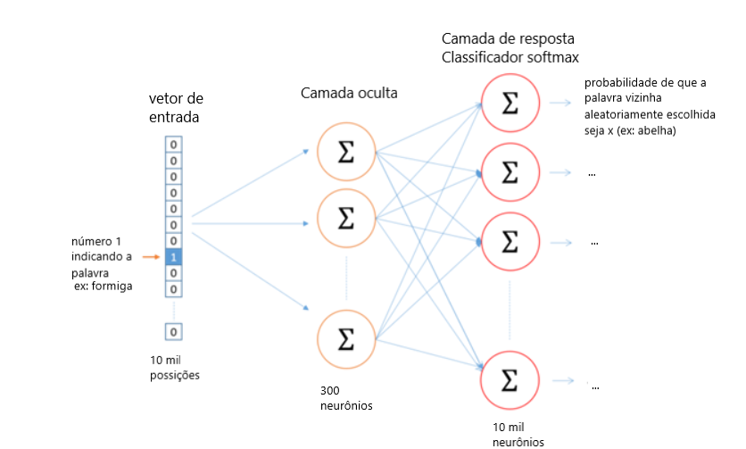
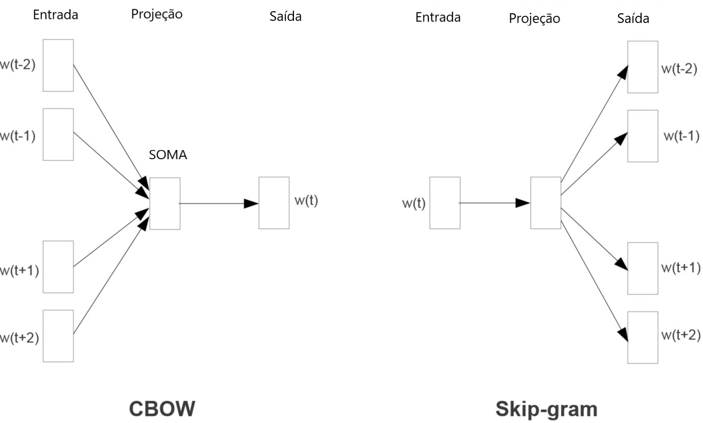
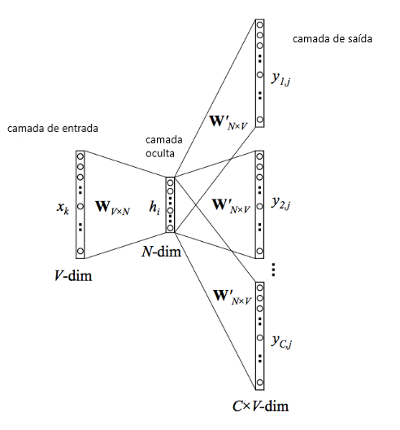
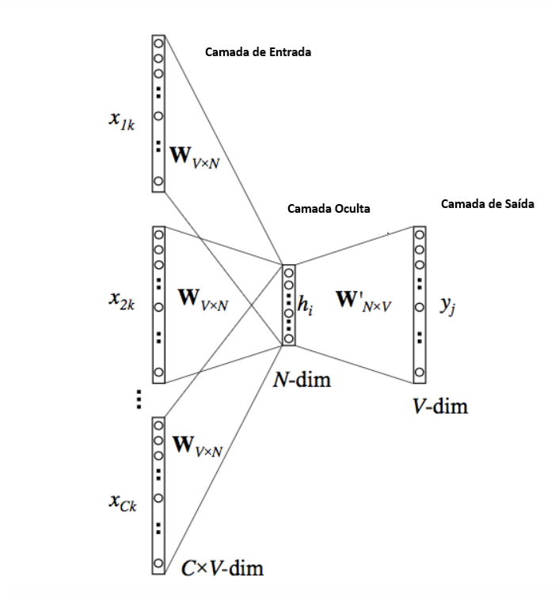
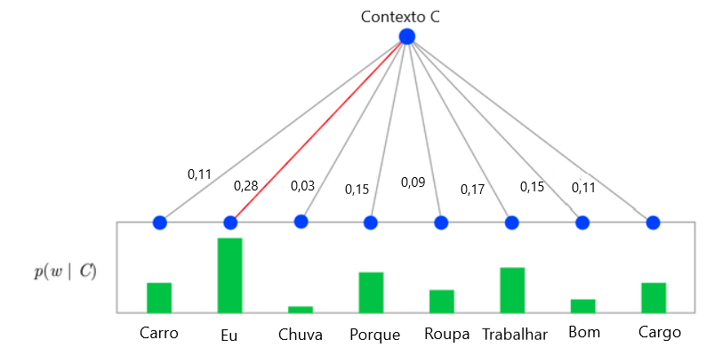
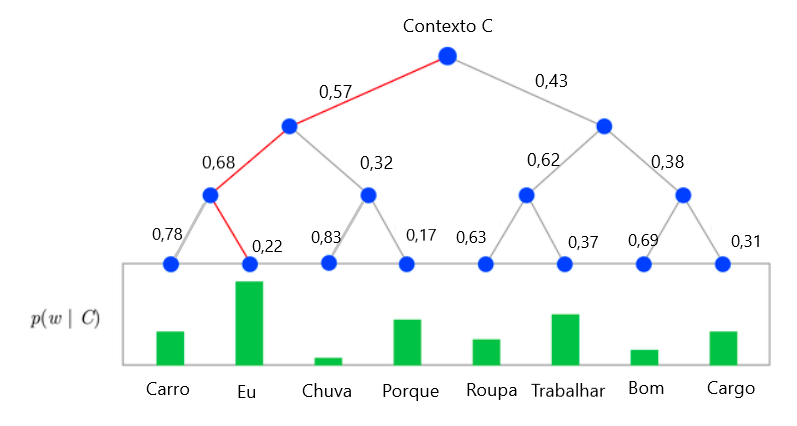
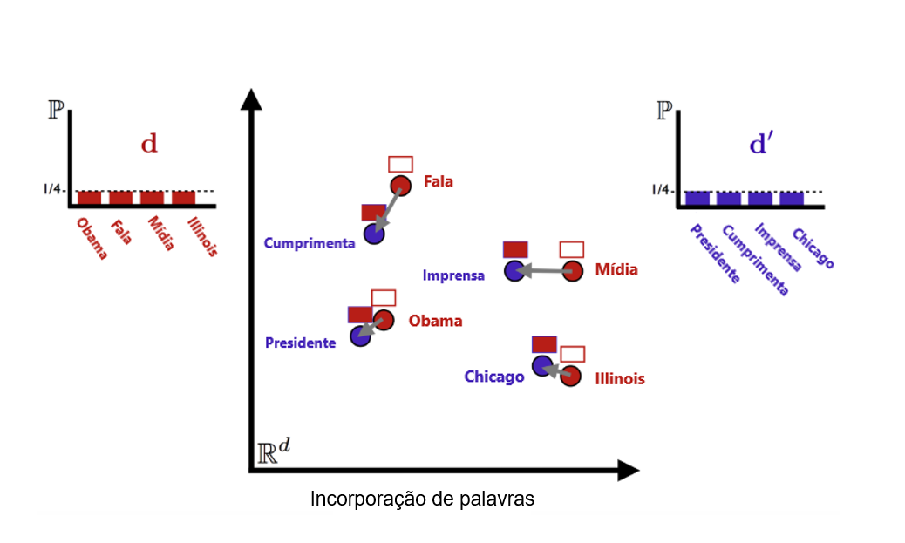

```{r setup, include=FALSE, warning=FALSE, message=FALSE}
knitr::opts_chunk$set(echo = FALSE, message = FALSE, warning = FALSE)

# Remove scientific notation
options(scipen=999, warn = -1)
```


___

**Atenção, este documento é o apêndice dos relatórios que utilizam *text mining* criados pela equipe de Dados da Tembici**

___

Neste relatório apresentamos uma visão geral dos métodos de processamento de linguagem natural utilizados pela equipe de Dados da Tembici

# Processamento de Linguagem Natural

Para explicar brevemente acerca do processamento de linguagem natural é preciso, primeiramente, ter em mente o conceito de *text mining*. A mineração de texto (em inglês, *text mining*) é uma tecnologia de inteligência artificial (IA) que procura examinar grandes coleções de recursos escritos para gerar novas informações. Seu objetivo é, portanto, descobrir informações relevantes no texto, transformando-o em dados que podem ser utilizados para análises adicionais, por exemplo, para reconhecimento de padrões, frequência da distribuição das palavras, extração de infromações, visualização e análise preditiva, dentre outras.

O processamento de linguagem natural (ou PLN), por sua vez, é um componente da mineração de texto, que realiza um tipo especial de análise linguística, auxiliando uma máquina a "ler" o texto. Enquanto o *text mining* lida com o próprio texto, a PLN lida com os metadados subjacentes/latentes, procurando de fato entender o significado semântico transmitido. A PLN usa uma variedade de metodologias para decifrar as ambiguidades na linguagem humana. Neste relatório, iremos focar na técnica *Word2vec*, uma das metodologias mais famosas do processamento de linguagem natural. 

Nesta seção são apresentados alguns conceitos essenciais no processamento de linguagem natural. A maior parte destes conceitos são originados da área de  <a href="https://pt.wikipedia.org/wiki/Recupera%C3%A7%C3%A3o_de_informa%C3%A7%C3%A3o" target="_blank">Recuperação de Informação</a> (*Information Retrieval*). Note que o objetivo desta seção é apenas introduzir conceitos associados às técnicas de processamento, para que depois possa ser apresentada a técnica aqui utilizada.  

## *Corpus*{#corpus -}

Define-se *corpus* como um conjunto de documentos. Aqui é importante notar que a designação "documento" remete a um texto, independente do seu tamanho ou complexidade. Logo, uma palavra, uma frase ou um texto complexo podem ser consideradas como documentos dependendo do contexto. O *corpus*, portanto, é o conjunto de textos que serviram de *input* para o algoritmo, como currículos ou cartas de apresentação, por exemplo. 


## *Tokens* {#tokens -} 

*Tokens* são termos individuais, como palavras. Um *token* é uma sequência de caracteres entre dois espaços, ou entre um espaço e sinais de pontuação. Além de palavras, um *token* pode representar também um número (seja ele real ou inteiro), ou ainda números separados por sinais de pontuação ou por caracteres, como ocorre em indicações de datas.

## *Bag of Words* {#bagofwords -}

É um modelo de representação de um *corpus* que identifica todos os *tokens* pertencentes a um documento. Geralmente contém também um vetor indicando a frequência de cada *token* em cada documento. No *bag of words*, a gramática, ordem das palavras, estrutura do texto e a pontuação são ignoradas, sendo que tudo é unificado da forma como está originalmente escrito.

É uma técnica que aborda cada documento como um conjunto de palavras individuais, considerando cada palavra como uma potencial palavra-chave. Uma das formas de colocar em prática o *bag of words* é tratar cada *token* (palavra) como uma variável binária, indicando para cada documento se há a presença daquela palavra no documento (1) ou se não há (0). Outra forma é de, ao invés de tratar os *tokens* de forma binária, trabalhar com a frequência dos *tokens*, ou seja, o número de vezes que cada termo aparece em um documento.

O *bag of words* é base para construção de nuvens de palavras e também para construir o *dataset* de treino de alguns algoritmos.

## Stemização {#stemizacao -}

O termo stemização vem do inglês *stemming*, e representa o processo de reduzir palavras flexionadas ou derivadas à sua base. Neste processo a tarefa é transformar palavras com derivação similar em uma só, extraindo apenas o radical dos verbos, por exemplo. Um exemplo da aplicação da técnica de stemização é reduzir as palavras “estudar, estudou, estudo e estudando” ao termo “estud”, que representa a base de todas as variações citadas.

## *Stop Words* {#stopwords -}

As *stop words* (palavras vazias) são palavras que não adicionam significados específicos quando analisadas individualmente, mas que são utilizadas na língua para dar maior coesão e ligação entre frases e palavras. São exemplos de *stop words* as palavras "para", "de", "uma", "este", "a", dentre outras.

Normalmente, as técnicas de processamento de linguagem natural excluem estas palavras antes do treinamento do algoritmo, uma vez que a grande frequência com que estas aparecem no texto pode diminuir a importância de palavras relevantes para o modelo. 

## *Word Embedding* {#embedding -}

*Word embedding*, ou incorporação de palavras, contempla um conjunto de técnicas que são capazes de transformar palavras ou frases em vetores de números reais. O objetivo destas técnicas é quantificar similaridades semânticas entre *tokens*, com base em suas distribuições ao longo dos documentos que estão sendo analisados. Estas técnicas partem do pressuposto de que uma palavra é caracterizada pelos demais *tokens* que a acompanham.


# *Word2Vec* {#word2vec}

O **Word2Vec** tem como objetivo transformar cada palavra (*token*) do nosso conjunto de frases ([*corpus*](#corpus)) em um vetor numérico que as represente. Esta  é uma das técnicas mais populares para aprender a incorporação de palavras (*word embedding*) usando uma rede neural artificial, e foi desenvolvida por @mikolov2013. 

A ideia principal do Word2Vec reside no pressuposto de que o significado de uma palavra é afetado pelas palavras ao seu redor, fazendo com que seja possível aprender as suas representações a partir das sentenças nas quais as palavras estão inseridas. Esta concepção tem suas bases na hipótese distributiva, que afirma que itens linguísticos com distribuições semelhantes (contextos similares) têm significados semelhantes. Por exemplo, ao observarmos as seguintes frases:


> "Ontem choveu muito."

> "Domingo fará muito sol."

> "Ventou muito na quarta-feira."

 
De acordo com a hipótese de distribuição, as palavras "choveu", "sol" e "ventou" devem estar relacionadas de alguma forma (ou seja, ter significado próximo) uma vez que ocorrem em um contexto semelhante (entre a palavra "muito" e uma palavra indicando um dia particular). Da mesma forma, as palavras "ontem", "domingo" e "quarta-feira" devem estar relacionadas, pois ocorrem no contexto de uma palavra que indica uma condição climática. Ou seja, o significado de uma palavra é apenas uma grande lista de todos os contextos em que ocorre. **Duas palavras têm um significado mais próximo se compartilharem contextos**.

No Word2Vec, os vetores utilizados para representar palavras em formas de números são chamados de representações neurais de palavras (*neural word embeddings*). O Word2Vec age como um autocodificador, codificando cada palavra como um vetor e treinando-os contra outras palavras vizinhas do *corpus* de entrada.

O interessante desta técnica é que, ao representarmos palavras por meio de vetores, conseguimos realizar operações matemáticas. Assim, é possível calcular a distância entre *tokens*, bem como performar novas operações a partir disso. Exemplo: o vetor que representa o *token* “Madri”, subtraído do vetor representante de “Espanha” e somado ao vetor de “França” será muito próximo do vetor obtido para “Paris”. Ou de uma forma equacionada:

$$
vec(Madri) - vec(Espanha) + vec(França) ≈ vec(Paris)
$$

Em resumo:

  * Palavras próximas umas das outras no espaço vetorial são mais propensas a compartilhar significados;
  
  * Cada dimensão representa um significado em um contexto particular;
  
  * Palavras com contextos semelhantes ocupam uma posição espacial semelhante, ou seja, o cosseno do ângulo entre os dois vetores (A e B) deverá ser próximo de 1, dado a equação:
  
$$
sin(A,B) = cos(\theta) = \frac{(A \times B)}{||A|||B||}
$$


Mais informações acerca do cálculo de distância entre duas palavras ou sentenças serão em uma [seção](#similaridade) subsequente deste relatório. 

## Como Representar Palavras Matematicamente? 

O ponto principal da técnica do Word2Vec é entender como o algoritmo transforma palavras em representações numéricas. De forma resumida, a primeira etapa consiste em criar um vocabulário de todas as palavras do nosso texto e depois codificar como um vetor das mesmas dimensões do vocabulário. Assim, cada dimensão pode ser pensada como uma palavra deste vocabulário. O resultado é um vetor com todos os zeros (0) e um (1) que representa a palavra correspondente. Essa técnica de codificação é chamada de codificação *one-hot*. Considerando, por exemplo, que o vocabulário fosse composto pelas palavras "a" "formiga" "entrou" "no" "mel", então a palavra "formiga" é representada por um vetor: `[0, 1, 0, 0, 0]`. O modelo recebe um *corpus* de texto e cria um vetor *one-hot* para cada palavra, em que cada vetor possuirá o tamanho do vocabulário (total de palavras exclusivas no *corpus*). 

A segunda etapa do processamento se dá a partir da multiplicação dos vetores de entrada por uma matriz de pesos. Como os vetores de entrada são *one-hot*, multiplicar um vetor de entrada por uma matriz de pesos $W$ equivale a simplesmente selecionar uma linha de $W$, como pode ser visto abaixo:

$$
\left[\begin{array}{cccc} 
0 & 0 & 0 & \textbf{1} & 0 
\end{array}\right] \times 
\left(\begin{array}{ccc} 
17 & 24 & 1 \\ 
23 & 5 & 7 \\
4 & 6 & 13 \\
\textbf{10} & \textbf{12} & \textbf{19} \\
11 & 18 & 25
\end{array}\right) = 
\left[\begin{array}{ccc} 
10 & 12 & 19
\end{array}\right] 
$$ 

Denominaremos a primeira matriz (`[0 0 0 1 0]`) de `camada de input`, a segunda matriz de $W$, e a matriz resultante `[10 12 19]` de `camada oculta`. 

Da camada oculta à camada de saída, a terceira etapa da técnica Word2Vec consiste em multiplicar o resultado da `camada oculta` por uma matriz de pesos, $W'$, utilizada para calcular a pontuação de cada palavra no vocabulário. Por fim, uma função [*softmax*] pode ser usada para obter a distribuição posterior das palavras. A função *softmax* é descrita detalhadamente [na sequência](#softmax). A função de ativação para a camada oculta simplesmente equivale a copiar a linha correspondente da matriz de pesos $W$ (linear), como pode ser visto na matriz acima. Na camada de saída, agora produzimos $C$ distribuições multinominais ao invés vez de apenas uma. O objetivo do treinamento é minimizar o erro de previsão, resumindo todas as palavras de contexto na camada de saída.


Em resumo, esse é um exemplo introdutório de *Word2Vec* que usa uma arquitetura denominada *skip-gram*. Há outra arquitetura chamada de CBOW. Ambas serão detalhadas na sequência deste documento. Veja a imagem a seguir:




Como exemplo, supomos que estamos treinando um conjunto de dados com 10 mil palavras, em que a camada oculta será representada por um total de 300 dimensões (neurônios). A quantidade de neurônios da camada oculta é um parâmetro definido na construção do modelo, sendo que não há uma regra específica para a sua definição.

Inicialmente o modelo recebe um vetor *one-hot* com o mesmo número de linhas da quantidade de palavras do conjunto de dados, indicando "1" para uma palavra específica (palavra "formiga" do exemplo). Esse procedimento se repete para todas as palavras. Em seguida a matriz de pesos $W$ (com 10.000 linhas e 300 colunas) multiplica pelo vetor *one-hot* e cria a camada oculta com 300 neurônios. A camada oculta passa então por uma nova matriz de pesos ($W'$), que terá 300 linhas e 10.000 colunas, gerando então os 10.000 neurônios da camada de saída. Por fim, aplica-se a função *softmax* (que é detalhada na sequência) para obter a probabilidade de cada uma das 10 mil palavras estar próxima à palavra "formiga".   

É importante ressaltar que os pesos das matrizes $W$ e $W'$ começam como valores aleatórios. A rede é treinada para ajustar os pesos para representar as palavras de entrada. Esse procedimento é explicado brevemente na seção [_backpropagation_](#backprop).

## Arquiteturas do Word2Vec

O *Word2Vec* oferece duas arquiteturas como opção: *continuous bag-of-words (CBOW)* e *skip-gram*. Não existe uma regra para a escolha entre uma ou outra. Ambas as arquiteturas têm suas vantagens e desvantagens. Na prática, o *skip-gram* funciona melhor para pequenas bases de dados, representando bem frases e palavras pouco frequentes no vocabulário. Já a arquitetura *CBOW* é computacionalmente mais rápida, além de possuir maior acurácia na predição de palavras mais frequentes. A seguir é apresentado um detalhamento sobre estas afirmações.

**O CBOW aprende a palavra a partir do contexto**. Em outras palavras, maximiza a probabilidade da palavra alvo ao olhar para o seu contexto. Isto, contudo, acaba por se tornar um problema para palavras pouco frequentes. Por exemplo, dado o contexto "hoje está um [...] dia", o CBOW poderá informar que as palavras mais prováveis para aquele contexto são "belo" e "ótimo". Palavras como "magnífico" terão uma menor atenção do modelo, pois sua arquitetura é desenhada para prever a palavra mais provável. As palavras raras, portanto, acabam por serem esquecidas em meio a diversas outras palavras mais frequentes.

Por outro lado, o ***skip-gram* tem sua arquitetura desenhada para predizer o contexto**. Levando em conta o exemplo anterior, dada a palavra "magnífico", o *skip-gram* poderia dizer que há uma alta probabilidade de que o contexto seja "hoje está um [...] dia", ou algum outro contexto relevante. Com o *skip-gram* a palavra "magnífico" não teria que competir com as palavra "belo" ou "ótimo", mas ao invés disso, os pares combinando $\text{“magnífico'' } + \text{contexto}$ seriam tratados como novas observações.

Levando em conta a introdução acima, é possível perceber que a estrutura criada pelo *skip-gram* é muito maior do que a do CBOW. Sendo assim, esta é a razão pela qual o *skip-gram* exige maior desempenho computacional. É também uma arquitetura que acaba sendo mais adequada em casos de dados não muito extensos e/ou de textos com especificidades em algumas palavras que poderiam ser perdidas com o uso do CBOW. O CBOW, por sua vez, é consideravelmente mais rápido que o *skip-gram* e possibilita levemente uma acurácia para as palavras mais frequentes.


```{r}

tribble(
  ~Arquitetura , ~"<i>Input</i>",    ~"Previsão" ,
  "CBOW" ,   "Contexto",        "Palavra" ,    
  "<i>Skip-gram</i>"  , "Palavra" , "Contexto"     
) %>%
  knitr::kable(
    escape = FALSE,
    format = "html",
    caption = "Entrada e saída dos modelos CBOW e <i>skip-gram</i>.",
    align = 'l',
  ) %>% 
  kable_styling(full_width = F) %>% 
  column_spec(c(1), bold = T, border_right = T)

```

A imagem a seguir ilustra a diferença entre o *CBOW* e o modelo *skip-gram*, em que $w(t)$ é a palavra chave, e $w(t\pm n )$ são as $n$ palavras de contexto anteriores ($-$) e posteriores ($+$) à palavra-chave.

<center></center>

Nas próximas seções segue detalhamento dos modelos CBOW e *skip-gram*.

### *Skip-gram* {#skipgram}

Esta arquitetura toma como ponto de partida uma determinada palavra e possui como objetivo prever as palavras do seu contexto.

Por exemplo, suponha a seguinte frase: “no meio do caminho tinha uma pedra”. Se escolhermos uma janela de tamanho 1 (um) para ser nosso contexto, teremos os seguintes vetores de pares (**contexto, palavra-alvo**): 

- [meio], no;
- [no, do], meio;
- [meio, caminho], do;
- __[do, tinha], caminho__;
- __[caminho, uma], tinha__;
- __[tinha, pedra], uma__;
- __[uma], pedra__. 

Como o objetivo do *Skip Gram* é predizer o contexto, teremos ainda uma reconstrução dos vetores acima da seguinte forma (a reconstrução foi feita apenas com os vetores __em negrito__ no exemplo): (do, caminho), (tinha, caminho), (caminho, tinha), (uma, tinha), sempre lembrando que estes vetores são pares (**contexto, palavra-alvo**).


O modelo *skip-gram* pode ser representado pela imagem a seguir:

<center></center>

No modelo acima, $x$ representa o vetor codificado *one-hot* correspondente à palavra de entrada no modelo e ${y_1, ... y_C}$ são os vetores codificados *one-hot* correspondentes às palavras de saída no modelo. A matriz $W$ é a matriz de pesos entre a camada de entrada e a camada oculta, cuja i-ésima linha representa os pesos correspondentes à i-ésima palavra no vocabulário. Essa matriz de ponderação $W$ é o que estamos interessados em aprender, uma vez que ela contém as codificações vetoriais de todas as palavras em nosso vocabulário. Cada vetor de palavra de saída, por sua vez, também possui uma matriz de saída associada $W'$. A camada oculta $h$ consiste em $N$ nós (o tamanho exato de $N$ é um parâmetro de treinamento do modelo).

Como já exemplificado na primeira seção deste apêndice, inicia-se o modelo multiplicando os vetores *one-hot* de entrada por uma matriz de pesos, o que equivale simplesmente a selecionar a linha da matriz correspondente. De forma equacionada:

$$
h = x^TW = W_{k,..} = v_{wI}
$$

Por sua vez, a entrada para o j-ésimo nó da c-ésima palavra de saída é definida por:

$$
u_{c,j} = v_{wj}^ {'T} \times h
$$
Após este cálculo, aplicação a função de ativação *softmax* sobre o resultado. Uma vez que esta função será posteriormente explicada neste relatório, não será exposta sua equação aqui. 


#### Cálculo das Matrizes de Pesos (*Backpropagation*){#backprop .unnumbered} 

De forma simplificada, os passos acima demostram como calculamos um modelo *Word2Vec* usando a arquitetura *skip-gram*. Além dos cálculos demonstrados acima, é interessante entender como as matrizes de peso $W$ e $W’$ são calculadas. 

Inicialmente, atribuem-se pesos aleatórios para as duas matrizes e, de forma subsequente, utilizamos os dados de treinamento do nosso modelo para observar o erro (basicamente, a diferença entre o valor esperado e o valor real de saída de um *output*). Após isso, calcula-se o gradiente desse erro com respeito aos elementos de ambas as matrizes, corrigindo-as de acordo com o mesmo. Esse procedimento de otimização é conhecimento como **Gradiente Descendente Estocástico (GDE)**[^1], mas o método utilizado para sua derivação é denominado *backpropagation*. 

De maneira resumida, *backpropagation* (ou retroprogramação) é um algoritmo eficiente usado para encontrar os pesos ótimos de uma rede neural: aqueles que minimizam a função de perda (as definições para funções de perda serão explicadas no <a href="https://pier-shared.gitlab.io/pier_apendice/ml#funcoes_perda" target="_blank">apêndice de *machine learning*</a>) . A maneira padrão de encontrar esses valores é aplicando o algoritmo de gradiente descendente, que implica descobrir as derivadas da função de perda em relação aos pesos (neste caso, em relação às matrizes de pesos $W$ e $W'$).Para informações adicionais acerca do cálculo das matrizes de pesos, acessar o <a href="http://www.claudiobellei.com/2018/01/06/backprop-word2vec/" target="_blank">material</a>.

### *CBOW* {#cbow}

É basicamente o contrário do modelo **skip-gram**. O objetivo da técnica *continuous bag of words* é prever uma palavra a partir de um determinado contexto. Para isto, a técnica utiliza uma rede neural cuja entrada é um vetor *one-hot encoded* que representa as palavras do contexto e a saída é a palavra que estamos buscando.

O modelo é uma rede neural com uma camada de entrada (vetor *one-hot*) $x$ com $V$ unidades (tamanho do vocabulário), uma camada oculta $h$ com $N$ unidades (dimensão do vetor, sendo um hiperparâmetro do modelo) e uma camada de saída $y$ com $V$ unidades (vetor *one-hot*). A matriz $w_{vn}$ representa os pesos entre a camada de entrada $x$ e a camada oculta, e a matriz $w’_{nv}$ contém os pesos entre a camada oculta e da camada de saída. A única função não linear que ocorre na rede é a função *softmax*, que é aplicada na camada de saída. 

O modelo funciona basicamente como já exemplificado. A diferença é que a entrada será um vetor *one-hot encoded* que represente as $C$ palavras de contexto. Quando $W_{vn}$ é usado para calcular entradas da camada oculta, calcula-se uma média de todas dos $C$ vetores de palavras de contexto.

<center></center>

Assumindo que conhecemos as matrizes de peso $W$ e $W’$, o primeiro passo é avaliar o vetor da camada oculta $h$, computado pela média dos vetores de entrada multiplicado pela matriz de pesos $W$:

$$
h = \frac{1}{C} W (\sum_{i=1}^C x_i)
$$


Em que:

* $h$ é o vetor resultante na camada oculta;

* $x_i$ são os vetores *one-hot* da camada de entrada;

* $C$ é o total de palavras no contexto;

* $W$ é a matriz de pesos aplicada entre a camada de entrada e a camada oculta.

Cabe observar que este cálculo da camada oculta é uma das únicas diferenças entre a arquitetura *CBOW* e a *skip-gram*. O próximo passo é calcular as entradas para cada nó de saída:

$$
u_{j} = v_{wj}^ {'T} \times h
$$

Em que:

*  $v_{wj}^ {'T}$ é j-ésima a coluna da matriz de saída $W'$;

* $u_j$ é o vetor resultante da camada de saída.


Por fim, o resultado final será calculado a partir da aplicação da função *softmax* sobre o vetor $u_j$. Uma vez que esta função de ativação será explicada [posteriormente](#softmax) neste documento, 


## *Softmax* {#softmax}

### O que é a Função Softmax? {.unnumbered} 

A função da ativação *softmax* é uma generalização da regressão logística que pode ser utilizada para classificação de múltiplas classes (supondo que as classes sejam mutuamente exclusivas).

<!-- (sinônimos: Logística Multinomial, Classificador de Entropia Máxima ou apenas Regressão Logística de Múltiplas Classes) -->

Ela é um **modelo generalizado de regressão logística** que permite **normalizar as categorizações** em classes cujo o resultado some 1. Ela possibilita, portanto, transformar as saídas de neurônios de valores numéricos para valores que representem probabilidades.  

A *softmax* é uma função sigmoide[^2], útil quando queremos lidar com problemas de classificação. Basicamente, essa função transforma as saídas para cada classe em valores entre 0 e 1 e divide pela soma das saídas. Isso, essencialmente, nos dá a probabilidade de a entrada estar em uma determinada classe. Ela é dada pela seguinte equação:

$$
P(y = j| z_i) = \phi_{softmax}(z_{i}) = \frac{e^{z_{i}}}{\sum_{j=0}^k e_k^{z_{i}}}
$$

Em que:

* $z$ é o vetor de entrada;

* $i$ representa os elementos do vetor $z$;

* $j = 1,...,k$ representa os rótulos de classes. 

Ou seja, aplica-se a função exponencial para cada elemento $z_i$ do vetor de entrada $z$ e normalizam-se os valores pela divisão da soma de todos os valores na exponencial, assegurando que a soma total dos componentes do vetor $\phi_{softmax}(z_{i})$ sejam iguais a 1. 

De forma simplificada, aplica-se a função *softmax* sobre as camadas de resultados dos neurônios. Assim, por exemplo, se nosso vetor de saída fosse:

 `[0 1 -0.5 0.5]`

Então, bastaria aplicar a função *softmax* acima. Dado que:

* $e^0 = 1$

* $e^1 = 2.7182$

* $e^{-0.5} = 0.6065$

* $e^{0.5} = 1.6487$

Então, $\sum_{j=0}^k e_k^{(z_{i})} = 5.9735$. Utilizando a função *softmax*, bastaria dividirmos os valores na exponencial pelo somatório, gerando as seguintes probabilidades:

`[0.16 0.46 0.10 0.27]`

Dado o vetor de destino, o vetor de erro para a camada de saída é calculado subtraindo o vetor de probabilidade do vetor de destino. Depois que o erro é conhecido, os pesos nas matrizes de entrada e saída podem ser atualizados usando a retropropagação. Assim, o treinamento pode prosseguir apresentando diferentes pares de palavras de contexto-alvo do *corpus*. É assim que o Word2Vec aprende relacionamentos entre palavras e, no processo, desenvolve representações vetoriais para palavras no *corpus*.

Para saber mais da regressão logística, base para o **softmax**, acesse o [link](http://www.portalaction.com.br/analise-de-regressao/regressao-logistica).

No caso do modelo Word2Vec podemos considerar que $z_{i} = h^\top v'_w$, sendo $h$ o vetor de saída da penúltima camada da rede e $v'_w$ a representação da palavra $i$ no vetor $w$ na camada de pesos da *softmax*. Sendo assim, teremos a seguinte aplicação da função softmax para estimar a probabilidade $P$ de uma palavra $w$ dado um contexto $c$:

$$
P(w|c) = \frac{e^{h^\top v'_w}}{\sum_{j=0}^k e_k^{h^\top v'_w} }
$$

#### *Softmax* Hierárquico {.unnumbered} 

A função *softmax*, quando aplicada a certos modelos específicos, como o Word2Vec, pode facilmente produzir dezenas de milhares de saídas na última camada. Isso ocorre porque ele gera uma saída para cada palavra dos dados de *input*. Este fato faz com que o processamento do Word2Vec exija um alto poder computacional, uma vez que a função *softmax* precisa dividir o exponencial da probabilidade de cada *output* ($e^z$) pela soma de todos ($\sum e^z$). Nesse sentido, a função *softmax* hierárquica aplica um método para **aproximar a _softmax_** e **reduzir consideravelmente o processamento** exigido no algoritmo.

> O **_softmax_ hierárquico** é uma adaptação da função ao *softmax*, visando maior agilidade da avaliação. Esta técnica é baseada na ideia de que, para armazenar um número $n$, torna-se necessário apenas $log(n)$ bits.

Esta função funciona a partir da criação de árvores binárias (em que cada nó possui exatamente duas ramificações) para a representação de todas as categorias do dicionário de saída ($V$). Dessa forma, as folhas das árvores representam as $V$ categorias finais, ou seja, todas as palavras do conjunto de dados. Para cada palavra final, temos um caminho único a partir da raiz, fazendo com que seja possível estimar as probabilidades para cada um destes caminhos. 

Uma vez que o *softmax* hierárquico trabalha apenas com árvores binárias, existirão $V-1$ nós intermediários. No algoritmo Word2Vec, implementado pelo *framework* H2O (utilizado neste projeto), é utilizada uma árvore binária específica chamada de *Huffman Tree*. O que é importante saber sobre uma *Huffman Tree* é que palavras raras são organizadas em níveis mais profundos e palavras mais frequentes ficam em níveis mais acima. Sendo assim, o caminho para se chegar até palavras menos frequentes é maior e, portanto, sua probabilidade é menor. 

O próximo passo então é entender como navegar pela árvore binária construída a fim de conseguir "ativar" a palavra desejada. Partindo do nó raiz da árvore binária criada, cada nó representará uma decisão, em que se aplica o produto escalar entre o vetor da palavra e da linha correspondente da matriz de saída. Com isso é possível decompor as probabilidades não mais por palavras, mas por nós da árvore binária, de tal forma que cada nível da árvore terá soma 1 nas probabilidades. Com este procedimento exige-se menos processamento computacional.

Para melhor compreensão, podemos comparar as árvores da função *softmax* e do *softmax hierárquico*. 

Podemos entender a função de ativação *softmax* como a seguinte árvore:

<center></center>

Assim, para calcular a probabilidade de determinada palavra, é preciso computar cada uma das probabilidades, ou "nós terminais" da árvore. 

Por sua vez, a função *softmax hierárquico* calcula estas probabilidades a partir de uma árvore de múltiplas camadas. Dessa forma, para calcular a probabilidade de uma palavra multiplica-se cada um dos nós. A imagem abaixo mostra o modo de computação das probabilidades a partir do *softmax hierárquico*. 

<center></center>

Assim, por exemplo, se quisermos calcular a probabilidade da palavra "eu" dado um contexto de palavras $c$, bastaria apenas multiplicar as probabilidades, de forma que:

$$
P(Eu ~|~ c) = 0,57 \times 0,68 \times 0,22 = 0,085 
$$


Em resumo, a ideia por trás da decomposição da camada de saída em uma árvore binária é de reduzir a complexidade para obter a distribuição de probabilidade de $n$ palavras para $log(n)$. Esta adaptação ao *softmax* possui um tempo de processamento inferior e, portanto, é a opção escolhida pelo [**H2o**](https://www.h2o.ai/), utilizado pela equipe da Tembici. 

# Similaridade entre Documentos {#similaridade}

A partir dos vetores criados pelo **_Word2Vec_** conseguimos medir, por exemplo, a distância entre duas sentenças ou entre dois documentos. Isso porque os vetores numéricos nos dão uma espécie de posição das palavras. Sendo assim, faz-se possível calcular uma métrica de similaridade a partir da distância entre os dois vetores, usualmente medida pela **distância entre cossenos**. 

o **Word2Vec** não é único método de incorporação de palavras. Outros métodos incluem o **_Glove_** e uma combinação mais recente, o **_Word Mover’s Distance (WMD)_**. 

**_Glove_** utiliza mecanismos diferentes do *Word2Vec* para criar a matriz de incorporação. É um modelo baseado em contagem que aprende vetores ou palavras a partir de suas informações de co-ocorrência, ou seja, baseados na frequência nos quais aparecem juntos em grandes *corpus* de texto. É uma técnica de incorporação de palavras em alta velocidade, treinada nas probabilidades de co-ocorrência de palavras. Para saber mais sobre esta técnica acesso o <a href="https://towardsdatascience.com/light-on-math-ml-intuitive-guide-to-understanding-glove-embeddings-b13b4f19c010" target="_blank">link</a>

**_Word Mover’s Distance (WMD)_** é uma técnica recentemente desenvolvida, que aprende representações semanticamente significativas para as palavras de co-ocorrência em frases. WMD aproveita os resultados de técnicas avançadas de incorporação, *Word2Vec* e *Glove*, que geram incorporações de palavras de ótima qualidade e escalam naturalmente para conjuntos de dados muito grandes. Essas técnicas de incorporação demonstram que os relacionamentos semânticos geralmente são preservados na transformação de palavras em *word vectors*.

 A técnica _Word Mover’s Distance_ sugere que as distâncias entre os vetores de palavras incorporados são, em algum grau, semanticamente significativas. Ele utiliza essa propriedade de incorporação de vetores de palavras e trata documentos de texto como uma nuvem de pontos ponderada de palavras incorporadas. A distância entre dois documentos de texto A e B é calculada pela distância cumulativa mínima que as palavras do documento de texto A precisam "percorrer" para corresponder exatamente à nuvem de pontos do documento de texto B.
 
 Por exemplo, se quiséssemos calcular a distância entre duas frases: "Obama fala para a mídia em Illinois" e "O presidente cumprimenta a imprensa em Chicago", teremos:



Enquanto as outras técnicas trabalham apenas com incorporações de palavras semânticas (_Word2Vec_) ou sintáticas (_Glove_), a técnica WMD abrange as duas incorporações: semântica e sintática. 

Formalmente, o cálculo da medida mínima necessária para que as palavras do texto "A" correspondam ao texto "B", denominada **custo cumulativo mínimo**, pode ser expresso por:

$$
min(T≥ 0) \sum_{i,j=1}^n T_{i,j}~c(i,j)
$$
Em que:

* $T_{ij}$ uma matriz que indica o quanto da palavra $i$ em $d$ "viaja" para a palavra $j$ em $d'$;
 
* $c(i,j)$ é o custo associado a "viagem" de uma palavra para outra;

A distância WMD possui as seguintes propriedades:

* É livre de parâmetros e simples de entender e usar;

* É altamente interpretável, pois a distância entre dois documentos pode ser dividida e explicada como as distâncias esparsas entre poucas palavras individuais;

* Naturalmente, incorpora o conhecimento codificado no espaço *Word2Vec*/*Glove* e gera alta precisão de recuperação.


Para saber mais sobre as técnicas de similaridades, acesso o <a href="http://proceedings.mlr.press/v37/kusnerb15.pdf" target="_blank">*link*</a>.


# Referências {.unnumbered}

<div id="refs"></div>


# Notas {.unnumbered}

[^1]: O gradiente descendente estocástico é um método de otimização, onde o parâmetro desejado é atualizado a cada iteração, como na maioria dos algoritmos de otimização.

[^2]: Sigmóide é uma função de ativação amplamente utilizada expressa por $f(x) = \frac{1}{(1 + e ^{-x})}$. Essa função varia de 0 a 1, tendo como formato uma curva "S" . 


